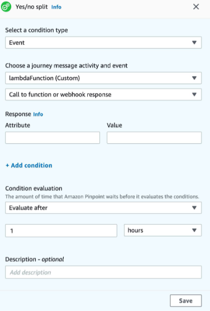

**End of support notice:** On October
30, 2026, AWS will end support for Amazon Pinpoint. After October 30, 2026, you will no
longer be able to access the Amazon Pinpoint console or Amazon Pinpoint resources (endpoints,
segments, campaigns, journeys, and analytics). For more information, see [Amazon Pinpoint end of
support](../../../console/pinpoint/migration-guide.md "../../../console/pinpoint/migration-guide.md"). **Note:** APIs related to SMS, voice,
mobile push, OTP, and phone number validate are not impacted by this change and are
supported by AWS End User Messaging.

# Lambda function response format for Amazon Pinpoint

If you want to use the journey multivariate or yes/no split to determine the
endpoint path after a custom channel activity you must structure your Lambda
function response into a format that Amazon Pinpoint can understand, and then send endpoints
down the correct path.

The structure of the response should be in the following format:

```
{
    <Endpoint ID 1>:{
        EventAttributes: {
            <Key1>: <Value1>,
            <Key2>: <Value2>,
            ...
        }
    },
    <Endpoint ID 2>:{
        EventAttributes: {
            <Key1>: <Value1>,
            <Key2>: <Value2>,
            ...
        }
    },
...
}
```

This will then allow you select a key and value you would like to determine the
endpoints path.


