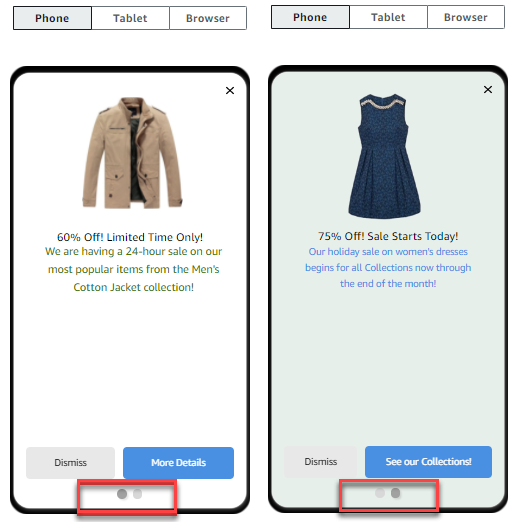

**End of support notice:** On October
30, 2026, AWS will end support for Amazon Pinpoint. After October 30, 2026, you will no
longer be able to access the Amazon Pinpoint console or Amazon Pinpoint resources (endpoints,
segments, campaigns, journeys, and analytics). For more information, see [Amazon Pinpoint end of
support](../../../console/pinpoint/migration-guide.md "../../../console/pinpoint/migration-guide.md"). **Note:** APIs related to SMS, voice,
mobile push, OTP, and phone number validate are not impacted by this change and are
supported by AWS End User Messaging.

# Configure the message

After you specify the target segment for the campaign, you can configure the message for
the campaign.

If you created the campaign as a standard campaign, you configure a single message. If you
set up the campaign as an A/B test campaign, you define two or more
_treatments_. A _treatment_ is a
variation of your message that the campaign sends to different portions of the
segment.

###### Prerequisite

Before you begin, complete [Specify the audience for the campaign](campaigns-segment.md "campaigns-segment.md").

## Set up the campaign

1. If you created this campaign as an A/B test campaign (as opposed to a standard
   campaign), specify the percentage of segment members who should receive each
   treatment. An A/B test campaign can include up to five treatments. Choose
   **Add another treatment** to add additional
   treatments.
2. On the **Create your message** page, configure the message
   for the campaign. The message options vary depending on the channel that you
   chose for the campaign.

If you're creating an email campaign, see [Configuring an email message](#campaigns-message-email "#campaigns-message-email").

If you're creating an in-app campaign, see [Configuring an in-app message](#campaigns-message-inapp "#campaigns-message-inapp").

If you're creating an SMS campaign, see [Configuring an SMS message](#campaigns-message-sms "#campaigns-message-sms").

If you're creating a push notification campaign, see [Configuring a push notification](#campaigns-message-push "#campaigns-message-push").

If you're creating a campaign that sends messages through a custom channel,
see [Configuring a custom channel
message](#campaigns-message-custom "#campaigns-message-custom").

###### To configure an email message

1. Choose the priority level for the **Create your
   message** page, do one of the following:
   - To design and write a new message for the campaign, select
     **Create a new email message**.

   ###### Note

   The maximum email message size for **Create a new
   message** is 200 KB. You can use email templates
   to send larger email messages.
   - To create a message that's based on an email template:
     1. Select **Choose an existing email
        template**, and then select
        **Choose a template**.
     2. Browse for the template that you want to use. When you
        select a template from the list, Amazon Pinpoint displays a
        preview of the active version of the template. (The
        active version is usually the version of a template
        that's been reviewed and approved for use, depending on
        your workflow.)
     3. When you find the template that you want, select it,
        and then select **Choose
        template**.
     4. Under **Template version**, specify
        whether you want Amazon Pinpoint to automatically update the
        message to include any changes that you might make to
        the template before the message is sent. To learn more
        about these options, see [Managing versions of message templates](message-templates-versioning.md "message-templates-versioning.md").
     5. When you finish choosing template options for the
        message, skip to step 5.

2. For **Subject**, enter the subject line for your
   email message.
3. For **Message**, enter the email body.

###### Tip

You can enter the email body by using either HTML or Design view.
In HTML view, you can manually enter HTML content for the email
body, including features such as formatting and links. In Design
view, you can use a rich text editor with a formatting toolbar to
apply formatting features such as links. To switch views, choose
**HTML** or **Design** from
the view selector above the message editor. 4. ###### Note

You must set up an email orchestration sending role before you can use email headers. For more
information, see [Creating an email orchestration
sending role in Amazon Pinpoint](channels-email-orchestration-sending-role.md "channels-email-orchestration-sending-role.md").

Under **Headers**, choose **Add new
headers**, to add up to 15 headers for the email message.
For a list of supported headers, see [Amazon SES
header fields](../../../ses/latest/dg/header-fields.md "../../../ses/latest/dg/header-fields.md") in the [Amazon Simple Email Service Developer Guide](../../../ses/latest/dg/Welcome.md "../../../ses/latest/dg/Welcome.md").

    * For **Name**, enter the name of the
     header.
    * For **Value**, enter the value of the
     header.

(Optional) To add a One-click unsubscribe link to a promotional email,
add the following two headers:

    1. Create a header with `List-Unsubscribe` for **Name** and set
     **Value** to your unsubscribe link. The
     link must support HTTP POST requests to process the recipients
     unsubscribe request.
    2. Create a header with `List-Unsubscribe-Post` for **Name** and set
     **Value** to
     `List-Unsubscribe=One-Click`.

5. (Optional) In the field below the message editor, enter the content
   that you want to display in the body of messages that are sent to
   recipients whose email applications don't display HTML.
6. If you created this campaign as an A/B test campaign (as opposed to a
   standard campaign), repeat the steps in this section for each treatment.
   You can switch between treatments by using the tabs at the top of the
   **Email details** section.
7. For **Sender email address**, choose the verified
   email address used to set up the email channel.
8. Choose where you want to send the test message to. This can be an
   existing segment of up to ten email addresses or endpoint IDs.
9. Choose **Next**.
   Use in-app messages to send targeted messages to users of your applications.
   In-app messages are highly customizable. They can include buttons that open
   websites or take users to specific parts of your app. You can configure
   background and text colors, position the text, and add images to the
   notification. You can send a single message, or create a
   _carousel_ that contains up to five unique messages that
   your users can scroll through.

When creating an in-app message, you can either choose to create a campaign
from an existing template or create a new message.

If you chose to create an A/B testing campaign, you can apply a different
template to each treatment. An A/B testing campaign can contain up to five
different treatments.

1.  On the **Create your message** page, do one of the
    following:
    - To create a new message for the campaign, select
      **Create a new in-app message**, and then
      proceed to step 2.
    - To create a message that's based on an existing in-app
      template, do the following:
      1. Select **Choose an existing in-app messaging
         template**, and then select
         **Choose a template**.
      2. Select the template that you want to use. When you
         select a template from the list, Amazon Pinpoint displays a
         preview of the active version of the template. The
         active version is typically the version of a template
         that's been reviewed and approved for use.
      3. When you find the template that you want do use,
         select it, and then select **Choose
         template**.
      4. Under **Template version**, specify
         whether you want Amazon Pinpoint to automatically update the
         message to include changes that are made to the template
         before the message is sent. To learn more about these
         options, see [Managing versions of message templates](message-templates-versioning.md "message-templates-versioning.md").
      5. When you finish choosing template options for the
         message, proceed to step 11.

2.  In the **In-app message details** section, under
    **Layout**, choose the type of layout for the
    message. You can choose from the following options:
    - **Top banner** – a message that appears
      as a banner at the top of the page.
    - **Bottom banner** – a message that
      appears as a banner at the bottom of the page.
    - **Middle banner** – a message that
      appears as a banner in the middle of the page.
    - **Full screen** – a message that covers
      the entire screen.
    - **Modal** – a message that appears in a
      window in front of the page.
    - **Carousel** – a scrollable layout of
      up to five unique messages.

3.  Under **Header**, configure the title that appears at
    the beginning of the message. If you created a Carousel message, you
    must create the first message for the Carousel, which includes the
    header.
    1. For **Header text** to display in the banner.
       You can enter up to 64 characters.
    2. For **Header text color**, choose the text
       color for the header. You can optionally enter RGB values or a
       hex color code.
    3. For **Header alignment**, choose whether you
       want the text to be **Left**,
       **Center**, or **Right**
       justified.

4.  Under **Message**, configure the body of the
    message.
    1. For **Message**, enter the body text for the
       message. The message can contain up to 150 characters.
    2. For **Text color**, choose the text color for
       the message body. You can optionally enter RGB values or a hex
       color code.
    3. For **Text alignment**, choose whether you
       want the text to be **Left**,
       **Center**, or **Right**
       justified.

5.  (Optional) Change the background color of the message. Under
    **Background** , choose a background color for the
    message. You can optionally enter RGB values or a hex color code.
6.  (Optional) Add an image to the message. Under **Image
    URL**, enter the URL of the image that you want to appear
    in the message. Only .jpg and .png files are accepted. The dimensions of
    the image depend on the message type:
    - For a **Banner**, the image should be 100
      pixels by 100 pixels, or a 1:1 aspect ratio.
    - For a **Carousel**, the image should be 300
      pixels by 200 pixels, or a 3:2 aspect ratio.
    - For a **Fullscreen** message, the image
      should be 300 pixels by 200 pixels, or a 3:2 aspect
      ratio.

7.  (Optional) Add a button to the message. Under **Primary
    button**, do the following:
    1.  Choose **Add primary button**.
    2.  For **Button text**, enter the text to
        display on the button. You can enter up to 64 characters.
    3.  (Optional) For **Button text color**, choose
        a color for the button text. You can optionally enter RGB values
        or a hex color code.
    4.  (Optional) For **Background color**, choose a
        background color for the button. You can optionally enter RGB
        values or a hex color code.
    5.  (Optional) For **Border radius**, enter a
        radius value. Lower values result in sharper corners, while
        higher numbers result in more rounded corners.
    6.  Under **Actions**, choose the event that
        occurs when the user taps the button:

            * **Close** – Dismisses the
             message.
            * **Go to URL** – Opens a
             website.
            * **Go to deep link** – Opens an
             app or opens a particular place in an app.

        If you want the button behavior to be different for different
        device types, you can override the default action. Under
        **Action**, use the tabs to choose the
        device type that you want to modify the button behavior for. For
        example, choose **iOS** to modify the button
        behavior for iOS devices. Next, choose **Override the
        default actions**. Finally, specify an
        action.

8.  (Optional) Add a secondary button to the message. Under
    **Secondary button**, choose **Add
    secondary button**. Follow the procedures in the preceding
    step to configure the secondary button.
9.  (Optional) Add custom data to the message. Custom data are key-value
    pairs delivered with your message. For example, you might want to pass a
    promotional code along with your message. If you're sending a carousel
    message, you can add custom data to each of the carousel messages. To
    add custom data, do the following:
    1. Under **Custom data**, choose **Add
       new item**.
    2. Enter a **Key**. For example, this might be
       `PromoCode`.
    3. Enter a **Value** for the key. Your
       `PromoCode` might be
       `12345`.
    4. When the message is sent, the code
       `12345` is included in your
       message.
    5. To add more key-value pairs, choose **Add new
       item**. You can add up to 10 key-value pairs to the
       message. When you finish adding custom data, proceed to the next
       step.

10. If your message is a carousel, you can add up to four more unique
    messages. To add messages to a carousel, expand the **Carousel
    overview** section. Next, choose **Add new
    message**. Repeat the preceding steps to configure the
    message.

As you add messages to the carousel, the **Preview**
page updates by displaying icons at the bottom of the page showing the
number of messages included in the carousel.

The following image shows a carousel with two messages:

 11. (Optional) If you created this campaign as an A/B test campaign (as
opposed to a standard campaign), repeat the steps in this section for
each treatment. You can switch between treatments by using the tabs at
the top of the **In-app messaging template**
section. 12. Choose **Next**.

###### Important

If you send SMS messages to recipients in India using a Sender ID, you
must complete additional steps. For more information, see [India sender ID registration
process](../../../sms-voice/latest/userguide/registrations-sms-senderid-india.md "../../../sms-voice/latest/userguide/registrations-sms-senderid-india.md") in the _AWS End User Messaging SMS User Guide_.

###### To configure an SMS message

1. On the **Create your message** page, do one of the
   following:
   - To design and write a new message for the campaign, select
     **Create a new SMS message**, and then
     proceed to step 2.
   - To create a message that's based on an SMS template, do the
     following:
     1. Select **Choose an existing SMS
        template**, and then select
        **Choose a template**.
     2. Select the template that you want to use. When you
        select a template from the list, Amazon Pinpoint displays a
        preview of the active version of the template. The
        active version is typically the version of a template
        that's been reviewed and approved for use.
     3. When you find the template that you want, select it,
        and then select **Choose
        template**.
     4. Under **Template version**, specify
        whether you want Amazon Pinpoint to automatically update the
        message to include changes that are made to the template
        before the message is sent. To learn more about these
        options, see [Managing versions of message templates](message-templates-versioning.md "message-templates-versioning.md").
     5. When you finish choosing template options for the
        message, proceed to step 6.

2. In the **SMS settings** section, for
   **Message type**, choose one of the
   following:
   - **Promotional** – Non-critical
     messages, such as marketing messages.
   - **Transactional** – Critical messages
     that support customer transactions, such as one-time passwords
     for multi-factor authentication.

###### Note

This campaign-level setting overrides your default message type,
which you set on the SMS settings page. 3. (Optional) For the **Origination phone number**,
select a phone number to send the message from. This list contains all of the
dedicated phone numbers that are associated with your account. If your account contains
multiple dedicated phone numbers, and you don't choose an origination number, Amazon Pinpoint
looks for a short code in your account; if it finds one, it uses that short code to send
the message. If a short code isn't found in your account, then it looks for a 10DLC
number (US recipients only), and then a toll-free number (US recipients only), and then a
long code. 4. (Optional) For **Sender ID**, enter the alphanumeric
Sender ID that you want to use to send this message.

###### Important

Sender IDs are only supported in certain countries. In some countries, you must register your
Sender ID with government or regulatory entities before you can use
it. Only specify a Sender ID if you know that Sender IDs are
supported in the countries
of your recipients. For more information about Sender ID
availability and requirements, see [Supported countries and regions (SMS
channel)](../../../sms-voice/latest/userguide/phone-numbers-sms-by-country.md "../../../sms-voice/latest/userguide/phone-numbers-sms-by-country.md") in the _AWS End User Messaging SMS User Guide_. 5. For **Message**, enter the body of the
message.

###### Tip

SMS messages can contain a limited number of characters. Long
messages are split into multiple message parts, and you're charged
separately for each of those parts. The maximum number of characters
that you can include depends on the characters that you use in your
messages. For more information, see [SMS character limits](../../../sms-voice/latest/userguide/sms-limitations-character.md "../../../sms-voice/latest/userguide/sms-limitations-character.md") in the _AWS End User Messaging SMS User Guide_. 6. (Optional) If you created this campaign as an A/B test campaign (as
opposed to a standard campaign), repeat the steps in this section for
each treatment. You can switch between treatments by using the tabs at
the top of the **SMS details** section. 7. Choose **Next**.

###### To configure a push notification

1. On the **Create your message** page, do one of the
   following:
   - To design and write a new message for the campaign, select
     **Create a new push notification**.
   - To create a message that's based on a push notification
     template:
     1. Select **Choose an existing push notification
        template**, and then select
        **Choose a template**.
     2. Browse for the template that you want to use. When you
        select a template from the list, Amazon Pinpoint displays a
        preview of the active version of the template. (The
        active version is typically the version of a template
        that's been reviewed and approved for use, depending on
        your workflow.)
     3. When you find the template that you want, select it,
        and then select **Choose
        template**.
     4. Under **Template version**, specify
        whether you want Amazon Pinpoint to automatically update the
        message to include any changes that you might make to
        the template before the message is sent. To learn more
        about these options, see [Managing versions of message templates](message-templates-versioning.md "message-templates-versioning.md").
     5. If you created this campaign as an A/B test campaign
        (as opposed to a standard campaign), repeat the steps in
        this section for each treatment. You can switch between
        treatments by using the tabs at the top of the
        **Push notification details**
        section.
     6. When you finish, choose
        **Next**.

2. For **Notification type**, specify the type of
   message that you want to send:
   - **Standard notification** – A push
     notification that has a title, a message body, and other content
     and settings. Recipients are alerted by their mobile devices
     when they receive the message.
   - **Silent notification** – A custom
     JSON attribute-value pair that Amazon Pinpoint sends to your app without
     producing notifications on recipients' devices. Use [silent
     notifications](../apireference/apps-application-id-campaigns-campaign-id.md "../apireference/apps-application-id-campaigns-campaign-id.md") to send data that your app is designed to receive
     and handle. For example, you can use silent notifications to
     update the app's configuration or to show messages in an in-app
     message center.
   - **Raw message** – A push notification
     that specifies all of a notification's content and settings as a
     JSON object. Use raw messages for cases such as sending custom
     data to an app for processing by that app, instead of the push
     notification service.

   If you choose the **Raw message** option, the
   message editor displays an outline of the code to use for the
   message. In the message editor, enter the content and settings
   that you want to use for each push notification service,
   including any optional settings—such as images, sounds,
   and actions—that you want to specify. For more
   information, see the documentation for the push notification
   services that you use. After you enter all the raw message
   content, repeat this step for each treatment, if you created
   this campaign as an A/B test campaign. When you finish, choose
   **Next**.

###### To create a standard notification

1. For **Title**, enter the title that you want
   to display above the message.
2. For **Body**, enter the message body. Your
   push notification can have up to 200 characters. A character
   counter below the field counts down from 200 as you add
   characters to the message.
3. For **Action**, select the action that you
   want to occur when a recipient taps the notification:
   - **Open your app** – Your app
     launches, or it becomes the foreground app if it was
     sent to the background.
   - **Go to a URL** – The default
     mobile browser on the recipient's device launches and
     opens a webpage at the URL that you specify. For
     example, this action can be useful for sending users to
     a blog post.
   - **Open a deep link** – Your
     app opens to a specific page or component in the app.
     For example, this action can be useful to direct users
     to special promotions for in-app purchases.

4. (Optional) Under **Media URLs**, enter the
   URLs for any media files that you want to display in the push
   notification. The URLs must be publicly accessible so that the
   push notification services for Android or iOS can retrieve the
   images.
5. If you created this campaign as an A/B test campaign (as
   opposed to a standard campaign), repeat the steps in this
   section for each treatment. You can switch between treatments by
   using the tabs at the top of the **Push notification
   details** section.
6. Choose **Next**.

###### To create a silent notification

1. For **Message**, enter the content of the
   message in JSON format. The exact content of the message varies
   depending on the notification service that you use and the
   values that your app expects to receive.
2. If you created this campaign as an A/B test campaign (as
   opposed to a standard campaign), repeat the steps in this
   section for each treatment. You can switch between treatments by
   using the tabs at the top of the **Push notification
   details** section.
3. Choose **Next**.
   This section contains information about configuring a campaign to send
   messages by using a custom channel. You can use custom channels to send messages
   to your customers through any service that has an API or webhook functionality,
   including third-party services.

#### Sending a custom message

using a Lambda function

To send messages through a service that has an API, you must create an
AWS Lambda function that calls the API. For more information about creating
these functions, see [Creating
custom channels](../developerguide/channels-custom.md "../developerguide/channels-custom.md") in the
_Amazon Pinpoint Developer Guide_.

###### To configure a custom channel that uses a Lambda function to call an

API

1. On the **Create your message** page, for
   **Choose your custom message channel type**,
   choose **Lambda function**.
2. For **Lambda function**, choose the name of the
   Lambda function that you want to execute when the campaign
   runs.
3. For **Endpoint options**, choose the endpoint
   types that you want Amazon Pinpoint to send to the Lambda function or webhook
   that's associated with the custom channel.

For example, if the segment you chose for this campaign contains
several endpoint types, but you only want to send the campaign to
endpoints that have the Custom endpoint type attribute, choose
**Custom**. You aren't required to choose the
Custom endpoint type. For example, you could choose to only send the
custom channel campaign to endpoints with the Email endpoint type
attribute. 4. Choose **Next**.

#### Sending a custom message

using a webhook

You can also create custom channels that send information about your
segment members to services that use webhooks.

###### To configure a custom channel that uses webhooks

1. On the **Create your message** page, for
   **Choose your custom message channel type**,
   choose **URL**.
2. For **Enter your custom message channel URL**,
   enter the URL of the webhook.

The URL that you specify has to begin with "https://." It can only
contain alphanumeric characters, plus the following symbols: hyphen
(-), period (.), underscore (\_), tilde (~), question mark (?), slash
or solidus (/), pound or hash sign (#), and semicolon (;). The URL
must comply with [RFC3986](https://datatracker.ietf.org/doc/html/rfc3986 "https://datatracker.ietf.org/doc/html/rfc3986"). 3. For **Endpoint options**, choose the endpoint
types that you want Amazon Pinpoint to send to the Lambda function. For
example, if the segment that you chose for this campaign contains
several endpoint types, but you only want to send the campaign to
endpoints that have the "Custom" endpoint type attribute, choose
**Custom**. 4. Choose **Next**.

## Use message variables

To create a message that's personalized for each recipient, use _message variables_. _Message
variables_ refer to specific user attributes. These attributes can include
characteristics that you create and store for users, such as the user's name, city,
device, or operating system. When Amazon Pinpoint sends the message, it replaces the variables
with the corresponding attribute values for the recipient. For information about the
attributes that you can use, see [Endpoint properties](../apireference/apps-application-id-endpoints-endpoint-id.md#apps-application-id-endpoints-endpoint-id-properties "../apireference/apps-application-id-endpoints-endpoint-id.md#apps-application-id-endpoints-endpoint-id-properties") in the _Amazon Pinpoint API Reference_.

To include a variable in your message, add the name of an existing attribute to the
message. Enclose the name in two sets of curly braces ({}), and use the exact
capitalization of the name—for example,
`{{Demographic.AppVersion}}`.

Often, the most useful attributes for message variables are custom attributes that you
create and store for users. By using custom attributes and variables, you can send
personalized messages that are unique for each recipient.

For example, if your app is a fitness app for runners and it includes custom
attributes for each user's first name, preferred activity, and personal record, you
could use variables in the following message:

`Hey {{User.UserAttributes.FirstName}}, congratulations on your new
 {{User.UserAttributes.Activity}} record of
 {{User.UserAttributes.PersonalRecord}}!`

When Amazon Pinpoint sends this message, the content varies for each recipient after the
variables are replaced. Possible final messages are:

`Hi Jane Doe, congratulations on your new half marathon record of
 1:42:17!`

Or:

`Hi John Doe, congratulations on your new 5K record of 20:52!`

## Test the message

Amazon Pinpoint can display a preview of an email message that you can view before you schedule
the message to be sent. For email and other types of messages, you can also send a test
message to a small group of recipients for testing purposes. You can send test messages
in the following channels —email, push notification, in-app notification, or
SMS.

### Previewing an email message without

sending it

The Design view in the Amazon Pinpoint message editor shows a preview of an email message as
it would appear if it was rendered by your web browser.

If you're working in HTML view, instead of Design view, you can display a preview
of an email message next to the HTML content of the message. This feature is helpful
when you want to verify that a message renders as you expect, before you send a
test.

Note that this preview only shows how the message would appear if it was rendered
by your web browser. As a best practice, you should still send test emails to
several recipients and view those test messages by using a variety of devices and
email clients.

###### To preview an email

1. In the area above the HTML view of the message editor, choose **No
   preview**, and then choose **Preview**. Amazon Pinpoint
   displays a preview pane next to the HTML editor.
2. (Optional) To display the HTML content and the preview in a larger window,
   choose **Fullscreen** in the area above the message
   editor.

### Sending a test message

It's often helpful to send a test message to actual recipients to make sure that
your message appears correctly when your customers receive it. By sending a test
version of a message, you can test incremental improvements to the content and
appearance of your message without impacting the status of your campaign.

When you send test messages, consider the following factors:

- You're charged for sending test messages as if they were regular campaign
  messages. For example, if you send 10,000 test emails in a month, you're
  charged $1.00 (USD) for sending the test emails. For more information about
  pricing, see [Amazon Pinpoint
  pricing](https://aws.amazon.com/pinpoint/pricing/ "https://aws.amazon.com/pinpoint/pricing/").
- Test messages count toward your account's sending quotas. For example, if
  your account is authorized to send 10,000 emails per 24-hour period, and you
  send 100 test emails, you can send up to 9,900 additional emails in the same
  24-hour period.
- When you send a test message to specific users, you can specify up to 10
  addresses. Use commas to separate multiple addresses.

###### Note

The word "address" (as it's used in this section) can refer to any of
the following: an email address, a mobile phone number, an endpoint ID,
or a device token.

- When you send a test SMS message to specific phone numbers, the numbers
  must be listed in E.164 format. That is, they must include a plus sign (+),
  the country code without a leading zero, and the complete subscriber number,
  including area code—for example, +12065550142. E.164-formatted numbers
  shouldn't contain parentheses, periods, hyphens, or any symbols other than
  the plus sign. E.164 phone numbers can have a maximum of 15 digits.
- When you send a test push notification, the addresses must be either
  endpoint IDs or device tokens.
- When you send a test in-app notification, the test message is only active
  for 30 minutes after you send it. Also, if you send multiple test messages
  to the same endpoint, the new message overrides all previous messages.
  Finally, when you remove an endpoint from a test message, the message is no
  longer available for that endpoint.
- When you send a test message to a segment, you can only choose one
  segment. Additionally, you can only choose segments that contain 100
  endpoints or fewer.
- When you send a test message to a segment, Amazon Pinpoint creates a campaign for
  that test. The name of the campaign contains the word "test", followed by
  four random alphanumeric characters, followed by the name of the campaign.
  These campaigns aren't counted toward the maximum number of active campaigns
  that your account can contain. Amazon Pinpoint doesn't create a new campaign when you
  send a test message to specific recipients.
- Events that are associated with test messages are counted in the metrics
  for the parent campaign. For example, the **Endpoint
  deliveries** chart on the **Campaigns**
  analytics page includes the number of test messages that were successfully
  delivered.

There are two ways to send a test message. You can send it to an existing segment
or you can send it to a list of addresses that you specify. The method that you
should choose depends on your use case. For example, if you have a regular group of
people who test your messages, you might find it helpful to create a segment that
contains all of their endpoints. If you need to send test messages to a group of
testers that changes regularly, or to a dynamically generated address, you might
want to specify your recipients manually.

###### To send a test message to a segment

1. Under the message editor, choose **Send a test
   message**.
2. In the **Send a test message** dialog box, under
   **Send a test message to**, choose **A
   segment**.
3. Use the dropdown list to choose the segment that you want to send the test
   message to.

###### Note

Amazon Pinpoint automatically excludes all segments that contain 100 endpoints
or more from this list. 4. Choose **Send message**.

###### To send a test message to specific recipients

1. Under the message editor, choose **Send a test
   message**.
2. In the **Send a test message** dialog box, under
   **Send a test message to**, choose one of the options
   in the following table.

| If you're sending...       | Choose...                                              | And then enter...                                                                                                 |
| -------------------------- | ------------------------------------------------------ | ----------------------------------------------------------------------------------------------------------------- |
| An email                   | **Email addresses**                                    | A comma-separated list of valid email addresses.                                                                  |
| An in-app message          | Either **Endpoint IDs\* • or **A Segment\*\*.    | A comma-separated list of endpoint IDs, or a single segment. You can also build a new segment for the test. |
| An SMS message             | **Phone numbers**                                      | A comma-separated list of E.164-formatted phone numbers.                                                       |
| A mobile push notification | Either **Endpoint IDs\* • or **Device tokens\*\* | A comma-separated list of endpoint IDs or device tokens, depending on the type of address you chose.           |

3. Choose **Send message**.

###### Next

[Schedule the campaign](campaigns-schedule.md "campaigns-schedule.md")
