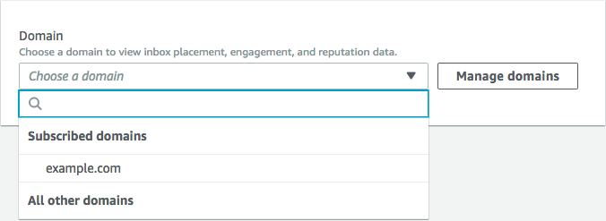
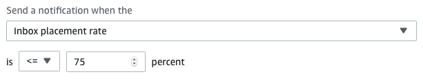
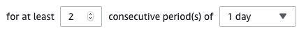
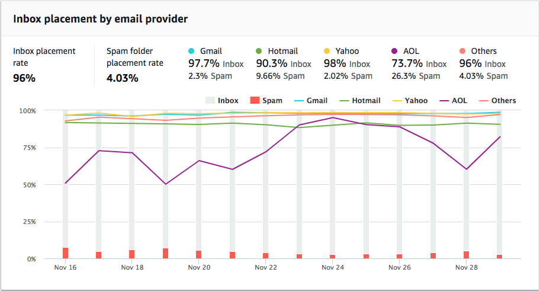

**End of support notice:** On October
30, 2026, AWS will end support for Amazon Pinpoint. After October 30, 2026, you will no
longer be able to access the Amazon Pinpoint console or Amazon Pinpoint resources (endpoints,
segments, campaigns, journeys, and analytics). For more information, see [Amazon Pinpoint end of
support](../../../console/pinpoint/migration-guide.md "../../../console/pinpoint/migration-guide.md"). **Note:** APIs related to SMS, voice,
mobile push, OTP, and phone number validate are not impacted by this change and are
supported by AWS End User Messaging.

# Amazon Pinpoint domain reputation

page

The **Domain reputation** page contains information about the domains
that you use to send email, including their engagement rates, inbox placement rates, and
denylist activities.

Choose a domain from the **Domain** menu to see information about that
domain, as shown in the following image.

## Summary

This section contains information about the percentage of emails from a specific
domain that arrived in your customers' inboxes. It also provides information about the
percentage of emails that your customers engaged with by opening them or by clicking
links in them. Finally, it shows the number of denylists that the IP addresses
associated with the domain are on.

###### Note

The information in this section contains general guidance, as opposed to exact
metrics. If you need precise metrics related to the delivery of your mail and
engagement with it, we recommend that you set up [Streaming events with Amazon Pinpoint](analytics-streaming.md "analytics-streaming.md").

To view data in this section, choose a subscribed domain, as shown in the following
image. When you choose a domain, data appears in the **Summary**,
**Inbox placement by email provider**, and
**Denylist
activities** sections.

When you choose a domain and a date range, the **Deliverability
overview** section shows the following information:

- **Engagement rate** – The percentage of email sent from
  the selected domain that recipients opened or clicked links in. When determining
  whether to deliver your email to recipient's inboxes, many email providers
  (especially larger ones) consider how often recipients engaged with email sent
  from your domain in the past month or two. For this reason, you should try to
  maintain an engagement rate of at least 25%.
- **Inbox placement rate** – The percentage of email sent
  from the selected domain that arrived in recipients' inboxes. An inbox placement
  rate of around 80% is considered average.
- **Denylist activities** – The number of denylists that
  IP addresses associated with the domain appear on. To learn more about
  denylists, see [Denylist
  activities](#channels-email-deliverability-dashboard-domain-denylist "#channels-email-deliverability-dashboard-domain-denylist").

### Alarms

On the **Alarms** tab, you can create alarms that send you
notifications for any of the metrics in the **Summary**
section.

###### To create an alarm

1.  Open the Amazon Pinpoint console at
    [https://console.aws.amazon.com/pinpoint/](https://console.aws.amazon.com/pinpoint/ "https://console.aws.amazon.com/pinpoint/").
2.  In the navigation pane, choose **Deliverability dashboard**.
3.  On the **Alarms** tab, choose **Create
    alarm**.
4.  On the **Create alarm** page, do the following:
    1. For **Alarm name**, enter a name that helps you
       easily identify the alarm.
    2. For **Send notification when the**, choose one of
       the following options:
       - **Inbox placement rate** – When you
         choose this option, the alarm considers the inbox placement
         rate across all email providers.
       - **Inbox placement rate** – When you
         choose this option, the alarm considers the inbox placement
         rate for specific email providers, such as Gmail or Yahoo.
         When you choose this option, you also have to choose the
         email provider that the alarm applies to.

    3. Configure the values that cause the alarm to be triggered. For
       example, if you want to be notified when the inbox placement rate
       for your account is 75% or less, choose
       **<=**. Then enter a value of
       `75`, as shown in the following
       image.

     4. Specify the amount of time that has to elapse before the alarm is
    triggered. For example, you can configure the alarm so that it only
    sends a notification when the inbox placement rate goes below a
    certain rate and stays below that rate for more than two days. In
    this example, next to **for at least**, enter a
    value of `2`. Then, next to
    **consecutive period(s) of**, choose
    **1 day**, as shown in the following
    image.

     5. Under **Notification method**, choose one of the
    following options:

        * **Use an existing SNS topic** –
         Choose this option if you've already created an Amazon SNS topic
         and subscribed endpoints to it.
        * **Create a new topic** – Choose
         this option if you haven't yet created an Amazon SNS topic, or if
         you want to create a new topic.

        ###### Note

        When you create a new topic, you must subscribe one or
         more endpoints to it. For more information, see [Subscribing an Amazon SNS
         topic](../../../sns/latest/dg/sns-create-subscribe-endpoint-to-topic.md "../../../sns/latest/dg/sns-create-subscribe-endpoint-to-topic.md") in the
         *Amazon Simple Notification Service Developer Guide*.

    6. (Optional) You can choose or create more than one Amazon SNS topic. To
       add a topic, choose **Notify an additional SNS
       topic**.
    7. When you finish, choose **Create**.

## Inbox

placement by email provider

This section shows you how different email providers handled the email that was sent
from your domain during the selected time period. The email providers analyzed in this
section include Gmail, Hotmail, Yahoo, and AOL. This section also contains a category
called **Others**. This category includes internet service providers
and regional providers. When combined, the delivery metrics in this section represent a
vast majority of all consumer email sent worldwide.

This section includes average rates for inbox placement and spam folder placement for
each email provider. It also includes a chart, shown in the following image, that
displays the inbox placement rate for each provider for every day in the analysis
period. You can use the information in this chart to help identify campaigns that
resulted in poor delivery rates.

###### Note

You can use the date filter to choose a date range that contains up to 30
days.

## Denylist

activities

This section helps you to quickly identify denylist events that could impact the
delivery of emails sent from your domain. A _denylist_ is a list of
IP addresses that are suspected of sending unsolicited or malicious email. Different
denylist providers have different criteria for adding IP addresses to their lists, and
for removing ("delisting") IP addresses from their lists. Additionally, each email
provider uses a different denylist or set of denylists. Also, each provider weighs
denylisting events differently. If one of your dedicated IP addresses is listed in this
section, it doesn't necessarily mean that there will be any impact on the delivery of
your email.

If one of your dedicated IP addresses appears in this section, contact the
organization that manages the denylist, and request that your IP address be removed. The
following table includes a list of denylist operators that are considered in this
section, and includes links to their procedures for delisting an IP address.

| Denylist operator                   | Link to delisting procedures                                                                                                     |
| ----------------------------------- | -------------------------------------------------------------------------------------------------------------------------------- |
| Spamhaus                            | [Spamhaus website](https://www.spamhaus.org/lookup/ "https://www.spamhaus.org/lookup/")                                       |
| Barracuda                           | [Barracuda website](https://www.barracudacentral.org/rbl/removal-request "https://www.barracudacentral.org/rbl/removal-request") |
| Cloudmark Sender Intelligence (CSI) | [Cloudmark sender intelligence website](https://csi.cloudmark.com/en/reset/ "https://csi.cloudmark.com/en/reset/")            |
| LashBack                            | [LashBack website](https://blacklist.lashback.com/ "https://blacklist.lashback.com/")                                            |
| Passive Spam Block List (PSBL)      | [Passive spam block list website](https://psbl.org/remove "https://psbl.org/remove")                                          |
| SpamCop                             | [SpamCop website](https://www.spamcop.net/fom-serve/cache/298.html "https://www.spamcop.net/fom-serve/cache/298.html")        |

## Domain

authentication

This section contains information about the various methods that you can use to
authenticate your domains. To configure DKIM or SPF authentication for a domain, you
must add specific records to the DNS configuration for the domain. To view these
records, choose **View the DNS record**.

The procedures for updating the DNS records for a domain vary depending on which DNS
or web hosting provider that you use. See your provider's documentation for more
information about adding DNS records.
