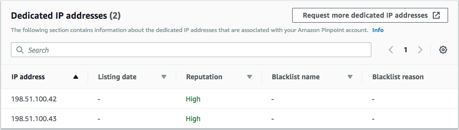
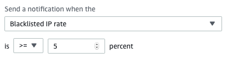
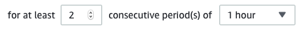

**End of support notice:** On October
30, 2026, AWS will end support for Amazon Pinpoint. After October 30, 2026, you will no
longer be able to access the Amazon Pinpoint console or Amazon Pinpoint resources (endpoints,
segments, campaigns, journeys, and analytics). For more information, see [Amazon Pinpoint end of
support](../../../console/pinpoint/migration-guide.md "../../../console/pinpoint/migration-guide.md"). **Note:** APIs related to SMS, voice,
mobile push, OTP, and phone number validate are not impacted by this change and are
supported by AWS End User Messaging.

# IP reputation

The **IP address reputation** page contains information about the
denylist activities for the dedicated IP addresses that you use to send email by using Amazon Pinpoint
and Amazon Simple Email Service (Amazon SES).

## Overview

The **Overview** tab lists every dedicated IP address that's
associated with your Amazon Pinpoint and Amazon SES accounts, as shown in the following image.

If the value in the **Reputation** column is
_High_, then there are no denylist activities that impact the
reputation of that IP address. If the IP address appears on a denylist, the name of that
denylist is shown in the
**Blacklist
name** column.

If one of your dedicated IP addresses appears in this section, contact the
organization that manages the denylist, and request that your IP address be removed. The
following table includes a list of denylist operators that are considered in this
section, and includes links to their procedures for delisting an IP address.

| Denylist operator              | Link to delisting procedures                                                                                                     |
| ------------------------------ | -------------------------------------------------------------------------------------------------------------------------------- | ------------------------------------------------------------------------------------------------------------------------------------------------------------------------------------------------------------------------------------------------------------------------------------------------------------------------------------------------------------------------------------------------------------------------------------------------------------------------------------------------------------------------------------------------------------------------------------------------------------------------------------------------------------------------------------------------------------------------------------------------------------------------------------------------------------------------------------------------------------------------------------------------------------------------------------------------------------------------------------------------------------------------------------------------------------------------------------------------------------------------------------------------------------------------------------------------------------------------------------------------------------------------------------------------------------------------------------------------------------------------------------------------------------------------------------------------------------------------------------------------------------------------------------------------------------------------------------------------------------------------------------------------------------------------------------------------------------------------------------------------------------------------------------------------------------------------------------------------------------------------------------------------------------------------------------------------------------------------------------------------------------------------------------------------------------------------------------------------------------------------------------------------------------------------------------------------------------------------------------------------------------------------------------------------------------------------------------------------------------------------------------------------------------------------------------------------------------------------------------ |
| Spamhaus                       | [Spamhaus website](https://check.spamhaus.org/ "https://check.spamhaus.org/")                                                    |
| Barracuda                      | [Barracuda website](https://www.barracudacentral.org/rbl/removal-request "https://www.barracudacentral.org/rbl/removal-request") |
| Invaluement                    | [Invaluement website](https://www.invaluement.com/removal/ "https://www.invaluement.com/removal/")                               |
| LashBack                       | [LashBack website](https://blacklist.lashback.com/ "https://blacklist.lashback.com/")                                            |
| Passive Spam Block List (PSBL) | [Passive spam block list website](https://psbl.org/remove "https://psbl.org/remove")                                             | ## Alarms On the **Alarms** tab, you can create alarms that send you notifications when your dedicated IPs are added to major denylists. ###### To create an alarm 1. Open the Amazon Pinpoint console at [https://console.aws.amazon.com/pinpoint/](https://console.aws.amazon.com/pinpoint/ "https://console.aws.amazon.com/pinpoint/"). 2. In the navigation pane, choose **Deliverability dashboard**. 3. On the **Alarms** tab, choose **Create alarm**. 4. On the **Create alarm** page, do the following: 1. For **Alarm name**, enter a name to help you identify the alarm. 2. Configure the values that cause the alarm to be triggered. For example, if you want to be notified when the denylisted IP rate for your account is 5% or greater, choose **>=**. Then enter a value of `5`, as shown in the following image.  3. Specify the amount of time that has to elapse before the alarm is triggered. For example, you can configure the alarm so that it only sends a notification when the denylisted IP rate exceeds a certain rate and stays at that rate for more than 2 hours. In this example, next to **for at least**, enter a value of `2`. Then, next to **consecutive period(s) of**, choose **1 hour**, as shown in the following image.  4. Under **Notification method**, choose one of the following options:  • **Use an existing SNS topic** – Choose this option if you've already created an Amazon SNS topic and subscribed endpoints to it.  • **Create a new topic** – Choose this option if you haven't yet created an Amazon SNS topic, or if you want to create a new topic. ###### Note When you create a new topic, you must subscribe one or more endpoints to it. For more information, see [Subscribing an Amazon SNS topic](../../../sns/latest/dg/sns-create-subscribe-endpoint-to-topic.md "../../../sns/latest/dg/sns-create-subscribe-endpoint-to-topic.md") in the _Amazon Simple Notification Service Developer Guide_. 5. (Optional) You can choose or create more than one Amazon SNS topic. To add a topic, choose **Notify an additional SNS topic**. 6. When you finish, choose **Create**. |
