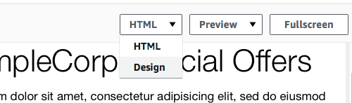

**End of support notice:** On October
30, 2026, AWS will end support for Amazon Pinpoint. After October 30, 2026, you will no
longer be able to access the Amazon Pinpoint console or Amazon Pinpoint resources (endpoints,
segments, campaigns, journeys, and analytics). For more information, see [Amazon Pinpoint end of
support](../../../console/pinpoint/migration-guide.md "../../../console/pinpoint/migration-guide.md"). **Note:** APIs related to SMS, voice,
mobile push, OTP, and phone number validate are not impacted by this change and are
supported by AWS End User Messaging.

# Create and schedule a

campaign

A _campaign_ is a messaging initiative that engages a specific audience
segment. A campaign sends tailored messages on the days and times that you specify. You can
use the console to create a campaign that sends messages through the email, push
notification, or SMS channels.

In this section, you create an email campaign. You create a new campaign, choose your
target segment, and create a responsive email message for the campaign. When you finish
setting up the message, you choose the day and time when you want the message to be
sent.

## Create the campaign and choose a

segment

When you create a segment, you first give the segment a name. Next, you choose the
segment that the campaign applies to. In this tutorial, you choose the segment that you
created in [Import the
sample customer data file](gettingstarted-import-customer-data.md#gettingstarted-import-customer-data-import-segment "gettingstarted-import-customer-data.md#gettingstarted-import-customer-data-import-segment").

###### To create the campaign and choose segment

1. In the Amazon Pinpoint console, in the navigation pane, choose
   **Campaigns**.
2. Choose **Create a campaign**.
3. Under **Campaign details**, for **Campaign
   name**, enter a name for the campaign.
4. For **Campaign type**, choose **Standard
   campaign**.
5. For **Choose a channel for this campaign**, choose
   **Email**.
6. Choose **Next**.
7. On the **Choose a segment** page, choose **Use an
   existing segment**. Then, for **Segment**, choose
   the targeted segment that you created in [Create
   a targeted segment](gettingstarted-import-customer-data.md#gettingstarted-import-customer-data-create-targeted-segment "gettingstarted-import-customer-data.md#gettingstarted-import-customer-data-create-targeted-segment"). Choose **Next**.

## Create the campaign

message

After you specify a campaign name and choose a segment, you can create your message.
This tutorial includes a link to an HTML file that you can use to create your
message.

This sample file uses responsive HTML to create a message that renders properly on
both computers and mobile devices. It uses inline CSS to provide compatibility with a
wide variety of email clients. It also includes tags that are used to personalize the
message with the recipient's name and other personal information.

###### To create the message

1. On the **Create your message** page, under **Message
   content**, choose **Create a new message**.
2. For **Subject**, enter a subject line for the email.
3. In a web browser, download the sample file from [the GitHub user content website](https://raw.githubusercontent.com/awsdocs/amazon-pinpoint-user-guide/main/examples/Pinpoint_Sample_Email.html "https://raw.githubusercontent.com/awsdocs/amazon-pinpoint-user-guide/main/examples/Pinpoint_Sample_Email.html"). Save the file to your
   computer.

###### Tip

You can quickly save this file to your computer by right-clicking the
link, and then choosing **Save Link As**. Otherwise, you
can click the link to open the HTML text in a browser tab. Keep the tab open
until you've completed Step 4. 4. Open the file that you just downloaded in a text editor, such as Notepad
(Windows) or TextEdit (macOS). If you opened the file in a browser tab then
select that tab. Press **Ctrl+A** (Windows) or
**Cmd+A** (macOS) to select all of the text. Then, press
**Ctrl+C** (Windows) or **Cmd+C** (macOS)
to copy it. 5. Under **Message**, erase the sample HTML code that's shown in
the editor. Paste the HTML code that you copied in the last step. 6. (Optional) Modify the content of the message to include a message that you
want to send.

You can personalize the message for each recipient by including the name of an
attribute inside two sets of curly braces. For example, the sample message
includes the following text: `{{User.UserAttributes.FirstName}}`.
This code represents the User.UserAttributes.FirstName attribute, which contains
the recipient's first name. When you send the campaign, Amazon Pinpoint removes this
attribute name and replaces it with the appropriate value for each
recipient.

You can experiment with other attribute names. Refer to the column headers in
the spreadsheet that you imported in [Import the
sample customer data file](gettingstarted-import-customer-data.md#gettingstarted-import-customer-data-import-segment "gettingstarted-import-customer-data.md#gettingstarted-import-customer-data-import-segment") for a complete list of attribute names that
you can specify in your message.

###### Tip

You can use Design view to edit the content of the message without having
to edit the HTML code. To use this view, choose **Design**
from the view selector above the message editor, as shown in the following
image.

 7. In **Email settings** for **Sender email address** choose the verified email address that you created while creating the project. 8. In **Send a test email** choose **A segment** and then
choose the segment you created from the dropdown list. 9. Choose **Next**.

## Schedule the campaign

The last step in creating the campaign is to choose when to send it. In Amazon Pinpoint, you can
set up your campaigns so that they're sent immediately after you launch them. You can
also schedule them to be sent in the future—anywhere from 15 minutes from the
current time, to six months into the future. Finally, you can schedule your messages to
be sent on a recurring basis (that is, hourly, daily, weekly, or monthly). Recurring
campaigns are a great way to send account or status updates where the appearance of the
campaign message stays the same over time, but is populated with information that
changes dynamically.

In this section, you schedule your campaign to be sent immediately after you launch
it.

###### To schedule the campaign

1. On the **Choose when to send the campaign** page, choose
   **At a specific time**. Then, under **Choose when
   the campaign should be sent**, choose
   **Immediately**. Finally, choose
   **Next**.
2. On the **Review and launch** page, review all of the details
   of the campaign. When you're ready to send it, choose **Launch
   campaign**.

Congratulations—you've created your first campaign with Amazon Pinpoint! Because you're the
only member of the segment that you created in [Create a targeted
segment](gettingstarted-import-customer-data.md#gettingstarted-import-customer-data-create-targeted-segment "gettingstarted-import-customer-data.md#gettingstarted-import-customer-data-create-targeted-segment"), you should receive the message in your inbox within a few
seconds.

**Next:**
[View campaign analytics](gettingstarted-analytics.md "gettingstarted-analytics.md")
