**End of support notice:** On October
30, 2026, AWS will end support for Amazon Pinpoint. After October 30, 2026, you will no
longer be able to access the Amazon Pinpoint console or Amazon Pinpoint resources (endpoints,
segments, campaigns, journeys, and analytics). For more information, see [Amazon Pinpoint end of
support](../../../console/pinpoint/migration-guide.md "../../../console/pinpoint/migration-guide.md"). **Note:** APIs related to SMS, voice,
mobile push, OTP, and phone number validate are not impacted by this change and are
supported by AWS End User Messaging.

# Add activities to the journey

Activities are the most important parts of any journey. Activities represent the steps
that are applied to journey participants. You can use activities to send messages to journey
participants across a variety of channels, or to split them into smaller groups, or to wait
for a period of time. There are several different types of activities that you can add to a
journey. This section provides basic information about adding activities to a journey. For
detailed information about setting up each type of activity, see [Setting up journey
activities](#journeys-add-activities-procedures "#journeys-add-activities-procedures").

###### Note

An exit journey element is added to the journey flow after reviewing and publishing
your journey.

## Setting up journey

activities

Each type of journey activity has separate components that you must configure. The
following sections provide additional information about setting up each type of
activity.

###### Topics in this section:

- [Set up an email
  activity](#journeys-add-activities-procedures-email "#journeys-add-activities-procedures-email")
- [Set up a push notification
  activity](#journeys-add-activities-procedures-push "#journeys-add-activities-procedures-push")
- [Set up an SMS message
  activity](#journeys-add-activities-procedures-sms "#journeys-add-activities-procedures-sms")
- [Set up a contact
  center activity](#journeys-add-activities-procedures-contact-center "#journeys-add-activities-procedures-contact-center")
- [Set up a custom message
  channel activity](#journeys-add-activities-procedures-custom "#journeys-add-activities-procedures-custom")
- [Set up a wait
  activity](#journeys-add-activities-procedures-wait "#journeys-add-activities-procedures-wait")
- [Set up a yes/no
  split activity](#journeys-add-activities-procedures-yes-no-split "#journeys-add-activities-procedures-yes-no-split")
- [Set up a
  multivariate split activity](#journeys-add-activities-procedures-multivariate-split "#journeys-add-activities-procedures-multivariate-split")
- [Set up a holdout
  activity](#journeys-add-activities-procedures-holdout "#journeys-add-activities-procedures-holdout")
- [Set up a random
  split activity](#journeys-add-activities-procedures-random-split "#journeys-add-activities-procedures-random-split")

### Set up an email

activity

When a journey participant arrives on a **Send email** activity,
Amazon Pinpoint sends them an email immediately. Before you can configure an email activity,
you must create an email template. For more information about creating email
templates, see [Creating email templates](message-templates-creating-email.md "message-templates-creating-email.md").

###### To set up an email activity

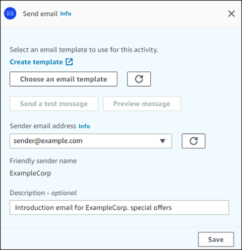

1. Choose **Add activity**.
2. For **Add an activity**, choose **Send an
   email**.
3. Under **Select an email template to use for this
   activity**, select **Choose an email
   template**, and then choose the email template for the message
   that you want participants to receive. Then, under **Template
   version behavior**, specify whether you want Amazon Pinpoint to
   automatically update the message to include any changes that you might make
   to the template before the message is sent. To learn more about these
   options, see [Managing versions of message templates](message-templates-versioning.md "message-templates-versioning.md").

###### Tip

You can send yourself a preview of the message, even if your Amazon Pinpoint
account doesn't contain an endpoint record for your email address. To
send a preview, choose **Send a test message**. 4. For **Sender email address**, choose the email address
that you want to send the message from. This list contains all the verified
email addresses for your Amazon Pinpoint account in the current AWS Region. For
information about verifying additional email addresses or domains, see [Verifying email identities](channels-email-manage-verify.md "channels-email-manage-verify.md").

###### Tip

To display a friendly sender name for the message, choose the default
email address for the project. A _friendly sender
name_ is the name that appears in participants' email
clients when they receive the message. To change the default email
address for the project or the friendly sender name for that address,
update the project's settings for the email channel. To do this, choose
**Settings** in the left navigation pane, and then
choose **Email**. Then, enter the settings that you
want. 5. (Optional) For **Description**, enter text that describes
the purpose of the activity. When you save the activity, this text appears
as its label. 6. When you finish, choose **Save**.

### Set up a push notification

activity

When a journey participant arrives on a **Send a push
notification** activity, Amazon Pinpoint sends them a push notification
immediately. Before you can configure a push notification activity, you must create
a push notification template. For more information about creating push notification
templates, see [Creating push notification
templates](message-templates-creating-push.md "message-templates-creating-push.md").

###### Note

To send push notifications to journey participants, your app must be
integrated with an AWS SDK. For more information, see [Handling Push Notifications](../developerguide/integrate-push.md "../developerguide/integrate-push.md") in
the _Amazon Pinpoint Developer Guide_.

###### To set up a push notification activity

1. Choose **Add activity**.
2. For **Add an activity**, choose **Send a push
   notification**.
3. Under **Choose a push notification template for this
   activity**, select **Choose a push notification
   template**, and then choose the push notification template for
   the message that you want participants to receive. Then, under
   **Template version behavior**, specify whether you want
   Amazon Pinpoint to use the template version that is currently designated as active or
   the template version that was active when the journey was created. To learn
   more about these options, see [Managing versions of message templates](message-templates-versioning.md "message-templates-versioning.md").

###### Tip

You can send yourself a preview of the message, even if your Amazon Pinpoint
account doesn't contain an endpoint ID or device token that you specify.
To send a preview, choose **Send a test
message**. 4. (Optional) For **Time to live**, specify whether you want
Amazon Pinpoint to use the default time to live (TTL) value or a custom value for each
push notification service. By default, Amazon Pinpoint uses the maximum TTL value of
each respective push notification service. You can also specify a custom TTL
value for all push notification services. If the message delivery fails, the
push notification service attempts to deliver the message for the amount of
time that you specify in this setting. For information about specific time
to live values, see [Messages](../apireference/apps-application-id-messages.md "../apireference/apps-application-id-messages.md") in
the _Amazon Pinpoint API Reference_. 5. (Optional) For **Description**, enter text that describes
the purpose of the activity. When you save the activity, this text appears
as its label. 6. When you finish, choose **Save**.

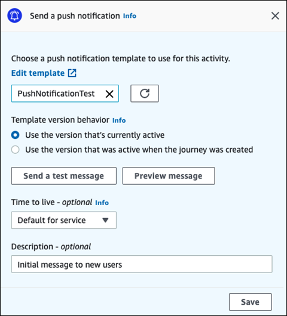

### Set up an SMS message

activity

When a journey participant arrives on a **Send an SMS message**
activity, Amazon Pinpoint sends them an SMS message immediately. Before you can configure an
SMS activity, you must create an SMS template. For more information about creating
SMS templates, see [Creating SMS templates](message-templates-creating-sms.md "message-templates-creating-sms.md").

###### To set up an SMS message activity

1. Choose **Add activity**.
2. For **Add an activity**, choose **Send an SMS
   message**.
3. Under **Choose an SMS message template for this
   activity**, select **Choose an SMS message
   template**, and then choose the SMS message template for the
   message that you want participants to receive. Then, under
   **Template version behavior**, specify whether you want
   Amazon Pinpoint to use the template version that's currently designated as active or
   the template version that was active when the journey was created. To learn
   more about these options, see [Managing versions of message templates](message-templates-versioning.md "message-templates-versioning.md").
4. Choose **Send a test message** if you want to first test
   this activity. Test messages don't count against your daily sending limits,
   but you are charged for each message. When sending a test message, you're
   prompted to optionally choose the origination number but required to choose
   a destination number.

###### Note

If your account is in the SMS sandbox, you can only send a test
message to one of your verified destination numbers. If the destination
number doesn't appear in the list, choose **Manage
numbers** to add that new number. For more information
about verifying destination numbers, see [SMS sandbox](../../../sms-voice/latest/userguide/sandbox.md#sandbox-sms "../../../sms-voice/latest/userguide/sandbox.md#sandbox-sms") in the _AWS End User Messaging SMS User Guide_. 5. For **Message type**, choose one of the following:

    * **Promotional** – Non-critical messages,
     such as marketing messages.
    * **Transactional** – Critical messages that
     support customer transactions, such as one-time passwords for
     multi-factor authentication.

6. (Optional) If necessary, expand the **Additional
   settings** section to configure optional SMS-related settings.
   The **Additional settings** section contains two
   tabs:
   - On the **SMS Settings** tab you can configure the
     following settings:
     - **Origination phone number** – The
       phone number that messages will be sent from. This list
       contains all of the dedicated phone numbers that are present
       in your Amazon Pinpoint account.
     - **Sender ID** – An alphanumeric ID
       that identifies the sender of the SMS message. The Sender ID
       appears on your recipients' devices only if the recipient is
       in a country where
       Sender IDs are supported. If you specify a Sender ID in a
       journey activity, it overrides the default value for your
       account. To learn more about which countries support Sender
       IDs, see [Supported countries and regions (SMS channel)](../../../sms-voice/latest/userguide/phone-numbers-sms-by-country.md "../../../sms-voice/latest/userguide/phone-numbers-sms-by-country.md") in the _AWS End User Messaging SMS User Guide_.

   ###### Note

   You only need to set one of these values. If you specify both
   values, Amazon Pinpoint attempts to send the message using the dedicated
   origination phone number.
   - On the **Regulatory Settings** tab, you can
     configure settings that apply specifically to sending messages to
     recipients in India. If you send messages to recipients in India,
     you must specify a Sender ID and both of the following
     values:
     - **Entity ID** – The ID that's
       associated with your company or brand, provided by TRAI
       during the Sender ID registration process.
     - **Template ID** – The ID that's
       associated with your message template. This value is also
       provided by TRAI during the Sender ID registration
       process.

   ###### Note

   If you don't send messages to recipients in India, or if you
   send messages to India using International Long-Distance
   Operator routes, you don't need to specify the **Entity
   ID** and **Template ID**
   values.

   For more information about the regulatory requirements for
   sending SMS messages to India, see [India sender ID registration process](../../../sms-voice/latest/userguide/registrations-sms-senderid-india.md "../../../sms-voice/latest/userguide/registrations-sms-senderid-india.md") in the _AWS End User Messaging SMS User Guide_.

7. (Optional) For **Description**, enter text that describes
   the purpose of the activity. When you save the activity, this text appears
   as its label.
8. When you finish, choose **Save**.

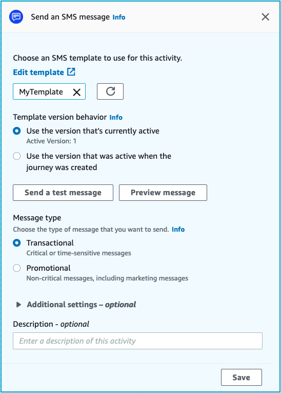

### Set up a contact

center activity

When a journey participant arrives on a **Send through a contact
center** activity, Amazon Pinpoint places them into an Amazon Connect outbound campaigns
(referred to in Amazon Pinpoint as an _Amazon Connect campaign_). You can configure
this activity type to dial the journey participant's phone number and either connect
them to an agent, or play a voice message.

Contact center activities behave differently when compared to other types of
journey activities. When a journey participant arrives on a **Send through a
contact center** activity, all of the preceding activities between the
contact center activity and previous messaging activity that involve a
**Multivariate split** or **Yes/no split**
activities are reevaluated immediately before the participant's phone number is
entered into the Amazon Connect queue to be dialed. If there is no messaging activity before
the contact center activity, then the journey entry criteria is also reevaluated.

The purpose of this reevaluation process is to make sure that the journey
participant still qualifies to receive a phone call at the moment the phone call is
queued. This behavior is useful because the participant's attributes could change
between the time when they arrive on the contact center activity and the time when
an agent becomes available to call them. This is the default behavior and can't be
turned off.

The journey reevaluation stores the evaluation result of the participant to be
dialed with a 10 second timer. A participant will be reevaluated once every 10
seconds and the results stored until the next reevaluation. This means that if the
time between an update and dial is less than 10 seconds, an evaluation may not occur
with the latest version of the participant.

For example, assume that a journey contains an entry step that adds members of a
specific segment into the journey, and a **Yes/no split** activity
that checks to see if the journey participant has completed a specific type of
transaction. In this scenario, the "yes" branch of the yes/no split (for
participants who complete the transaction) sends a follow-up email, while the "no"
branch (for participants who didn't complete the transaction) leads to a contact
center activity. Participants who arrive on the contact center activity remain there
until the call is queued successfully to Amazon Connect. When an agent becomes available, the
journey reevaluates the participant's attributes against the criteria in the journey
entry step and the yes/no split activity.

###### Important

Contact Center activities are not supported in event triggered journeys.

#### Prerequisites

Before you can add a contact center activity to a journey, you must do the
following:

- Create an Amazon Connect account and instance.
- Use Amazon AppIntegrations to enable high-volume outbound campaigns for your Amazon Connect
  instance.
- Enable your Amazon Connect instance for outbound calling.
- Create a dedicated outbound communications queue to handle any
  contacts that will be routed to agents because of the campaign. The
  queue must be assigned to the agent's routing profile.
- Create and publish a contact flow that includes a **Check call
  progress** block. This block enables you to branch based on
  whether a person answered the phone, for example, or a voice mail was
  detected.
- Make sure that the Amazon Connect queue you plan to use has an outbound number
  defined in the queue.
- In IAM, create a policy and role that allow Amazon Connect to send messages
  through Amazon Pinpoint.

###### Note

The **ResourceID** roles specified
for **ConnectCampaignExecutionRoleArn**
support IAM [service-roles](../../../IAM/latest/UserGuide/id_roles_terms-and-concepts.md#iam-term-service-role "../../../IAM/latest/UserGuide/id_roles_terms-and-concepts.md#iam-term-service-role") and [service-linked-roles](../../../IAM/latest/UserGuide/id_roles_terms-and-concepts.md#iam-term-service-linked-role "../../../IAM/latest/UserGuide/id_roles_terms-and-concepts.md#iam-term-service-linked-role"). For more
information, see [IAM identifiers](../../../IAM/latest/UserGuide/reference_identifiers.md "../../../IAM/latest/UserGuide/reference_identifiers.md") in the
_AWS Identity and Access Management User Guide_.

###### Important

Deletions or misconfiguration of IAM roles and resource access
policies for published journeys can cause Amazon Pinpoint to halt outbound
dials until the IAM configuration is reinstated with the original
set of roles, access policies, and permissions.

You can find procedures for completing these tasks in steps 1–5 of
[Make predictive and progressive calls using Amazon Connect outbound](https://aws.amazon.com/blogs/contact-center/make-predictive-and-progressive-calls-using-amazon-connect-high-volume-outbound-communications/ "https://aws.amazon.com/blogs/contact-center/make-predictive-and-progressive-calls-using-amazon-connect-high-volume-outbound-communications/") on the
AWS Contact Center blog.

#### Setting up a contact center activity

You can connect your journey to an existing Amazon Connect outbound campaign, or click
to build an Amazon Connect outbound campaign.

Note the following considerations when using contact center activities in
Amazon Pinpoint:

- You can only use three contact center activities in a Journey.
- You can only use one Amazon Connect campaign per journey. If a journey contains
  multiple contact center activities, and you change the Amazon Connect campaign
  for one activity, the change is reflected in all other contact center
  activities in the same journey.
- You can use a single Amazon Connect campaign in multiple journeys. Amazon Pinpoint shows
  a warning if the Amazon Connect campaign is already in use when you publish the
  journey.
- Your phone numbers of your customers must exist in Amazon Pinpoint as voice
  endpoints.
- Endpoint phone numbers must be in E.164 format. For more information,
  see [E.164: The
  international public telecommunication numbering plan](https://www.itu.int/rec/T-REC-E.164/en "https://www.itu.int/rec/T-REC-E.164/en") on the
  International Telecommunications Union website.

##### Using an existing Amazon Connect campaign

1. Choose **Add activity**.
2. For **Add an activity**, choose **Send
   through a contact center**.
3. Choose the **Amazon Connect instance** that you want to
   use.
4. Choose the **Amazon Connect outbound campaign** from the
   dropdown list.
5. (Optional) You can choose **Build an Amazon Connect outbound
   campaign**, which directs you to Amazon Connect.
6. For **IAM role**, complete one of the following
   steps:
   1. If you want to have Amazon Pinpoint create a role that allows it to
      pass phone numbers to Amazon Connect, select **Automatically
      create a role**. Then, for IAM role, enter a
      unique name for the new role that you're creating.
   2. If you've already created an IAM role that allows Amazon Pinpoint
      to pass phone numbers to Amazon Connect, select **Choose an
      existing role**. Then, for IAM role, select a
      role that contains the appropriate permissions.

7. (Optional) In **Description**, describe the
   purpose of the activity. When you save the activity, this text
   appears as the activity's label.
8. When you finish, choose **Save**.

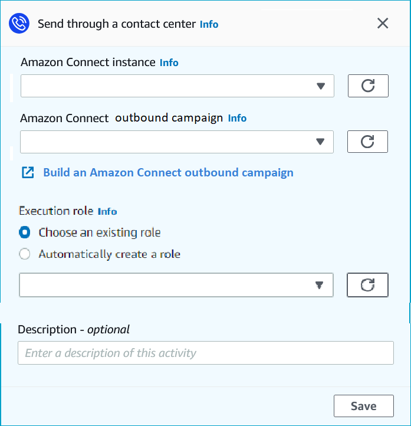

### Set up a custom message

channel activity

When a journey participant arrives on a **Send through a custom
channel** activity, Amazon Pinpoint sends information about the participant to an
AWS Lambda function or webhook. You can use a custom channel to send messages to
your customers through any service that has an API, including non-AWS
services.

Before you can configure a custom channel activity, you must decide whether to use
a Lambda function or a webhook URL to send your message. For more information about
creating custom message channels, see [Creating custom channels in Amazon Pinpoint](../developerguide/channels-custom.md "../developerguide/channels-custom.md") in the
_Amazon Pinpoint Developer Guide_.

###### To set up a custom message channel activity that calls a Lambda

function

1. Choose **Add activity**.
2. For **Add an activity**, choose **Send through a
   custom channel**.
3. For **Choose the method that you want to use to send
   messages**, select **Execute a Lambda
   function**.
4. For **Lambda function**, choose the function that you
   want to execute.
5. (Optional) The **Custom Data** is for when endpoints are
   delivered to the custom channel, the custom data is in the payload as well.
   This field can contain up to 5,000 alphanumeric characters.
6. For **Specify the endpoint types that will receive this
   message**, select the endpoint types that the custom channel
   applies to. By default, only the **Custom** endpoint type
   is selected. To add additional endpoint types, select **Choose
   endpoint types**.
   1. The Lambda function can be used to evaluate which endpoints to
      include in the segment. For more information, see [Customizing segments with AWS Lambda](../developerguide/segments-dynamic.md "../developerguide/segments-dynamic.md").
   2. The **Custom Data** is for when endpoints are
      delivered to the custom channel, the custom data is in the payload
      as well.###### Note

Other endpoint types that arrive at this activity are sent through it,
but only the endpoint types that you specify are sent to the Lambda
function or webhook. 7. (Optional) For **Description**, enter text that describes
the purpose of the activity. When you save the activity, this text appears
as its label. 8. When you finish, choose **Save**.

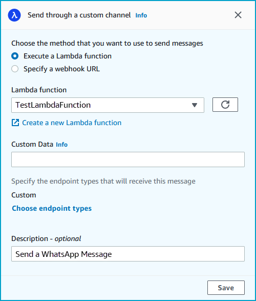

###### To set up a custom message channel activity that uses a webhook URL

1. Choose **Add activity**.
2. For **Add an activity**, choose **Send through a
   custom channel**.
3. For **Choose the method that you want to use to send
   messages**, select **Specify a webhook
   URL**.
4. For **Webhook URL**, enter the address of the webhook
   that you want to execute. For more information about configuring webhooks,
   see [Creating custom channels
   in Amazon Pinpoint](../developerguide/channels-custom.md "../developerguide/channels-custom.md") in the _Amazon Pinpoint Developer Guide_.
5. (Optional) The Custom Data is for when endpoints are delivered to the
   custom channel, the custom data is in the payload as well. This field can
   contain up to 5,000 alphanumeric characters.
6. For **Specify the endpoint types that will receive this
   message**, select the endpoint types that the custom channel
   applies to. By default, only the **Custom** endpoint type
   is selected. To add additional endpoint types, select **Choose
   endpoint types**.

###### Note

Other endpoint types that arrive at this activity are sent through it,
but only the endpoint types that you specify are sent to the Lambda
function or webhook. 7. (Optional) For **Description**, enter text that describes
the purpose of the activity. When you save the activity, this text appears
as its label. 8. When you finish, choose **Save**.

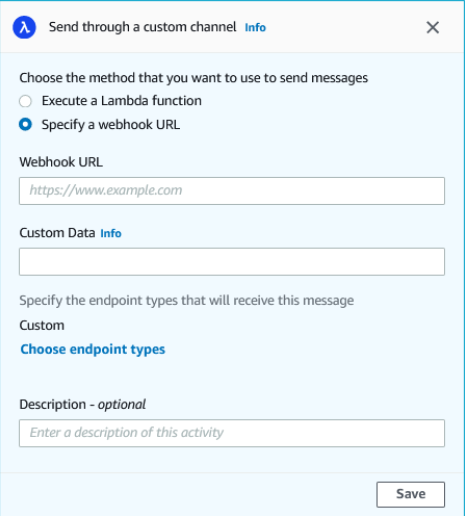

### Set up a wait

activity

When a journey participant arrives on a **Wait** activity, they
remain on that activity for a certain period of time or until a specific date and
time. This type of activity is a useful way to schedule the sending of
time-sensitive communications, or to give customers time to interact with messages
that you sent earlier in the journey.

###### To set up a wait activity

1. Choose **Add activity**.
2. For **Add an activity**, choose
   **Wait**.
3. Choose one of the following options:
   - **For a period of time** – Choose this
     option if you want journey participants to remain on this activity
     for a certain amount of time. Then, enter the amount of time that
     you want journey participants to wait on this activity before they
     proceed to the next activity. You can specify a value that's as
     short as 1 hour or as long as 365 days.
   - **Until a specific date** – Choose this
     option if you want journey participants to remain on this activity
     until a specific date and time. Then, enter the date and time when
     journey participants should move to the next activity. You can
     choose any date and time that precedes the end date of the
     journey.

4. (Optional) For **Description**, enter text that describes
   the purpose of the activity. When you save the activity, this text appears
   as its label.
5. When you finish, choose **Save**.

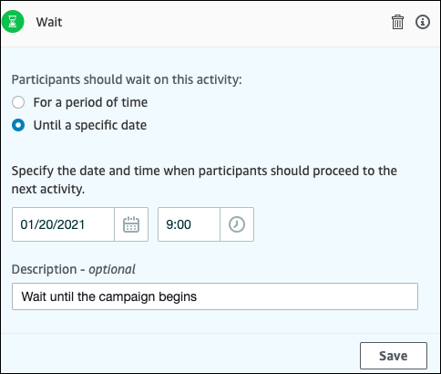

### Set up a yes/no

split activity

When journey participants arrive on a **yes/no split** activity,
they're sent down one of two paths based on their attributes or behaviors. You can
use this type of split activity to send journey participants down separate paths
based on their membership in a segment. You can also send participants down separate
paths based on their interactions with other journey activities. For example, you
can divide journey participants based on whether they opened an email that was sent
earlier in the journey.

###### Note

To create split activities that send participants down different paths based
on push notification events (such as Open or Received events), your mobile app
has to specify the User ID and Endpoint ID values. For more information, see
[Integrating Amazon Pinpoint with your
application](../developerguide/integrate.md "../developerguide/integrate.md") in the _Amazon Pinpoint Developer Guide_.

If the Journey segment is at the user-level, with user_id in the data and the
criteria used for evaluating a conditional split is an endpoint attribute, Amazon Pinpoint
processes the journey attributes using a logical OR between the attribute values for
the different endpoints of the user. For example, if a single user has multiple
endpoints, and if any of these endpoints had the criteria satisfied, all endpoints
linked to that user would be grouped together and evaluated as a ‘Yes’, and would go
down the ‘Yes’ branch of a Yes/No split activity.

###### To set up a yes/no split activity

1.  Choose **Add activity**.
2.  For **Add an activity**, choose **Yes/no
    split**.
3.  For **Select a condition type**, choose one of the
    following options:
    - **Segment** – Choose this option to send
      all members of the chosen segment down the "Yes" path. Then, for
      **Segments**, choose a segment.
    - **Event** – Choose this option to send
      users down the "Yes" path based on their interactions with a
      previous step in this journey. Then, complete the following
      steps:
      1. For **Events**, select the messaging
         activity you want to split on:
      2. For **Choose an activity**, choose the
         message activity that the split should be applied to.
         Depending on the channel type of messaging activity you
         select you will have the following options on split
         on:
         - For **Email** here are the events
           you can select.
           - **Send** – Amazon Pinpoint accepted the
             message and will attempt to deliver it.
           - **Delivered** – The message
             was successfully delivered to the recipient.
           - **Rejected** – Amazon Pinpoint rejected
             the message because it contained a virus or malware.
           - **Hard bounce** – The email
             wasn't delivered to the recipient because of a permanent
             issue. For example, the recipient's email address might not
             exist anymore. When a message generates a hard bounce, Amazon Pinpoint
             doesn't attempt to re-deliver it.
           - **Soft bounce** – The email
             wasn't delivered to the recipient because of a temporary
             issue. For example, the recipient's inbox could be full, or
             their email provider might be experiencing a temporary
             issue. When a soft bounce occurs, Amazon Pinpoint attempts to
             re-deliver the message for a certain period of time. If the
             message still can't be delivered, the message becomes a hard
             bounce.
           - **Complaint** – The recipient
             received the email, but used the "Report spam" or similar
             button in their email client to report the message as
             unwanted.

           ###### Note

           Amazon Pinpoint relies on complaint reports from email providers
           to generate complaint events. Some email providers give
           us these reports on a regular basis, while others send
           them infrequently.
           - **Open** – The recipient
             received the email and opened it.

           ###### Note

           For Amazon Pinpoint to capture an **Email
           open** event, the recipient's email client
           has to download the images contained in the message.
           Many common email clients, such as Microsoft Outlook,
           don't download email images by default.
           - **Click** – The recipient
             received the email and followed one of the links contained
             in the body of the message.
           - **Unsubscribe** – The
             recipient received the email and used the "Unsubscribe" link
             to opt out of future messages.

         - For **SMS**, here are the events
           you can select.
           - **Send** – Amazon Pinpoint
             attempted to send the message.
           - **Delivered** – Amazon Pinpoint
             received a confirmation that the message was
             delivered.
           - **Failed** – An error
             occurred when delivering the message to the
             endpoint address.
           - **Opt-out** – The
             user who's associated with the endpoint address
             has opted out of receiving messages from you.

         - For **Push**, here are the events
           you can select.
           - **Send** – Amazon Pinpoint
             attempted to send the message.
           - **Opened notification**
             – Amazon Pinpoint received a confirmation that the
             message was opened by the user.
           - **Received foreground**
             – Amazon Pinpoint received a confirmation that the
             message was received by the users device and
             displayed in the foreground.
           - **Received background**
             – Amazon Pinpoint received a confirmation that the
             message was received by the users device and
             displayed in the background.

         - For **Contact Center**, here are
           the events you can select.
           - **Connected** – Amazon Pinpoint
             received a confirmation that the call was
             connected to an agent.
           - **SIT tone** – Amazon Pinpoint
             received a response that the call gave back a busy
             tone.
           - **Fax** – Amazon Pinpoint
             received a response that the call gave back a fax
             tone.
           - **Voicemail beep** –
             Amazon Pinpoint received a response that the call gave back
             a voicemail with beep.
           - **Voicemail no beep**
             – Amazon Pinpoint received a response that the call
             gave back a voicemail without beep.
           - **Not answered** –
             Amazon Pinpoint received a response that the call was not
             answered and rang out without a voicemail.

         - **Custom channel** – For
           the custom channel activity you can define the
           response attribute and value you would like to split
           on. Make sure that this attribute and value is
           passed back to Amazon Pinpoint journeys in a way that can be
           read. For more information about how this response
           should be structured, see [Creating custom
           channels](../developerguide/channels-custom.md "../developerguide/channels-custom.md") in Amazon Pinpoint in the Amazon Pinpoint Developer
           Guide.

      3. ###### Note

      (Optional) For custom channel activities you can split
      based on the **Call to a function or webhook
      response**. To configure this, can you
      define:

          + **Attribute** – The
           name of the attribute to evaluate.
          + **Value** – The value
           used to determine in which way to split.

4.  For **Condition evaluation**, choose when Amazon Pinpoint should
    evaluate the condition. You can choose from the following options:
    - **Evaluate immediately** – If you choose
      this option, Amazon Pinpoint checks to see if the event condition that you
      specified has been met the moment when the journey participant
      arrives on the activity.
    - **Evaluate after** – If you choose this
      option, Amazon Pinpoint waits for a specified period of time. After the
      specified period of time has elapsed, Amazon Pinpoint checks to see if the
      event condition that you specified has been met.
    - **Evaluate on** – If you choose this
      option, Amazon Pinpoint waits until a specific date and time. When that date
      and time arrives, Amazon Pinpoint checks to see if the event condition that
      you specified has been met.

5.  (Optional) For **Description**, enter text that describes
    the purpose of the activity. When you save the activity, this text appears
    as its label.
6.  When you finish, choose **Save**.

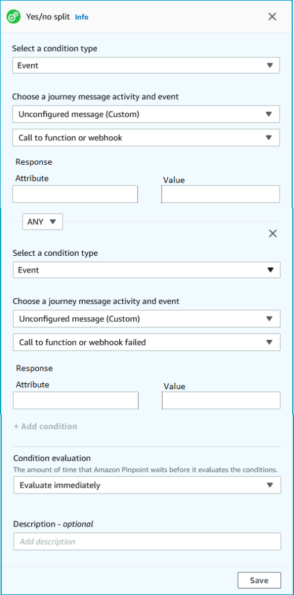

### Set up a

multivariate split activity

When journey participants arrive on a **Multivariate split**
activity, they're sent down one of several paths based on their attributes or
behaviors. This type of split is similar to a yes/no split. The advantage of using a
multivariate split activity is that it can evaluate more than one condition.
Additionally, every multivariate split activity contains an "Else" path. Journey
participants who don't meet any of the conditions that you specified in other paths
are automatically sent down the "Else" path.

You can use this type of split to send journey participants down separate paths
based on their membership in a segment. You can also send participants down separate
paths based on their interactions with other journey activities. For example, you
can divide journey participants based on whether they opened an email that was sent
earlier in the journey.

###### Note

If a journey participant meets more than one condition in a conditional split,
they are sent down the first condition that they meet, in alphabetical order.
For example, if a participant meets the conditions in Branch A and Branch D,
they're sent down the path that corresponds with Branch A.

To create split activities that send participants down different paths based
on push notification events (such as Open or Received events), your mobile app
has to specify the User ID and Endpoint ID values. For more information, see
[Integrating Amazon Pinpoint with your
application](../developerguide/integrate.md "../developerguide/integrate.md") in the _Amazon Pinpoint Developer Guide_.

If the Journey segment is at the user-level, with user_id in the data and the
criteria used for evaluating a conditional split is an endpoint attribute, Amazon Pinpoint
processes the journey attributes using a logical OR between the attribute values for
the different endpoints of the user. For example, if a single user has multiple
endpoints, and if any of these endpoints had the criteria satisfied, all endpoints
linked to that user would be grouped together and evaluated as a ‘Yes’, and would go
down the ‘Yes’ branch of a Yes/No split activity.

###### To set up a multivariate split activity

1.  Choose **Add activity**.
2.  For **Add an activity**, choose **Multivariate
    split**.
3.  Determine how many different paths (branches) you want to create. Choose
    **Add another branch** to create additional
    paths.
4.  On each branch, for **Select a condition type**, choose
    one of the following options:

        * **Segment** – Choose this option to send
         all members of the chosen segment down the path. Then, for
         **Segments**, choose a segment.
        * **Event** – Choose this option to send
         users down the path based on their interactions with a previous step
         in this journey. Then, complete the following steps:

        	1. For **Events**, select the messaging
        	 activity you would like to split on.
        	2. For **Choose an activity**, choose the
        	 message activity that the split should be applied to.
        	 Depending on the channel type of messaging activity you
        	 select you will have the following options on split
        	 on:

        		+ For **Email**, here are the
        		 events you can select.

        			- **Send** – Amazon Pinpoint accepted the
        			 message and will attempt to deliver it.
        			- **Delivered** – The message
        			 was successfully delivered to the recipient.
        			- **Rejected** – Amazon Pinpoint rejected
        			 the message because it contained a virus or malware.
        			- **Hard bounce** – The email
        			 wasn't delivered to the recipient because of a permanent
        			 issue. For example, the recipient's email address might not
        			 exist anymore. When a message generates a hard bounce, Amazon Pinpoint
        			 doesn't attempt to re-deliver it.
        			- **Soft bounce** – The email
        			 wasn't delivered to the recipient because of a temporary
        			 issue. For example, the recipient's inbox could be full, or
        			 their email provider might be experiencing a temporary
        			 issue. When a soft bounce occurs, Amazon Pinpoint attempts to
        			 re-deliver the message for a certain period of time. If the
        			 message still can't be delivered, the message becomes a hard
        			 bounce.
        			- **Complaint** – The recipient
        			 received the email, but used the "Report spam" or similar
        			 button in their email client to report the message as
        			 unwanted.

        			###### Note

        			Amazon Pinpoint relies on complaint reports from email providers
        			 to generate complaint events. Some email providers give
        			 us these reports on a regular basis, while others send
        			 them infrequently.
        			- **Open** – The recipient
        			 received the email and opened it.

        			###### Note

        			For Amazon Pinpoint to capture an **Email
        			 open** event, the recipient's email client
        			 has to download the images contained in the message.
        			 Many common email clients, such as Microsoft Outlook,
        			 don't download email images by default.
        			- **Click** – The recipient
        			 received the email and followed one of the links contained
        			 in the body of the message.
        			- **Unsubscribe** – The
        			 recipient received the email and used the "Unsubscribe" link
        			 to opt out of future messages.
        		+ For **SMS**, here are the events
        		 you can select.

        			- **Send** – Amazon Pinpoint
        			 attempted to send the message.
        			- **Delivered** – Amazon Pinpoint
        			 received a confirmation that the message was
        			 delivered.
        			- **Failed** – An error
        			 occurred when delivering the message to the
        			 endpoint address.
        			- **Opt-out** – The
        			 user who's associated with the endpoint address
        			 has opted out of receiving messages from you.
        		+ For **Push**, here are the events
        		 you can select.

        			- **Send** – Amazon Pinpoint
        			 attempted to send the message.
        			- **Opened notification**
        			 – Amazon Pinpoint received a confirmation that the
        			 message was opened by the user.
        			- **Received foreground**
        			 – Amazon Pinpoint received a confirmation that the
        			 message was received by the users device and
        			 displayed in the foreground.
        			- **Received background**
        			 – Amazon Pinpoint received a confirmation that the
        			 message was received by the users device and
        			 displayed in the background.
        		+ For **Contact Center**, here are
        		 the events you can select.

        			- **Connected** – Amazon Pinpoint
        			 received a confirmation that the call was
        			 connected to an agent.
        			- **SIT tone** – Amazon Pinpoint
        			 received a response that the call gave back a busy
        			 tone.
        			- **Fax** – Amazon Pinpoint
        			 received a response that the call gave back a fax
        			 tone.
        			- **Voicemail beep** –
        			 Amazon Pinpoint received a response that the call gave back
        			 a voicemail with beep.
        			- **Voicemail no beep**
        			 – Amazon Pinpoint received a response that the call
        			 gave back a voicemail without beep.
        			- **Not answered** –
        			 Amazon Pinpoint received a response that the call was not
        			 answered and rang out without a voicemail.
        		+ **Custom channel** – For
        		 the custom channel activity you can define the
        		 response attribute and value you would like to split
        		 on. Make sure that this attribute and value is
        		 passed back to Amazon Pinpoint journeys in a way that can be
        		 read. For more information about how this response
        		 should be structured, see [Creating custom
        		 channels](../developerguide/channels-custom.md "../developerguide/channels-custom.md") in Amazon Pinpoint in the Amazon Pinpoint Developer
        		 Guide.
        	3. For **Choose a journey message activity and
        	 event** choose Call to a function or webhook
        	 response.

        		+ **Attribute** – The name of
        		 the attribute to evaluate.
        		+ **Value** – The value used
        		 to determine which branch to traverse for the
        		 path.

    Repeat this step for each path in the activity.

5.  For **Condition evaluation**, choose when Amazon Pinpoint should
    evaluate the condition. You can choose from the following options:
    - **Evaluate immediately** – If you choose
      this option, Amazon Pinpoint checks to see if the event condition that you
      specified has been met at the moment the journey participant arrives
      on the activity.
    - **Evaluate after** – If you choose this
      option, Amazon Pinpoint waits for a specified period of time. After the
      specified period of time has elapsed, Amazon Pinpoint checks to see if the
      event condition that you specified has been met.
    - **Evaluate on** – If you choose this
      option, Amazon Pinpoint waits until a specific date and time. When that date
      and time arrives, Amazon Pinpoint checks to see if the event condition that
      you specified has been met.

6.  (Optional) For **Description**, enter text that describes
    the purpose of the activity. When you save the activity, this text appears
    as its label.
7.  When you finish, choose **Save**.

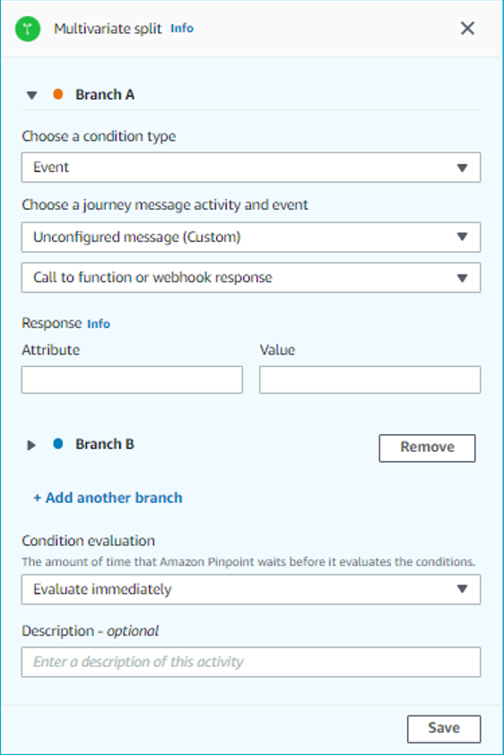

### Set up a holdout

activity

When journey participants arrive on a **Holdout** activity, the
journey ends for a random selection of participants. You can specify the percentage
of total journey participants who are held out. Holdout activities can help you
measure the impact of a journey by creating a control group that doesn't receive
your messages. When a journey finishes running, you can compare the behaviors of the
users who participated in the journey against those who were part of the control
group.

###### Note

Amazon Pinpoint uses a probability-based algorithm to determine which journey
participants are held out. The percentage of journey participants who are held
out will be very close to the percentage that you specify, but it might not be
perfectly equal.

###### To set up a holdout activity

1. Choose **Add activity**.
2. For **Add an activity**, choose
   **Holdout**.
3. For **Holdout percentage**, enter the percentage of
   journey participants who should be prevented from proceeding to the next
   activity in the journey.
4. (Optional) For **Description**, enter text that describes
   the purpose of the activity. When you save the activity, this text appears
   as its label.
5. When you finish, choose **Save**.

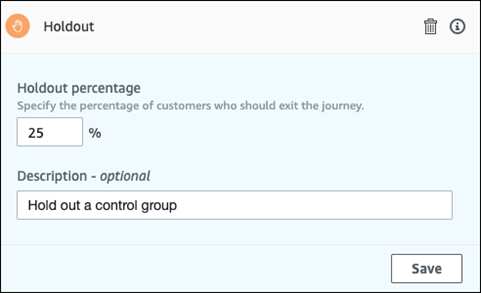

### Set up a random

split activity

When journey participants arrive on a **Random split** activity,
they're randomly sent down one of up to five paths. You can create two to five
separate paths for this type of activity. This type of activity is useful when you
want to measure the effectiveness of different message variants.

###### Note

Amazon Pinpoint uses a probability-based algorithm to determine which journey
participants are sent down each path in a random split activity. The percentages
of journey participants who are sent down each path will be very close to the
percentages that you specify, but they might not be perfectly equal.

###### To set up a random split activity

1. Choose **Add activity**.
2. For **Add an activity**, choose **Random
   split**.
3. Determine how many different paths (branches) you want to create. Choose
   **Add another branch** to create each additional
   path.
4. In the field next to each branch, enter the percentage of journey
   participants who should be sent down that branch. The values that you
   specify have to be positive numbers, and they can't contain decimals. The
   sum of the values that you enter across all branches has to equal exactly
   100%.
5. (Optional) For **Description**, enter text that describes
   the purpose of the activity. When you save the activity, this text appears
   as its label.
6. When you finish, choose **Save**.

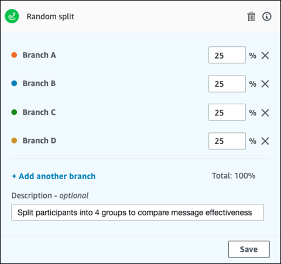

**Next**: [Review and test a journey](journeys-review-test.md "journeys-review-test.md")
