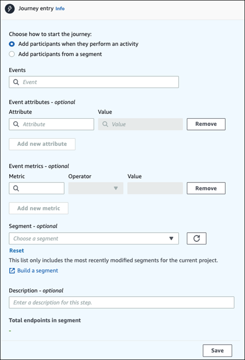
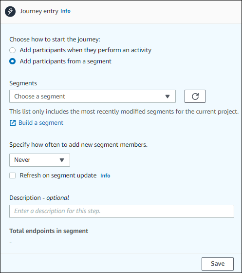
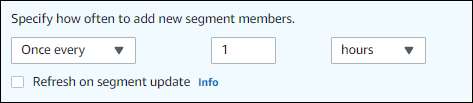

**End of support notice:** On October
30, 2026, AWS will end support for Amazon Pinpoint. After October 30, 2026, you will no
longer be able to access the Amazon Pinpoint console or Amazon Pinpoint resources (endpoints,
segments, campaigns, journeys, and analytics). For more information, see [Amazon Pinpoint end of
support](../../../console/pinpoint/migration-guide.md "../../../console/pinpoint/migration-guide.md"). **Note:** APIs related to SMS, voice,
mobile push, OTP, and phone number validate are not impacted by this change and are
supported by AWS End User Messaging.

# Set up the journey entry activity

After you create and configure the journey, you must configure the _Journey
entry_ activity. This activity determines how participants are added to the
journey. There are two ways to add participants to a journey:

- **When an event occurs** – You can configure
  the journey so that participants are inserted into a journey dynamically, when
  specific events occur. For example, you can use this option to add participants to a
  journey when they complete a sign-up workflow. For more information, see [Add participants when they
  perform an activity](#journeys-entry-activity-event-triggered "#journeys-entry-activity-event-triggered").

###### Important

Contact Center activities aren't supported in event triggered journeys.

- **Based on segment membership** – You can
  insert the members of an existing segment directly into the journey. The journey can
  be configured to periodically re-evaluate the segment to determine if there are new
  segment members to add. For more information, see [Add participants from a
  segment](#journeys-entry-activity-segment-based "#journeys-entry-activity-segment-based").

###### Note

_Participant_ refers to either a user and their endpoints or individual
endpoints, depending on the data. If the journey entry segment
consists of user-level data (user_id), then the _participant_ is the
user and all the endpoints associated with the user progress through the journey
together. If the journey entry segment consists of endpoint-level data (no user_id),
then the _participant_ is the individual endpoints.

## Add participants when they

perform an activity

This event-triggered journey type adds participants based on a chosen event. You
choose an event, such as music downloads, and then choose the event attributes to
further define the journey event. This might be downloading music from a specific
artist. When a user performs any of the activities described by the event, they become
participants in the journey.

**To add participants when they perform an activity**

1. Choose **Add participants when they perform an activity** if
   it's not already chosen.

 2. For **Events**, choose an event from a list of
events or type a new event to add it. For example, you might want to trigger a
journey when a user downloads a particular artist from your music service. Let's
call this event `artist.download`. A journey can
include only one event.

Events can be submitted by using any of the following:

    * The PutEvents API. See [Events](../apireference/apps-application-id-events.md "../apireference/apps-application-id-events.md")  in the Amazon Pinpoint API Reference
    * AWS Mobile SDK for Android: version 2.7.2 or later
    * AWS Mobile SDK for iOS: version 2.6.30 or later

    ###### Note

    If you're using either of the AWS Mobile SDKs you will be
     limited to a set of events. For the list of supported events, see
     [App events](../developerguide/event-streams-data-app.md "../developerguide/event-streams-data-app.md")  in the Amazon Pinpoint Developer Guide.

3. (Optional) An event attribute is a specific piece of information used to
   refine an event. It's composed of an attribute name and a value. We'll narrow
   down the `artist.download` by adding an
   `artistName` attribute For **Attribute**, choose the attribute from the list. Because you want
   to add participants based on specific a specific artist, you'd choose
   `artistName` as the **Attribute**, and then choose a specific artist for the **Value** – for example, `Bruce
Springsteen`. Your journey event now adds any participants from
   the `artist.download` event and the
   `artistName` is `Bruce
Springsteen`.

If you want to refine the journey even further, add additional attributes and
values by choosing **Add new attribute** for each
attribute that you want to add. If an attribute has multiple possible values,
you must add each attribute and value pair separately. For
`artist.download` event, you can now add in an
additional `artistName` attribute, `Alicia
 Keys`. Choose **Add new
attribute**, again choose `artistName` as
the attribute, and then choose `Alicia Keys` for the
**Value**. When you use the same attribute
multiple times with different values, Amazon Pinpoint processes the journey attributes
using "or" between the values. Your journey event now adds any participants from
the `artist.download` event, and the
`artistName` is either `Bruce
 Springsteen` or `Alicia Keys`.

You can add a combination of attributes with multiple values in addition to
attributes with only a single value. 4. (Optional) Choose an event **Metric**. This is an
event that typically uses a range of numbers, such as a duration or a cost.
After entering the event, choose an **Operator**:

    * **is equal to**
    * **is greater than**
    * **is less than**
    * **is greater than or equal to**
    * **is less than or equal to**

Enter the **Value** for the operator. Only
numeric values are supported. Participants are added based on the metric,
operator, and value. For the `artist.download` event
you might add a `songLength` metric where you add
participants when they download any song by either `Bruce
 Springsteen` or `Alicia Keys` and
where the `songLength` is greater than or equal to
`500 seconds`.

###### Note

You can't use the same metric with multiple values. 5. (Optional) Select the dynamic segment to use for the journey. You can have
only one previously defined segment per journey entry. In addition, for any
endpoint to enter into the journey, that endpoint must be part of the chosen
segment. If you want to build a new segment for this journey, you can build that
segment through the Amazon Pinpoint console. For more information about segments, see
[Building
segments](segments-building.md "segments-building.md").

###### Note

Imported segments and dynamic segments based on an imported segment aren't
supported. The dropdown list indicates the type of segment. While a segment
displayed in the dropdown list might indicate that it's dynamic, if it's
based on an imported segment, you will get an error. 6. (Optional) For **Description**, enter text that describes the
activity. When you save the activity, this text appears as its label. 7. Choose **Save**.

## Add participants from a

segment

For this type of journey, you choose a segment to participate in the journey. You can
optionally configure the Journey entry activity to add new journey participants by
periodically searching for new segment members.

**To add participants from a segment**

1. Choose **Add participants from a segment**.

 2. For **Segments**, choose the segment that you
want to add to a journey.

###### Tip

You can include only one segment in the **Journey
entry** activity. If you need to add more segments, you can
create a new segment that includes all of the segments that you want to add
to the journey. Then, later in the journey, you can use a multivariate split
activity to divide journey participants into separate groups based on their
segment membership. 3. (Optional) For **Specify how often to add new segment
members**, choose how often the segment membership should be
evaluated and refreshed. You can choose **Never**, or you can
choose to check on a schedule. For example, if you choose **Once every
12 hours**, Amazon Pinpoint checks for new segment members every 12 hours. If
new segment members are found during one of these checks, they are added to the
journey. Existing endpoints are also re-evaluated. If the **Maximum
entries per interval** is greater than 1, then existing endpoints
also re-enter the journey.

You can also optionally choose **Refresh on segment update**.
If you enable this feature, new endpoints are added to the journey when the
segment is updated. For this feature to work as expected, you must also choose a
refresh interval.

The following table describes how changes to segment membership are handled in
various situations.

| Refresh interval        | Status of **Refresh on segment update** option | Behavior                                                                                                                                                                                                                                                                                                                                                                                                                                                                                                          |
| ----------------------- | ---------------------------------------------- | ----------------------------------------------------------------------------------------------------------------------------------------------------------------------------------------------------------------------------------------------------------------------------------------------------------------------------------------------------------------------------------------------------------------------------------------------------------------------------------------------------------------- | ------------------------------------------------------------------------------------------------------------------------------------------------------------------------------------------------------------------------------------------------------------------------------------------------------------------------------------------------------------------------------------------------------------------------------------- |
| Set to **Never**        | Not enabled                                    | Only endpoints that were members of the original segment are processed. Any endpoints added before the journey starts are included. Endpoints that are added to or removed from the segment after the journey starts aren't processed.                                                                                                                                                                                                                                                                            |
| Set to **Never**        | Enabled                                        | If the journey is currently processing endpoints, any changes to the segment are evaluated. However, if the journey has finished processing endpoints, any endpoints that were added or removed after the journey started aren't included.                                                                                                                                                                                                                                                                        |
| Set to a period of time | Not enabled                                    | Any endpoints that are added to a dynamic segment, or that are common across segment updates, are processed other journey limits allow it. Removed endpoints aren't processed by the journey. NoteThe journey re-evaluates the segment membership based on the segment criteria that were present when the journey was first launched. If you modify the criteria for the segment after launching a journey that uses this option, the journey will not consider the new criteria when re-evaluating the segment. |
| Set to a period of time | Enabled                                        | Changes to both dynamic and imported segments are evaluated and updated based on the refresh interval. Changes are also evaluated when segments are changed. Any segment endpoints that are added, or that are common across segment updates, are processed if allowed by other journey limits. Removed endpoints aren't processed by the journey.                                                                                                                                                                | 4. (Optional) For **Description**, enter text that describes the activity. When you save the activity, this text appears as its label. 5. Choose **Save**. When you finish setting up the journey entry activity, you can begin to [add other activities to the journey](journeys-add-activities.md "journeys-add-activities.md"). **Next**: [Add activities to the journey](journeys-add-activities.md "journeys-add-activities.md") |
