**End of support notice:** On October
30, 2026, AWS will end support for Amazon Pinpoint. After October 30, 2026, you will no
longer be able to access the Amazon Pinpoint console or Amazon Pinpoint resources (endpoints,
segments, campaigns, journeys, and analytics). For more information, see [Amazon Pinpoint end of
support](../../../console/pinpoint/migration-guide.md "../../../console/pinpoint/migration-guide.md"). **Note:** APIs related to SMS, voice,
mobile push, OTP, and phone number validate are not impacted by this change and are
supported by AWS End User Messaging.

# View journey metrics

After you publish a journey, the **Journey metrics** pane appears in the
journey workspace, and Amazon Pinpoint begins to capture metrics related to the journey.

###### Topics

- [Journey-level execution metrics](#journeys-metrics-execution "#journeys-metrics-execution")
- [Activity-level execution
  metrics](#journeys-metrics-execution-activity "#journeys-metrics-execution-activity")
- [Journey-Level engagement metrics](#journeys-metrics-engagement "#journeys-metrics-engagement")
- [Activity-level engagement
  metrics](#journeys-metrics-engagement-activity "#journeys-metrics-engagement-activity")

## Journey-level execution metrics

Journey-level execution metrics include information about the endpoints that entered
(or were prevented from entering) your journey. To view engagement metrics, choose
**Engagement metrics** in the **Journey metrics**
pane.

These metrics are divided into several sections, which are discussed in detail in the
following sections.

### Entry metrics

The first section in the list of journey execution metrics shows how many
participants entered your journey. An example of this section is shown in the
following image.

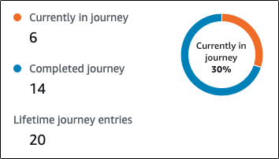

This section contains the following information:

- **Currently in journey** – The number of
  participants who are actively proceeding through the activities in the
  journey.
- **Completed journey** – The number of participants
  who have reached an end activity in the journey.
- **Lifetime journey entries** – The number of
  participants who have entered the journey since the start date of the
  journey. This section also contains a chart that shows the percentage of
  participants who completed the journey (shown in blue) and the percentage of
  participants who are still in the journey (shown in orange).

### Journey refresh metrics

This section shows the refresh metrics for the journey. It includes information
about the number of segments refreshed, how many times a segment has been refreshed,
and whether the segment is set to refresh on update or not. An example of this
section is shown in the following image.

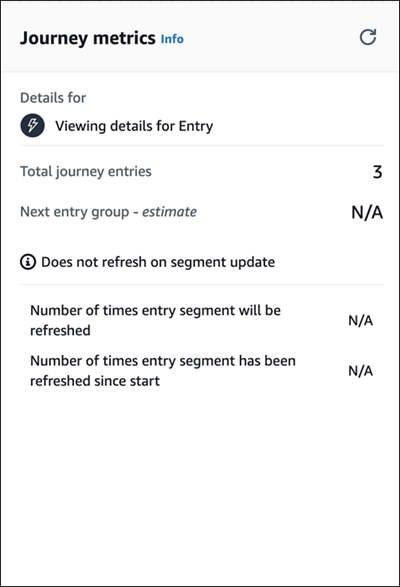

This section contains the following information:

- **Total journey entries** – The total number of
  journey entries.
- **Next entry group - _estimate_**
  – The number of endpoints that will be added on the next update. If a
  segment refresh interval isn't set, there will be no endpoints to add. The
  value displays as **N/A**.
- **Does not refresh on segment update**/
  **Refreshes on update** – Indicates whether
  **Refresh on segment update** was chosen when adding
  endpoints for the journey entry activity.
- **Number of times entry segment will be refreshed**
  – The maximum number of times that the segment will be refreshed
  during the journey.
- **Number of times entry segment has been refreshed since
  start** – The current number of times the segment has
  been refreshed since the journey started.
- **Removed due to re-evaluation** – The number of
  endpoints that were removed from the journey because of the re-evaluation
  process that occurs when a participant reaches a **Send contact
  center** activity. For more information, see [Set up a contact
  center activity](journeys-add-activities.md#journeys-add-activities-procedures-contact-center "journeys-add-activities.md#journeys-add-activities-procedures-contact-center").

### Unsent Message Metrics

The next section in the list of journey execution metrics includes information
about the reasons why messages weren't sent to journey participants. An example of
this section is shown in the following image.

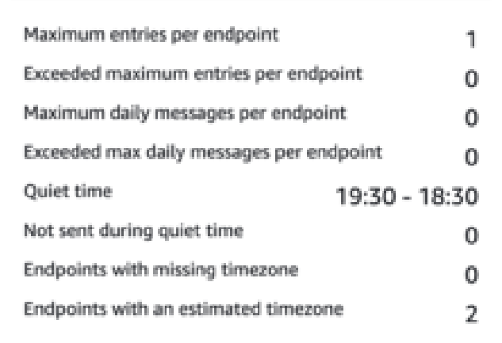

This section contains the following information:

- **Maximum entries per endpoint**/**Exceeded
  maximum entries per endpoint** – Displays the maximum
  number of entries per endpoint and the number of participants who were
  prevented from participating in the journey because they would have exceeded
  the maximum number of times that a single endpoint can participate in the
  journey.
- **Maximum daily messages per
  endpoint**/**Exceeded max daily messages per
  endpoint** – Displays the maximum number of daily
  messages per endpoint, and the number of messages that weren't sent because
  sending them would have exceeded the maximum number of messages that a
  single participant can receive during a 24-hour period.
- **Quiet time**/**Not sent during quiet
  time** – Displays the current quiet time hours set for
  the journey, and the number of messages that weren't sent for the following
  reasons.
  - If **Resume sending after quiet times** is not
    turned on and sending is blocked due to encountering the quiet time
    window.
  - If **Time zone estimation** is turned on and sending is blocked due to the
    endpoint having no time zone (result of missing
    `Demographic.Timezone` attribute and unsuccessful
    time zone estimation).

## Activity-level execution

metrics

Activity-level execution metrics include information about the endpoints that entered
(or were prevented from entering) your activity. Select an individual activity to view
its execution metrics. To view engagement metrics, choose **Engagement
metrics** in the **Journey metrics** pane.

###### Important

The number of endpoints that move through each activity in your journey is noted
in the top right corner of each activity modal.

These metrics are divided into several sections, which are discussed in detail in the
following sections.

### Sent message

metrics

The first section in the list of activity execution metrics shows how many
endpoints entered your activity. An example of this section is shown in the
following image.

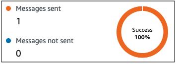

This section contains the following information:

- **Messages sent** – The number of messages
  sent.
- **Messages not sent** – The number of messages not
  sent.

### Unsent Message

Metrics

Each activity in your journey includes a list of execution metrics that indicates
information about the number of messages that couldn't be delivered because of
system issues, Amazon Pinpoint account configuration, or end user preferences such as an
opt-out. An example of this section is shown in the following image.

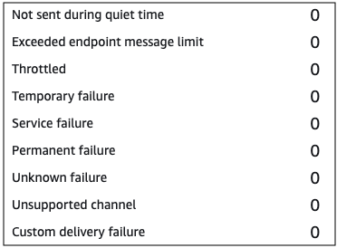

This section contains the following information:

- **Not sent during quiet time** – The number of
  messages that weren't sent because they would have been delivered during
  quiet time in the recipient's time zone.
- **Exceeded endpoint message limit** – The number of
  messages that weren't sent because sending them would have exceeded the
  maximum number of messages that a single participant can receive during a
  24-hour period.
- **Throttled** – The number of messages that weren't
  sent because sending them would exceed the sending quotas for your Amazon Pinpoint
  account.
- **Temporary failure** – The number of messages that
  weren't sent because of a temporary failure.
- **Service failure** – The number of messages that
  weren't sent because of an issue with the Amazon Pinpoint service.
- **Permanent failure** – The number of messages that
  weren't sent because of a permanent failure.
- **Unsupported channel** – The number of endpoints
  that weren’t sent through the activity because the endpoint didn't match the
  activity type.
- **Unknown failure** – The number of messages that
  weren't sent because of an unknown reason.
- **Custom delivery failure** – The number of
  messages that weren't sent because of a Lambda function or webhook
  failure.

###### Note

This metric only appears on **Send through a custom
channel** activities.

- **Dial failure** – The number of messages that
  couldn't be delivered through a **Send through a contact
  center** activity because an issue prevented the number from
  being dialed. This type of failure can occur if there are permissions issues
  that prevent the call from being made, if an Amazon Connect service quota has been
  exceeded, or if a transient service issue occurs.
- **Removed due to re-evaluation** – The number of
  endpoints that were removed from the journey because of the re-evaluation
  process that occurs when a participant reaches a **Send through a
  contact center** activity. For more information, see [Set up a contact
  center activity](journeys-add-activities.md#journeys-add-activities-procedures-contact-center "journeys-add-activities.md#journeys-add-activities-procedures-contact-center").

###### Note

The **Dial failure** and **Removed due to
re-evaluation** metrics only appear on **Send
through a contact center** activities.

- **Quiet time**/**Not sent during quiet
  time** – Displays the current quiet time hours set for
  the journey, and the number of messages that weren't sent for the following
  reasons.
  - If **Resume sending after quiet times** isn't
    turned on and sending is blocked due to encountering the quiet time
    window.
  - If **Time zone estimation** is turned on and sending is blocked due to the
    endpoint having no time zone (result of missing
    `Demographic.Timezone` attribute and unsuccessful
    time zone estimation).

## Journey-Level engagement metrics

Journey-level engagement metrics include information about the ways in which the
participants in your journey interacted with the messages that were sent from the
journey.

These metrics are divided into several sections, which are discussed in detail in the
following sections.

###### Important

Several of the engagement metrics are based on information that we receive from
recipients' email providers or mobile phone carriers or from push notification
services, such as Apple Push Notification service or Firebase Cloud Messaging. After
we receive this data from these sources, there is a delay of up to two hours while
we process the incoming metrics.

### Number of message

activities

The engagement metrics for each journey provide the number of message activities
in that journey.

If there are multiple activity types in the journey, the engagement metrics are
broken down by type, as seen in the following image.

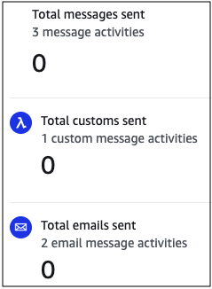

## Activity-level engagement

metrics

Activity-level engagement metrics include information about the ways in which the
participants in your journey interacted with the messages that were sent from the
journey.

These metrics are divided into several sections, which are discussed in detail in the
following sections.

Email activities provide the following engagement metrics.

#### Response

metrics

These metrics provide information about participants' interactions with
the messages that were sent from the email message activity.

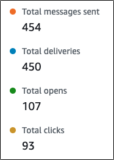

This section contains the following information:

- **Total messages sent** – The number of
  emails sent from this activity, whether the messages were
  successfully delivered to the recipients’ inboxes.
- **Total deliveries** – The number of
  messages that were delivered to recipients' email providers.
- **Total opens** – The number of messages
  that were opened by recipients.

###### Note

For Amazon Pinpoint to count an email open event, the recipient must
load the images in your messages. Several email clients, such as
some versions of Microsoft Outlook, prevent images from being
loaded by default.

If a message is opened once or opened multiple times within
the same hour, it will be counted as one open. Multiple opens
taking place at different hours will be counted as separate
opens. For example, if a message is opened at 8:30 AM and 8:45
AM, it will count as one open but if the messaged is opened at
8:30 AM and 9:05 AM, it will count as two opens because the hour
has changed. For this reason, it's possible (but unlikely) for
the number of opens to exceed the number of sends or
deliveries.

- **Total clicks** – The number of times that
  recipients clicked links in messages.

###### Note

If a message recipient clicks multiple links in a message or
clicks the same link more than once, those clicks will be
counted as one click if they occur within the same hour.
Multiple clicks taking place at different hours will be counted
as separate clicks. For example, a link is clicked at 8:30 AM
and 8:45 AM it will count as one click but if the link is
clicked at 8:30 AM and 9:05 AM it will count as two clicks
because the hour has changed. For this reason, it's possible for
the number of clicks to exceed the number of opens or
deliveries.

#### Message engagement

metrics

The final section in the list of engagement metrics provides additional
email response metrics. An example of this section is shown in the following
image.

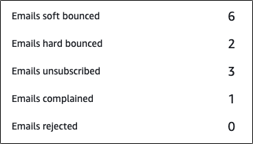

This section contains the following information:

- **Emails soft bounced** – The number of
  messages that resulted in a soft bounce. A soft bounce occurs when a
  message can't be delivered because of a temporary issue (for
  example, when the recipient's inbox is full).

###### Note

Amazon Pinpoint attempts to re-deliver messages that result in a soft
bounce for a certain period of time. If the message is delivered
during one of these redelivery attempts, then the message is
counted in the **Total deliveries** metric and
removed from the **Emails soft bounced**
metric.

- **Emails hard bounced** – The number of
  messages that resulted in a hard bounce. A hard bounce occurs when a
  message can't be delivered because of a permanent issue (for
  example, when the destination email address no longer
  exists).

###### Note

Soft bounces that can't be delivered after a certain period of
time are converted to hard bounces. For this reason, you might
see the number of soft bounces decrease and the number of hard
bounces increase.

- **Emails unsubscribed** – The number of
  messages that prompted the recipient to unsubscribe.

###### Note

For Amazon Pinpoint to count an unsubscribe event, the unsubscribe link
in the email has to contain a special link tag (a tag called
`unsubscribeLinkTag`, as in the following
example: `<a ses:tags="unsubscribeLinkTag:click;"
 href="http://www.example.com/unsubscribe">`). Only
links that contain this tag are counted as unsubscribes.

- **Emails complained** – The number of
  messages that were reported by the recipient as unsolicited
  mail.

###### Note

This metric is based on complaint report data that we receive
from recipients' email providers. Some email providers send us
complaint data immediately, while others send a weekly or
monthly digest.

- **Emails rejected** – The number of
  messages that weren't sent because they were rejected. A message is
  rejected if Amazon Pinpoint determines that the message contains malware.
  Amazon Pinpoint doesn't attempt to send rejected messages.

SMS message activities provide the following engagement metrics.

#### Delivery

metrics

These metrics provide information about participants' interactions with
the messages that were sent from the SMS message activity.

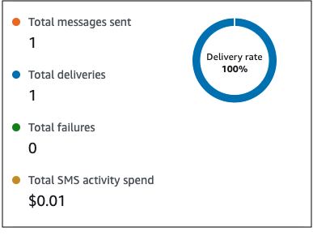

This section contains the following information:

- **Total messages sent** – The number of SMS
  messages sent from this activity, whether the messages were
  successfully delivered to the recipients’ devices.
- **Total deliveries** – The number of SMS
  messages delivered from the provider to the recipients'
  devices.
- **Total failures** – The number of SMS
  messages that failed to be delivered to recipients.
- **Total SMS activity spend** – The
  estimated amount of money you've spent sending SMS messages through
  this activity.

Push notification activities provide the following engagement metrics.

#### Response Metrics

These metrics provide information about participants' interactions with
the messages that were sent from the push notification activity.

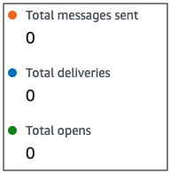

This section contains the following information:

- **Total messages sent** – The number of
  push notifications sent from this activity, whether the messages
  were successfully delivered to the recipients’ devices.
- **Total deliveries** – The number of push
  notifications delivered from the push notification service to the
  recipients' devices. This metric only reflects deliveries that are
  made when an app is running in the foreground or background of a
  recipient's device. Due to discrepancies in how mobile operating
  systems prioritize background notifications, delivery of push
  notifications are not guaranteed.
- **Total opens** – The number of push
  notifications that were opened by recipients.

#### Time to Live

Metrics

The push notification engagement metrics also provide the time to live
(TTL) value for the push notification activity. The TTL is the amount of
time, in seconds, during which Amazon Pinpoint can deliver the message.
After this time elapses, Amazon Pinpoint drops the message and doesn't
attempt to re-deliver it.

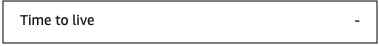

When the default TTL value is used, the metric displays a “-”. For custom
TTL values, the metric displays the exact number and unit of time that you
chose.

Custom channel activities provide the following engagement metrics.

#### Call

Success Metrics

These metrics provide information about participants' interactions with
the messages that were sent from the custom channel activity.

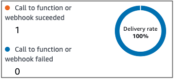

This section contains the following information:

- **Call to function or webhook succeeded** –
  The number of times that a Lambda function or webhook was
  successfully invoked because of this activity.

###### Note

This doesn't indicate that the message was delivered to the
destination, it only indicates that the Lambda function or
webhook was called.

- **Call to webhook or function failed** –
  The number of times that a Lambda function or webhook was not
  successfully invoked because of this activity.

You can use Contact center activity metrics to analyze participants'
interactions with your calls.

#### Contact center metrics

The following call metrics are available:

- **Total successful dials** – The total
  number of calls that were successfully dialed.
- **Connected** – The number of calls that
  connected to an agent. If answering machine detection is enabled,
  then calls received by answering machines won't be included in the
  **Connected** metric. Otherwise, if answering
  machine detection is disabled they are included. For more
  information about answering machine detection, see [AnswerMachine DetectionConfig](../../../connect/latest/APIReference/API_connect-outbound-campaigns_AnswerMachineDetectionConfig.md "../../../connect/latest/APIReference/API_connect-outbound-campaigns_AnswerMachineDetectionConfig.md") in the _Amazon Connect
  Outbound Campaigns API Reference_.
- **SIT tone** – The number of calls that
  received a busy tone.
- **Fax** – The number of calls that received
  a fax tone.
- **Voicemail beep** – The number of calls
  that reached voice mail with a beep sound.
- **Voicemail no beep** – The number of calls
  that reached voice mail without a beep sound.
- **Not answered** – The number of calls that
  received a response, but the call continued to ring without reaching
  voice mail.
- **Connection error** – The number of calls
  that received a response, but the call could not reach voice
  mail.
- **Connection rate** – The rate of calls
  that successfully connected to an agent as compared to all
  successful dials.
- **Total failed dials** – The number of
  calls that failed due to system issues, telecom issues, or
  permission errors.
- **Total expired dials** – The number of
  calls that expired because the dialer faced an error or there were
  no agents available.

### Activity metrics

In addition to viewing metrics for channel-specific activity types (email, SMS,
push, and custom channels), you can also view metrics for other activity types,
which include the following: **Wait** activities, **Yes/no
split** activities, **Multivariate split** activities,
and **Random split** activities.

#### Wait activity metrics

Journey metrics for wait activities include the following information:

- **Wait completed** – The number of journey
  participants who completed the activity.
- **Wait date passed** – The number of journey
  participants who arrived on the activity and immediately moved to the
  next activity because the wait date occurred in the past.
- **Currently waiting** – The number of
  participants who are currently waiting (in the activity).

#### Yes/No split activity

metrics

Journey metrics for yes/no split activities include the following
information:

- **Total participants** – The number of journey
  participants who passed through the activity.
- **Details for _path_** – The number of journey
  participants who were sent down each path of the activity.

#### Multivariate

split activity metrics

Journey metrics for multivariate split activities include the following
information:

- **Total participants** – The number of journey
  participants who passed through the activity.
- **Details for _path_** – The number of journey
  participants who were sent down each path of the activity.

#### Holdout activity

metrics

Journey metrics for holdout activities include the following
information:

- **Total entered** – The number of journey
  participants who passed through activity.
- **Participants held out** – The number of
  participants who exited the journey because of being held out by the
  activity.

#### Random split activity

metrics

Journey metrics for random split activities include the following
information:

- **Total participants** – The number of journey
  participants who passed through the activity.
- **Details for _path_** – The number of journey
  participants who were sent down each path of the activity.
