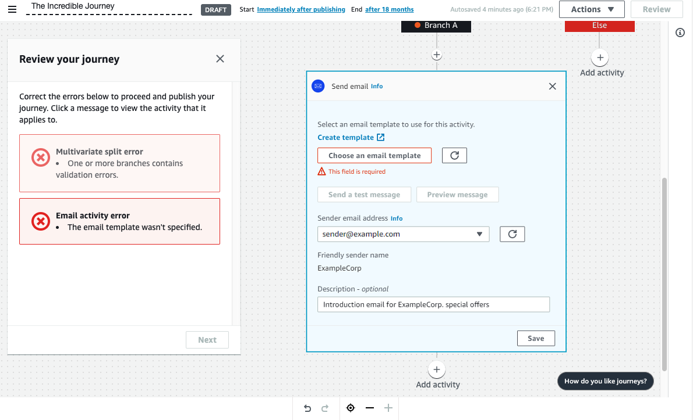

**End of support notice:** On October
30, 2026, AWS will end support for Amazon Pinpoint. After October 30, 2026, you will no
longer be able to access the Amazon Pinpoint console or Amazon Pinpoint resources (endpoints,
segments, campaigns, journeys, and analytics). For more information, see [Amazon Pinpoint end of
support](../../../console/pinpoint/migration-guide.md "../../../console/pinpoint/migration-guide.md"). **Note:** APIs related to SMS, voice,
mobile push, OTP, and phone number validate are not impacted by this change and are
supported by AWS End User Messaging.

# Review and test a journey

Before you can publish your journey, you must review it to make sure that all of the
activities that it contains are configured properly. It's also a good idea to enroll test
users in a copy of the journey before you publish it, to confirm that it behaves the way
that you expect it to behave. This section contains information and procedures related to
reviewing and testing your journey.

## Reviewing a journey

The review feature provides information about configuration errors in your journey,
and also provides some recommendations.

###### To review a journey

1. In the upper-right corner of the journey workspace, choose
   **Review**. The **Review your journey**
   pane appears in the journey workspace. The following image shows the journey
   workspace with the **Review your journey** pane opened.

 2. Review the error messages that are shown on the first page of the
**Review your journey** pane. You can't publish your
journey until you resolve all the issues that are shown on this page. If there
aren't any issues with your journey, you see a message stating that your journey
doesn't contain any errors. When you're ready to proceed, choose
**Next**.

###### Tip

Choose an error to go directly to the activity that it applies to. 3. The second page of the **Review your journey** pane contains
recommendations and best practices that are relevant to your journey. You can
proceed without resolving the issues that are shown on this page. When you're
ready to proceed, choose **Mark as reviewed**. 4. On the third page of the **Review your journey** pane, you
can publish your journey. If you're ready for customers to enter the journey,
choose **Publish**. However, if you want to test your journey
first, close the **Review your journey** pane, and then
complete the steps in [Testing a journey](#journeys-test "#journeys-test").

## Testing a journey

One of the most important steps in creating a journey is testing it to make sure that
it behaves as intended. Journeys includes a testing feature that streamlines the process
to send a group of test participants through the journey. It includes features to reduce
or removes the amount of time that participants spend on wait or multivariate split
activities, so that you can test each journey thoroughly and quickly.

###### To test a journey

1. Create a new segment that contains only the test participants who you want to
   participate in the test journey. Or, if you already have a segment of test
   participants, proceed to the next step.

For more information about creating segments, see [Building segments](segments-building.md "segments-building.md").

###### Tip

We recommend that you create a test segment by importing a spreadsheet.
For more information, see [Importing segments](segments-importing.md "segments-importing.md").

Only dynamic segments are supported for testing journeys with an event based entry conditions. 2. On the **Actions** menu, choose
**Test**. 3. For **Test segment**, choose the segment that contains the
test participants. 4. Choose how to handle delays in the journey. You can choose one of the
following options:

    * **Skip all waits and delays** – Choose this
     option to have test participants proceed from one activity to another
     without any intervening delays.
    * **Custom wait time** – Choose this option to
     have test participants wait for a pre-defined amount of time at each
     activity that includes a delay. This option is helpful if your journey
     contains wait activities, or yes/no split or multivariate split
     activities that are based on customer interactions.

5. Choose **Send test**. Amazon Pinpoint creates a new journey with
   `Test-` added to the beginning of the journey name. The test
   participants are added to the journey.
6. When you finish testing, choose **Stop journey** to
   permanently end the test journey.

###### Tip

During the testing process, if you discover that you need to make changes
to the original journey (that is, the journey that the test journey was
based on), return to the **Journeys** page. In the list of
journeys, choose the original journey, and then make your changes. Changes
that you make to the test journey aren't automatically applied to the
journey that the test is based on.

### Best practices for testing your

journeys

- Include several test participants in the segment that you use to test your
  journey.
- Include test participants whose email addresses are on domains other than
  your own.
- Use a variety of email clients and operating systems to test the messages
  that are sent from your journey.
- If your journey includes yes/no split or multivariate split activities
  that are based on interactions with your emails, test those interactions.
  For example, if you have a split activity that checks to see if an email was
  opened, then some of your test participants should open the email. Then,
  check the **Journey metrics** pane to make sure that the
  correct number of users went down each path.
- If your email templates include message variables that refer to endpoint
  attributes, make sure that your test participants have those same
  attributes. For example, if your email template refers to a
  `User.UserAttributes.FirstName` attribute, the endpoints in
  your test segment should also have that attribute.

**Next**: [Publish a journey](journeys-publish.md "journeys-publish.md")
