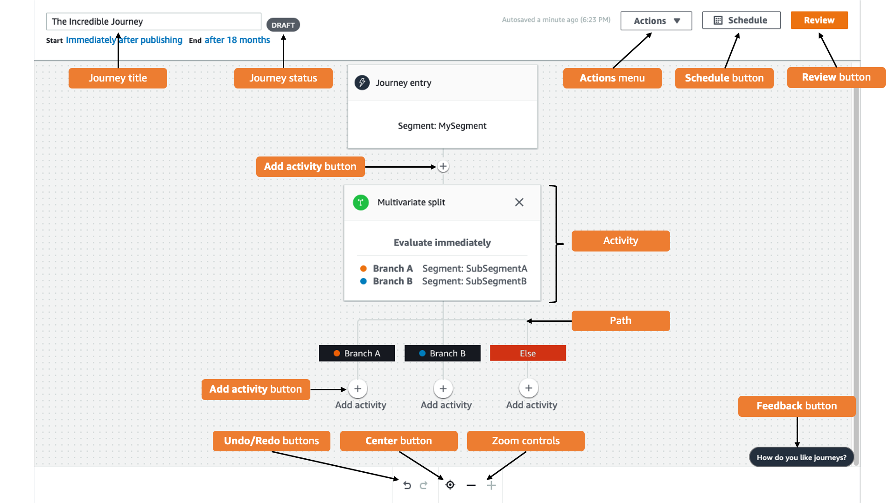

**End of support notice:** On October
30, 2026, AWS will end support for Amazon Pinpoint. After October 30, 2026, you will no
longer be able to access the Amazon Pinpoint console or Amazon Pinpoint resources (endpoints,
segments, campaigns, journeys, and analytics). For more information, see [Amazon Pinpoint end of
support](../../../console/pinpoint/migration-guide.md "../../../console/pinpoint/migration-guide.md"). **Note:** APIs related to SMS, voice,
mobile push, OTP, and phone number validate are not impacted by this change and are
supported by AWS End User Messaging.

# Take a tour of journeys

Journeys includes some new concepts and terminology that you might not be familiar with.
This topic explores these concepts in detail.

## Journeys terminology

**Journey workspace**

The area of the journey page where you create your journey by adding
activities.

**Activity**

A step in a journey. Different things can happen when participants arrive
on different types of activities. In Amazon Pinpoint, you can create the following
types of activities:

**Send an email**

When a participant arrives on a **Send an
email** activity, Amazon Pinpoint sends them an email. When
you create a **Send an email** activity, you
specify an [email template](message-templates-creating-email.md "message-templates-creating-email.md") to use for the email. Email templates
can include message variables, helping you to create a more
personalized experience.

**Send a push notification**

When a participant arrives on a **Send a push
notification** activity, Amazon Pinpoint immediately sends a
push notification to the user's device. When you create a
**Send a push notification** activity, you
will choose the [push notification template](message-templates-creating-push.md "message-templates-creating-push.md") to use. Push notification
templates can include messages variables, helping you to create
a more personalized experience.

**Send an SMS message**

When a participant arrives on a **Send an SMS
message** activity, Amazon Pinpoint immediately sends an SMS
notification to the user's device. When you create a
**Send an SMS notification** activity, you
will choose the [SMS template](message-templates-creating-sms.md "message-templates-creating-sms.md") to use. SMS templates can include
messages variables, helping you to create a more personalized
experience.

**Send through a custom channel**

Send your message through one of your custom channels. For
example, you can use custom channels to send messages through
third-party services such as WhatsApp or Facebook Messenger.
Amazon Pinpoint immediately sends a notification using that service to the
user's device using either an AWS Lambda function or
a webhook. For more information about creating custom channels,
see [Custom channels in
Amazon Pinpoint](channels-custom.md "channels-custom.md").

**Wait**

When a participant arrives on a **Wait**
activity, they remain on that activity until a certain date or
for a specific amount of time.

**Yes/No split**

Sends participants down one of two paths based on criteria
that you define. For example, you can send all participants who
read an email down one path, and send everyone else down the
other path.

**Multivariate split**

Sends participants down one of up to four paths, based on
criteria that you define. Participants who don't meet any of the
criteria proceed down an _Else
path_.

**Holdout**

Ends the journey for a specified percentage of
participants.

**Random split**

Randomly sends participants down one of up to five
paths.

**Path**

A connector that joins one activity to another. A split activity might
have several paths.

**Participant**

A person who is traveling through the activities in a journey.

## Parts of the journeys interface

This section contains information about the components of the journeys interface. When
you create or edit a journey, you see the journey workspace. The following image shows
an example of the journey workspace.

The following table includes descriptions of several of the buttons that appear in the
journey workspace.

| Appearance                      | Button name         | Description                                                                                                                                                                                                              |
| ------------------------------- | ------------------- | ------------------------------------------------------------------------------------------------------------------------------------------------------------------------------------------------------------------------ |
| The journey information button. | **Info**            | Opens the help panel, which shows additional information about individual journey activities.                                                                                                                         |
| The delete activity button.     | **Delete activity** | Deletes the highlighted activity.                                                                                                                                                                                        |
| The undo button.                | **Undo**            | Reverts the most recent action.                                                                                                                                                                                          |
| The redo button.                | **Redo**            | Restores an action that was previously undone by using the \*_Undo_ • button.                                                                                                                                      |
| The center view button.         | **Center**          | Moves to the top of the journey and centers the \*_Journey entry_ • activity on the journey workspace.                                                                                                             |
| The zoom out button.            | **Zoom out**        | Reduces the size of objects in the journey workspace.                                                                                                                                                                 |
| The zoom in button.             | **Zoom in**         | Increases the size of objects in the journey workspace.                                                                                                                                                               |
| The add activity button.        | **Add activity**    | This button appears at every point where you can insert another step in the journey. When you choose this button, you see a menu that lets you choose an activity type.                                            |
| The send feedback button.       | **Feedback**        | A quick way to provide feedback about your experience using journeys. We review all of the feedback that we receive through this button. We might contact you for additional information if we have any questions. |
