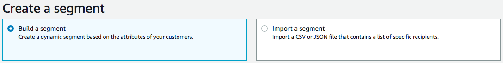
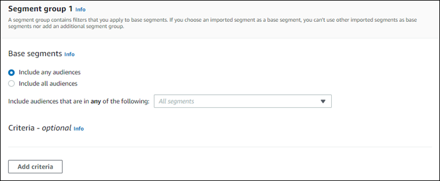
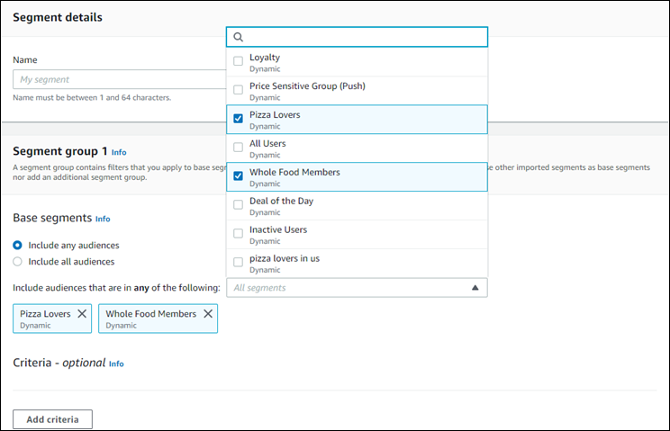
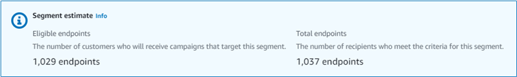
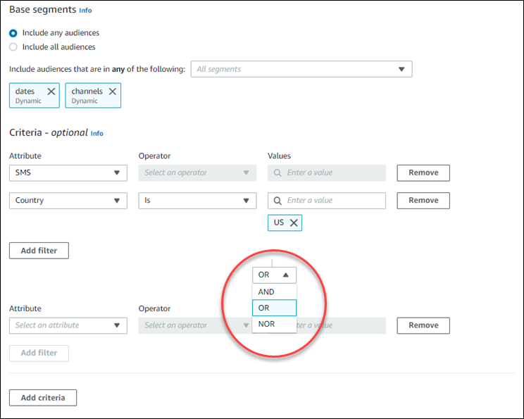
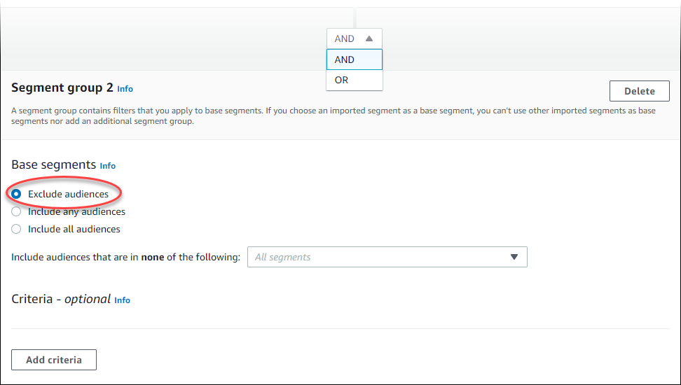

**End of support notice:** On October
30, 2026, AWS will end support for Amazon Pinpoint. After October 30, 2026, you will no
longer be able to access the Amazon Pinpoint console or Amazon Pinpoint resources (endpoints,
segments, campaigns, journeys, and analytics). For more information, see [Amazon Pinpoint end of
support](../../../console/pinpoint/migration-guide.md "../../../console/pinpoint/migration-guide.md"). **Note:** APIs related to SMS, voice,
mobile push, OTP, and phone number validate are not impacted by this change and are
supported by AWS End User Messaging.

# Building segments

After you integrate your apps with Amazon Pinpoint, you can create dynamic segments that are based on
the data your apps provide to Amazon Pinpoint. When you create a dynamic segment, you choose the type
of segment you want to create, create a segment group, and then refine that segment group by
choosing the segments and the criteria that define those segments. For example, you could
create a dynamic segment group, and then choose an audience segment and criteria of all
customers who use version 2.0 of your app on an Android device and who have used your app
within the past 30 days. Amazon Pinpoint continuously re-evaluates your segments as your app records
new customer interactions. As a result, the size and membership of each segment changes over
time. For information about integrating your apps with Amazon Pinpoint, see [Integrating Amazon Pinpoint with your application](../developerguide/integrate.md "../developerguide/integrate.md") in the
_Amazon Pinpoint Developer Guide_.

## Segment groups

When you create a dynamic segment, you create one or more _segment
groups_. A segment group consists of these components:

- Base segments – The segments that define
  the initial user population. You can specify a single base segment, several base
  segments, or all of the segments in your Amazon Pinpoint project.
- Criteria – Categories of audience information that
  you apply on top of the base segments. You can add multiple groups of criteria
  and then create relationships between those criteria.
- Filters – Filters reduce the audience
  number that belong to the segment. You can add as many filters as you want in
  order to tailor the segment to your needs.

You have to create at least one segment group, but you can optionally create a second
segment group, and then create a relationship between the two groups.

## Creating a dynamic segment

The following steps describe creating and configuring a segment:

- [Step 1: Build a new segment or import an
  existing segment](#segment-building-new "#segment-building-new")
- [Step 2: Configure segment group 1](#segmentconfigure "#segmentconfigure")
- [Step 3: Choose the segments to include in
  the group](#choosesegments "#choosesegments")
- [Step 4: Choose and configure the segment
  criteria](#choosecriteria "#choosecriteria")
- [Step 5: Add a second criteria group](#addsecondcriteria "#addsecondcriteria")
- [Step 6: Add segment group 2](#addsegmentgroup "#addsegmentgroup")

### Step 1: Build a new segment or import an

existing segment

###### To build a segment

1. Sign in to the AWS Management Console and open the Amazon Pinpoint console at
   [https://console.aws.amazon.com/pinpoint/](https://console.aws.amazon.com/pinpoint/ "https://console.aws.amazon.com/pinpoint/").
2. On the **All projects** page, choose the project to which
   you want to add the segment.
3. In the navigation pane, choose **Segments**. The
   **Segments** page opens and displays segments that you
   previously defined.
4. Choose **Create a segment**.
5. Under **Create a segment**, choose **Build a
   segment**.

 6. For **Segment name**, enter a name for the segment.

### Step 2: Configure segment group 1

You will first choose how you want to define the audience segments for the segment
group.

###### To configure segment group 1

- Under **Segment group 1**, for **Base segments**,
  choose one of the following options:
  - **Include any audiences** – If you use more than one segment as
    a base segment, your new segment contains endpoints that are in at
    least one of the segments you choose. For example, you might have
    two dynamic segments, `Older than 18` and
    `Lives in New York City`. Your target
    audience when choosing this option is any audience older than 18
    _or_ who live in New York City.
  - **Include all audiences** – If you use more than one segment as
    a base segment, your new segment only contains endpoints common to
    all of the selected segments. For example, you might have two
    dynamic segments, `Older than 18` and
    `Lives in New York City`. Your target
    audience when choosing this option is all audiences older than 18
    _and_ who live in New York City.

  

### Step 3: Choose the segments to include in

the group

The next step is to choose which segments you will include in the group. These segments are
composed of the audience that you want to target in the segment group.

1. For the dropdown list, select one or more segments to include in the segment group. Each
   segment that you add displays in the section.

###### Note

The segments dropdown list doesn't close when you choose a segment. It remains open, with a
check mark by each segment you're including in the group. You can clear
the checkbox by any segment that you want to remove. When you're done
choosing segments, choose an area outside of the dropdown list to close
it.

 2. As you add or remove segments, the Segment estimate section updates to display the eligible
and total endpoints set to receive the campaign. Eligible endpoints are
those endpoints determined by the any/and relationship for the segment
group, while the total is the sum of all endpoints regardless of the
relationship connector.

### Step 4: Choose and configure the segment

criteria

After you've chosen your segments, you can further refine the target audience by applying
attributes, operators, and values to those segments.

###### To choose and configure the segment criteria

1. For **Attribute**, you can choose from the following types:
   - **Standard attributes** – Filter the audience based
     on one of its default attributes.
   - **Channel Types** – Filter the audience based on the recipient's
     endpoint type: EMAIL, SMS, PUSH, or CUSTOM.
   - **Activity** – Filters the audience on whether
     they've been Active or Inactive.
   - **Custom Endpoint Attributes** – Filter the audience based on an
     endpoint-specific attribute. For example, this might be a list of
     your customers who have opted out of a distribution list or a list
     of customers who signed up for a distribution list.
   - **Customer User Attributes** – Filter the audience based on a
     user-specific attribute. For example, this might be
     `LastName` or
     `FirstName`.
   - **Metrics** – Filter the audience based on a quantitative evaluation.
     For example, you might have a metric,
     `Visits`, that you can choose if you
     want to target an audience who have visited a specific location
     `x` number of times.

2. Choose the **Operator** and enter a **Value**.
   Operators determine the relationship of the attribute to a value that you
   enter. Values can be no longer than 100 characters and you can have no more
   than 100 total values between all groups, criteria, and filters. The
   following describes the available operators. Each attribute has its own set
   of supported operators.

###### Note

The Channel Types attributes don't use operators or values.

    * **After** – Filters the audience after a specific date.
    * **Before** – Filters the audience before a
     specific date.
    * **Between** – Filters the audience based on a
     date range.
    * **Contains** – Use this to filter the audience
     based on a substring within a string. For example, if you have a
     city metric, you could pass the `ew` to
     return `New York City` or Newcastle. The
     passed value is case-sensitive, so `ew`
     returns different results than `EW`.
    * **During** – Only used for the Activity
     attribute. Filters the audience by one of the following time frames:
     **the last day**, **the last 7
     days**, **the last 14 days**, or
     **the last 30 days**.
    * **Equals** – Used for the Metrics attributes only, this operator
     filters the results by a numerical value. For example, you might
     have a metric, `Visits`, that you can use
     to filter results by only those customers who visited a location
     `3` times.
    * **Greater than** – Used for the Metrics attributes only, this operator
     filters results that are greater than the number passed. For
     example, you might have a metric, `Visits`,
     that you can use to filter results by only those customers who
     visited a location greater than `3` times.
    * **Greater than or equal** – Used for the Metrics attributes only, this
     operator filters results that are greater than or equal to the
     number passed. For example, if you have a metric,
     `Visits`, you might use this operator
     to filter results by only those customers who visited a location
     `3` or more times.
    * **Is** – Use this option to filter by
     endpoint-specific attributes. When you select this option, you
     specify how recently the endpoint was active, or how long it's been
     inactive. After that, you can optionally specify additional
     attributes associated with that endpoint.
    * **Is not** – Use this option if you want to
     filter out results that match the passed value. For example, you
     might have a `city` customer user endpoint
     that you can use to filter out results that include a specific city.
     Use this operator and `New York City` for
     the value to ignore any results that include this city.
    * **Less than** – Used for the Metrics attributes only, this operator
     filters results that are less than the number passed. For example,
     you might have a metric, `Visits`, that you
     can use to filter results by only those customers who visited a
     location less than `3` times.
    * **Less than or equal** – Used for the Metrics attributes only, this
     operator filters results that are less than or equal to the number
     passed. For example, you might have a metric,
     `Visits`, that you can use to filter
     results by only those customers who visited a location
     `3` times or less.
    * **On** – Use this metric for filtering results.
     For example, you might have a metric,
     `OptOut`, that you can use to filter
     results by only those customers who opted out of a distribution list
     on `2020/11/09` .

###### Note

The Amazon Pinpoint console uses a default time of 00:00:00 UTC for all
time-based filters. You can filter on dates but times are recorded as
the same value. If you enter a date of
`2020-12-31`, the console passes the time
as `2020-12-31T12:00:00Z`. Therefore, if you
have multiple segments that pass the date, 2020-20-12 with different
times, the Amazon Pinpoint console records the date and time for any of those
segments as `2020-12-31T12:00:00Z`. 3. (Optional) To apply additional attributes to this criteria, choose **Add
filter**. To create another group of segment criteria, choose
**Add criteria**. To create a second segment group,
choose **Add another segment group**. For information about
adding a second segment group, see [Step 6: Add segment group 2](#addsegmentgroup "#addsegmentgroup"). 4. If you're finished setting up this segment, choose **Create
segment**.

### Step 5: Add a second criteria group

Optionally add criteria groups to further refine your results. You will create a
relationship between this group of criteria and the group before it.

###### To add a second criteria group

1. Choose **Add criteria**.
2. Create the relationship between this group and the group previous to it by choosing one
   of the following:
   - **AND** – The segment contains only that audiences who meet the
     criteria for both criteria groups.
   - **OR** – The segment contains audiences who meet the criteria in
     either one of the criteria groups.
   - **NOR** – The segment excludes the audiences that fits the criteria
     from the results.

 3. (Optional) To add another group of criteria, choose **Add criteria**
or, to add a second segment group, choose **Add another segment
group**. For more information, see [Step 6: Add segment group 2](#addsegmentgroup "#addsegmentgroup"). 4. If you're finished setting up the segment group, choose **Create
segment**.

### Step 6: Add segment group 2

You can optionally create a second segment group and create a relationship with segment
group 1. When you create a segment by using the Amazon Pinpoint console, you can have a
maximum of two segment groups per segment. If you add a second segment group to your
segment, you can choose one of two ways to specify how the two segment groups are
connected:

- By using AND logic – If you use AND
  logic to connect two segment groups, your segment contains all endpoints who
  meet all of the criteria in both of the segment groups.
- By using OR logic – If you use OR
  logic to connect two segment groups, your segment contains all endpoints who
  meet all of the criteria in either one of the segment groups.

###### Note

If you use an imported segment as the base segment for your first segment
group, you can't create a second segment group.

###### To configure second segment group

1. Choose **Add another segment group**.
2. Create the relationship with the first segment group. If you choose
   **AND**, the segment contains only those customers who
   meet the criteria for both segment groups. If you choose
   **OR**, the segment contains those customers who meet
   the criteria in either one of the segment groups. Within segment group 2,
   you have a third option to **Exclude audiences**. Segments
   that are excluded will not be included in the results. You can only exclude
   audiences in segment group 2.

 3. Choose the segments that you want to include in segment group 2. See [Step 3: Choose the segments to include in
the group](#choosesegments "#choosesegments"). 4. (Optional) Choose the criteria by which you want to filter your segments. See [Step 4: Choose and configure the segment
criteria](#choosecriteria "#choosecriteria") . 5. (Optional) Add additional groups of criteria. See [Step 5: Add a second criteria group](#addsecondcriteria "#addsecondcriteria"). 6. When you finish setting up the segment, choose **Create
segment**.
