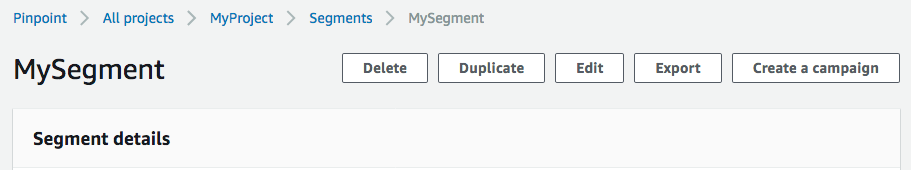
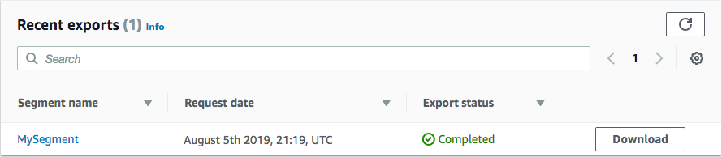

**End of support notice:** On October
30, 2026, AWS will end support for Amazon Pinpoint. After October 30, 2026, you will no
longer be able to access the Amazon Pinpoint console or Amazon Pinpoint resources (endpoints,
segments, campaigns, journeys, and analytics). For more information, see [Amazon Pinpoint end of
support](../../../console/pinpoint/migration-guide.md "../../../console/pinpoint/migration-guide.md"). **Note:** APIs related to SMS, voice,
mobile push, OTP, and phone number validate are not impacted by this change and are
supported by AWS End User Messaging.

# Exporting segments in the Amazon Pinpoint console

From the **Segments** page in the Amazon Pinpoint console, you can export an
existing segment to a file on your computer. When you do, Amazon Pinpoint exports all of the
information that's associated with the endpoints in the segment to a file.

This feature is useful if you want to share a list of segment members with somebody else
in your organization who doesn't use Amazon Pinpoint. It's also helpful in situations where you want
to modify the segment by using a different application.

1. Open the Amazon Pinpoint console at
   [https://console.aws.amazon.com/pinpoint/](https://console.aws.amazon.com/pinpoint/ "https://console.aws.amazon.com/pinpoint/").
2. On the **All projects** page, choose the project that contains
   the segment that you want to export.
3. In the navigation pane, choose **Segments**.
4. In the list of segments, choose the segment that you want to export.
5. At the top of the page, choose **Export**, as shown in the
   following image.

 6. Amazon Pinpoint creates a new export job, and you see the **Recent
exports** tab on the **Segments** page.

Note the value in the **Export status** column for the segment
that you exported. When you first create the export job, the status is **In
progress**.

Wait a few minutes, and then choose the **refresh** (

) button. If the status is still **In
progress**, wait another minute, and then repeat this step. Otherwise,
if the status is **Complete**, proceed to the next step.

###### Note

If a segment requires more than 10 minutes to complete, the export process
times out. If you need to export very large segments, you should use the [CreateExportJob](../apireference/apps-application-id-jobs-export.md#CreateExportJob "../apireference/apps-application-id-jobs-export.md#CreateExportJob") operation in the Amazon Pinpoint API. 7. Choose **Download** to save the segment to your computer, as
shown in the following image.

