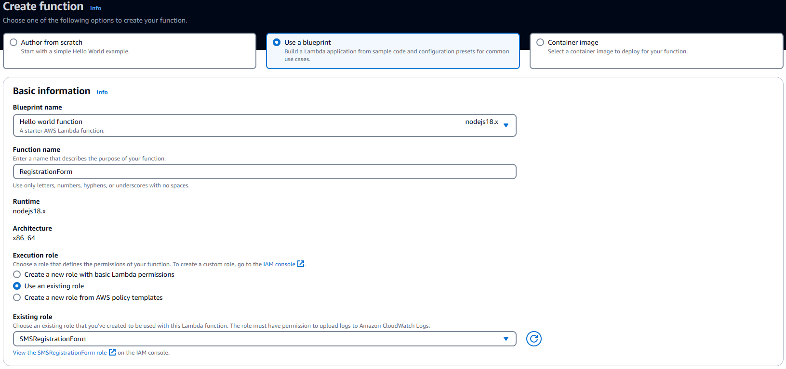
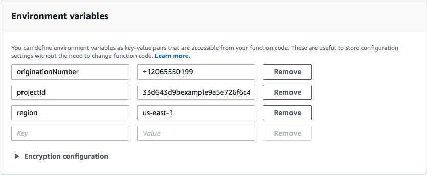
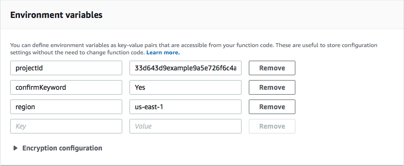

**End of support notice:** On October
30, 2026, AWS will end support for Amazon Pinpoint. After October 30, 2026, you will no
longer be able to access the Amazon Pinpoint console or Amazon Pinpoint resources (endpoints,
segments, campaigns, journeys, and analytics). For more information, see [Amazon Pinpoint end of
support](../../../console/pinpoint/migration-guide.md "../../../console/pinpoint/migration-guide.md"). **Note:** APIs related to SMS, voice,
mobile push, OTP, and phone number validate are not impacted by this change and are
supported by AWS End User Messaging.

# Create Lambda functions for use with Amazon Pinpoint SMS messaging

This section shows you how to create and configure
two Lambda functions for use with Amazon Pinpoint SMS messaging. Later, you set up API Gateway and Amazon Pinpoint to invoke these functions when certain
events occur. Both of these functions create and update endpoints in the Amazon Pinpoint project that
you specify. The first function also uses the phone number validation feature.

The first function takes input from your registration form, which it receives from
Amazon API Gateway
It uses this information to obtain information about the customer's phone number by
using the [phone number validation](../developerguide/validate-phone-numbers.md "../developerguide/validate-phone-numbers.md") feature
of Amazon Pinpoint. The function then uses the validated data to create a new endpoint in the
Amazon Pinpoint project that you specify. By default, the endpoint that the function creates is
opted out of future communications from you, but this status can be changed by the
second function. Finally, this function sends the customer a message asking them to
verify that they want to receive SMS communications from you.

###### To create the Lambda function

1. Open the AWS Lambda console at
   [https://console.aws.amazon.com/lambda/](https://console.aws.amazon.com/lambda/ "https://console.aws.amazon.com/lambda/").
2. Choose **Create function**.
3. Under **Create a function**, choose **Use a
   blueprint**.
4. In the search field, enter `hello`, and then press Enter.
   In the list of results, choose the `hello-world` Node.js function, as
   shown in the following image.

 5. Under **Basic information**, do the following:

    * For **Name**, enter a name for the function, such as
     `RegistrationForm`.
    * For **Role**, select **Choose an existing
     role**.
    * For **Existing role**, choose the
     **SMSRegistrationForm** role that you created in
     [Create an IAM role](tutorials-two-way-sms-part-2.md#tutorials-two-way-sms-part-2-create-role "tutorials-two-way-sms-part-2.md#tutorials-two-way-sms-part-2-create-role").

When you finish, choose **Create function**. 6. For **Code source** delete the sample function in the code
editor, and then paste the following code:

```
import { PinpointClient, PhoneNumberValidateCommand, UpdateEndpointCommand, SendMessagesCommand } from "@aws-sdk/client-pinpoint"; // ES Modules import
const pinClient = new PinpointClient({region: process.env.region});

// Make sure the SMS channel is enabled for the projectId that you specify.
// See: https://docs.aws.amazon.com/pinpoint/latest/userguide/channels-sms-setup.html
var projectId = process.env.projectId;

// You need a dedicated long code in order to use two-way SMS.
// See: https://docs.aws.amazon.com/pinpoint/latest/userguide/channels-voice-manage.html#channels-voice-manage-request-phone-numbers
var originationNumber = process.env.originationNumber;

// This message is spread across multiple lines for improved readability.
var message = "ExampleCorp: Reply YES to confirm your subscription. 2 msgs per "
            + "month. No purchase req'd. Msg&data rates may apply. Terms: "
            + "example.com/terms-sms";

var messageType = "TRANSACTIONAL";

export const handler = async (event, context) => {
  console.log('Received event:', event);
  await validateNumber(event);
};

async function validateNumber (event) {
  var destinationNumber = event.destinationNumber;
  if (destinationNumber.length == 10) {
    destinationNumber = "+1" + destinationNumber;
  }
  var params = {
    NumberValidateRequest: {
      IsoCountryCode: 'US',
      PhoneNumber: destinationNumber
    }
  };
  try{
    const PhoneNumberValidateresponse = await pinClient.send( new  PhoneNumberValidateCommand(params));
    console.log(PhoneNumberValidateresponse);
     if (PhoneNumberValidateresponse['NumberValidateResponse']['PhoneTypeCode'] == 0) {
        await createEndpoint(PhoneNumberValidateresponse, event.firstName, event.lastName, event.source);

      } else {
        console.log("Received a phone number that isn't capable of receiving "
                   +"SMS messages. No endpoint created.");
      }
  }catch(err){
    console.log(err);
  }
}

async function createEndpoint(data, firstName, lastName, source) {
  var destinationNumber = data['NumberValidateResponse']['CleansedPhoneNumberE164'];
  var endpointId = data['NumberValidateResponse']['CleansedPhoneNumberE164'].substring(1);

  var params = {
    ApplicationId: projectId,
    // The Endpoint ID is equal to the cleansed phone number minus the leading
    // plus sign. This makes it easier to easily update the endpoint later.
    EndpointId: endpointId,
    EndpointRequest: {
      ChannelType: 'SMS',
      Address: destinationNumber,
      // OptOut is set to ALL (that is, endpoint is opted out of all messages)
      // because the recipient hasn't confirmed their subscription at this
      // point. When they confirm, a different Lambda function changes this
      // value to NONE (not opted out).
      OptOut: 'ALL',
      Location: {
        PostalCode:data['NumberValidateResponse']['ZipCode'],
        City:data['NumberValidateResponse']['City'],
        Country:data['NumberValidateResponse']['CountryCodeIso2'],
      },
      Demographic: {
        Timezone:data['NumberValidateResponse']['Timezone']
      },
      Attributes: {
        Source: [
          source
        ]
      },
      User: {
        UserAttributes: {
          FirstName: [
            firstName
          ],
          LastName: [
            lastName
          ]
        }
      }
    }
  };
  try{
    const UpdateEndpointresponse = await pinClient.send(new UpdateEndpointCommand(params));
    console.log(UpdateEndpointresponse);
    await sendConfirmation(destinationNumber);
  }catch(err){
    console.log(err);
  }
}

async function sendConfirmation(destinationNumber) {
  var params = {
    ApplicationId: projectId,
    MessageRequest: {
      Addresses: {
        [destinationNumber]: {
          ChannelType: 'SMS'
        }
      },
      MessageConfiguration: {
        SMSMessage: {
          Body: message,
          MessageType: messageType,
          OriginationNumber: originationNumber
        }
      }
    }
  };
  try{
    const SendMessagesCommandresponse = await pinClient.send(new SendMessagesCommand(params));
    console.log("Message sent! "
          + SendMessagesCommandresponse['MessageResponse']['Result'][destinationNumber]['StatusMessage']);
  }catch(err){
    console.log(err);
  }
}
```

7.  On the **Configuration** tab for **Environment
    variables**, choose **Edit** and then
    **Add environment variable**, do the following:

        * In the first row, create a variable with a key of
         `originationNumber`. Next, set the value to the
         phone number of the dedicated long code that you received in [Step
         1.2](tutorials-two-way-sms-part-1.md#tutorials-two-way-sms-part-1-set-up-channel "tutorials-two-way-sms-part-1.md#tutorials-two-way-sms-part-1-set-up-channel").


        ###### Note

        Be sure to include the plus sign (+) and the country code for the
         phone number. Don't include any other special characters, such as
         dashes (-), periods (.), or parentheses.
        * In the second row, create a variable with a key of
         `projectId`. Next, set the value to the unique
         ID of the project that you created in [Step
         1.1](tutorials-two-way-sms-part-1.md#tutorials-two-way-sms-part-1-create-project "tutorials-two-way-sms-part-1.md#tutorials-two-way-sms-part-1-create-project").
        * In the third row, create a variable with a key of
         `region`. Next, set the value to the Region
         that you use Amazon Pinpoint in, such as `us-east-1` or
         `us-west-2`.

    When you finish, the **Environment Variables** section should
    resemble the example shown in the following image.

 8. At the top of the page, choose **Save**.

### Test the function

After you create the function, you should test it to make sure that it's
configured properly. Also, make sure that the IAM role you created has the
appropriate permissions.

###### To test the function

1. Choose the **Test** tab.
2. Choose **Create new event**, do the following:
   - For **Event name**, enter a name for the test
     event, such as `MyPhoneNumber`.
   - Erase the example code in the code editor. Paste the following
     code:

   ```
   {
     "destinationNumber": "`+12065550142`",
     "firstName": "`Carlos`",
     "lastName": "`Salazar`",
     "source": "Registration form test"
   }
   ```

   - In the preceding code example, replace the values of the
     `destinationNumber`, `firstName`, and
     `lastName` attributes with the values that you want
     to use for testing, such as your personal contact details. When you
     test this function, it sends an SMS message to the phone number that
     you specify in the `destinationNumber` attribute. Make
     sure that the phone number that you specify is able to receive SMS
     messages.
   - Choose **Create**.

3. Choose **Test**.
4. Under **Execution result: succeeded**, choose
   **Details**. In the **Log output**
   section, review the output of the function. Make sure that the function ran
   without errors.

Check the device that's associated with the `destinationNumber`
that you specified to make sure that it received the test message. 5. Open the Amazon Pinpoint console at
[https://console.aws.amazon.com/pinpoint/](https://console.aws.amazon.com/pinpoint/ "https://console.aws.amazon.com/pinpoint/"). 6. On the **All projects** page, choose the project that you
created in [Create an Amazon Pinpoint
project](tutorials-two-way-sms-part-1.md#tutorials-two-way-sms-part-1-create-project "tutorials-two-way-sms-part-1.md#tutorials-two-way-sms-part-1-create-project"). 7. In the navigation pane, choose **Segments**. On the
**Segments page**, choose **Create a
segment**. 8. In **Segment group 1**, under **Add filters to
refine your segment**, choose **Filter by
user**. 9. For **Choose a user attribute**, choose
**FirstName**. Then, for **Choose
values**, choose the first name that you specified in the test
event.

The **Segment estimate** section should show that there
are zero eligible endpoints, and one total endpoint, as shown in the
following image. This result is expected. When the function creates a new
endpoint, the endpoint is opted out. Segments in Amazon Pinpoint automatically exclude
opted-out endpoints.


The second function is only executed when a customer replies to the message that's
sent by the first function. If the customer's reply includes the keyword that you
specified in [Enable two-way SMS](tutorials-two-way-sms-part-1.md#tutorials-two-way-sms-part-1-set-up-channel "tutorials-two-way-sms-part-1.md#tutorials-two-way-sms-part-1-set-up-channel"), the function updates their endpoint record to opt them in to future
communications. Amazon Pinpoint also automatically responds with the message that you specified in
[Enable two-way SMS](tutorials-two-way-sms-part-1.md#tutorials-two-way-sms-part-1-set-up-channel "tutorials-two-way-sms-part-1.md#tutorials-two-way-sms-part-1-set-up-channel").

If the customer doesn't respond, or responds with anything other than the designated
keyword, then nothing happens. The customer's endpoint remains in Amazon Pinpoint, but it can't be
targeted by segments.

###### To create the Lambda function

1.  Open the AWS Lambda console at
    [https://console.aws.amazon.com/lambda/](https://console.aws.amazon.com/lambda/ "https://console.aws.amazon.com/lambda/").
2.  Choose **Create function**.
3.  Under **Create function**, choose
    **Blueprints**.
4.  In the search field, enter `hello`, and then press Enter.
    In the list of results, choose the `hello-world` Node.js function, as
    shown in the following image. Choose **Configure**.
5.  Under **Basic information**, do the following:

        * For **Name**, enter a name for the function, such as
         `RegistrationForm_OptIn`.
        * For **Role**, select **Choose an existing
         role**.
        * For **Existing role**, choose the SMSRegistrationForm
         role that you created in [Create an IAM role](tutorials-two-way-sms-part-2.md#tutorials-two-way-sms-part-2-create-role "tutorials-two-way-sms-part-2.md#tutorials-two-way-sms-part-2-create-role").

    When you finish, choose **Create function**.

6.  Delete the sample function in the code editor, and then paste the following
    code:

```
import { PinpointClient, UpdateEndpointCommand } from "@aws-sdk/client-pinpoint"; // ES Modules import

// Create a new Pinpoint client instance with the region specified in the environment variables
const pinClient = new PinpointClient({ region: process.env.region });

// Get the Pinpoint project ID and the confirm keyword from environment variables
const projectId = process.env.projectId;
const confirmKeyword = process.env.confirmKeyword.toLowerCase();

// This is the main handler function that is invoked when the Lambda function is triggered
export const handler = async (event, context) => {
    console.log('Received event:', event);

    try {
        // Extract the timestamp, message, and origination number from the SNS event
        const timestamp = event.Records[0].Sns.Timestamp;
        const message = JSON.parse(event.Records[0].Sns.Message);
        const originationNumber = message.originationNumber;
        const response = message.messageBody.toLowerCase();

        // Check if the response message contains the confirm keyword
        if (response.includes(confirmKeyword)) {
            // If the confirm keyword is found, update the endpoint's opt-in status
            await updateEndpointOptIn(originationNumber, timestamp);
        }
    }catch (error) {
        console.error('An error occurred:', error);
        throw error; // Rethrow the error to handle it upstream
    }
};

// This function updates the opt-in status of a Pinpoint endpoint
async function updateEndpointOptIn(originationNumber, timestamp) {
    // Extract the endpoint ID from the origination number
    const endpointId = originationNumber.substring(1);

     // Prepare the parameters for the UpdateEndpointCommand
    const params = {
        ApplicationId: projectId,
        EndpointId: endpointId,
        EndpointRequest: {
            Address: originationNumber,
            ChannelType: 'SMS',
            OptOut: 'NONE',
            Attributes: {
                OptInTimestamp: [timestamp]
            },
        }
    };

    try {
        // Send the UpdateEndpointCommand to update the endpoint's opt-in status
        const updateEndpointResponse = await pinClient.send(new UpdateEndpointCommand(params));
        console.log(updateEndpointResponse);
        console.log(`Successfully changed the opt status of endpoint ID ${endpointId}`);
    } catch (error) {
        console.error('An error occurred while updating endpoint:', error);
        throw error; // Rethrow the error to handle it upstream
    }
}
```

7.  Under **Environment variables**, do the following:

        * In the first row, create a variable with a key of
         `projectId`. Next, set the value to the unique
         ID of the project that you created in [Create an Amazon Pinpoint project](tutorials-two-way-sms-part-1.md#tutorials-two-way-sms-part-1-create-project "tutorials-two-way-sms-part-1.md#tutorials-two-way-sms-part-1-create-project").
        * In the second row, create a variable with a key of
         `region`. Next, set the value to the Region
         that you use Amazon Pinpoint in, such as `us-east-1` or
         `us-west-2`.
        * In the third row, create a variable with a key of
         `confirmKeyword`. Next, set the value to the
         confirmation keyword that you created in [Enable two-way SMS](tutorials-two-way-sms-part-1.md#tutorials-two-way-sms-part-1-set-up-channel "tutorials-two-way-sms-part-1.md#tutorials-two-way-sms-part-1-set-up-channel").


        ###### Note

        The keyword isn't case sensitive. This function converts the
         incoming message to lowercase letters.

    When you finish, the **Environment Variables** section should
    resemble the example shown in the following image.

 8. At the top of the page, choose **Save**.

### Test the function

After you create the function, you should test it to make sure that it's
configured properly. Also, make sure that the IAM role you created has the
appropriate permissions.

###### To test the function

1. Choose **Test**.
2. On the **Configure test event** window, do the
   following:
   1. Choose **Create new test event**.
   2. For **Event name**, enter a name for the test
      event, such as `MyResponse`.
   3. Erase the example code in the code editor. Paste the following
      code:

   ```
   {
     "Records":[
       {
         "Sns":{
           "Message":"{\"originationNumber\":\"`+12065550142`\",\"messageBody\":\"`Yes`\"}",
           "Timestamp":"2019-02-20T17:47:44.147Z"
         }
       }
     ]
   }

   ```

   In the preceding code example, replace the values of the
   `originationNumber` attribute with the phone number
   that you used when you tested the previous Lambda function. Replace
   the value of `messageBody` with the two-way SMS keyword
   that you specified in [Enable two-way SMS](tutorials-two-way-sms-part-1.md#tutorials-two-way-sms-part-1-enable-two-way "tutorials-two-way-sms-part-1.md#tutorials-two-way-sms-part-1-enable-two-way"). Optionally, you can replace the value of
   `Timestamp` with the current date and time. 4. Choose **Create**.

3. Choose **Test** again.
4. Under **Execution result: succeeded**, choose
   **Details**. In the **Log output**
   section, review the output of the function. Make sure that the function ran
   without errors.
5. Open the Amazon Pinpoint console at
   [https://console.aws.amazon.com/pinpoint/](https://console.aws.amazon.com/pinpoint/ "https://console.aws.amazon.com/pinpoint/").
6. On the **All projects** page, choose the project that you
   created in [Create an Amazon Pinpoint
   project](tutorials-two-way-sms-part-1.md#tutorials-two-way-sms-part-1-create-project "tutorials-two-way-sms-part-1.md#tutorials-two-way-sms-part-1-create-project").
7. In the navigation pane, choose **Segments**. On the
   **Segments page**, choose **Create a
   segment**.
8. In **Segment group 1**, under **Add filters to
   refine your segment**, choose **Filter by
   user**.
9. For **Choose a user attribute**, choose
   **FirstName**. Then, for **Choose
   values**, choose the first name that you specified in the test
   event.

The **Segment estimate** section should show that there
is one eligible endpoint, and one total endpoint.

**Next**: [Set up
Amazon API Gateway](tutorials-two-way-sms-part-4.md "tutorials-two-way-sms-part-4.md")
