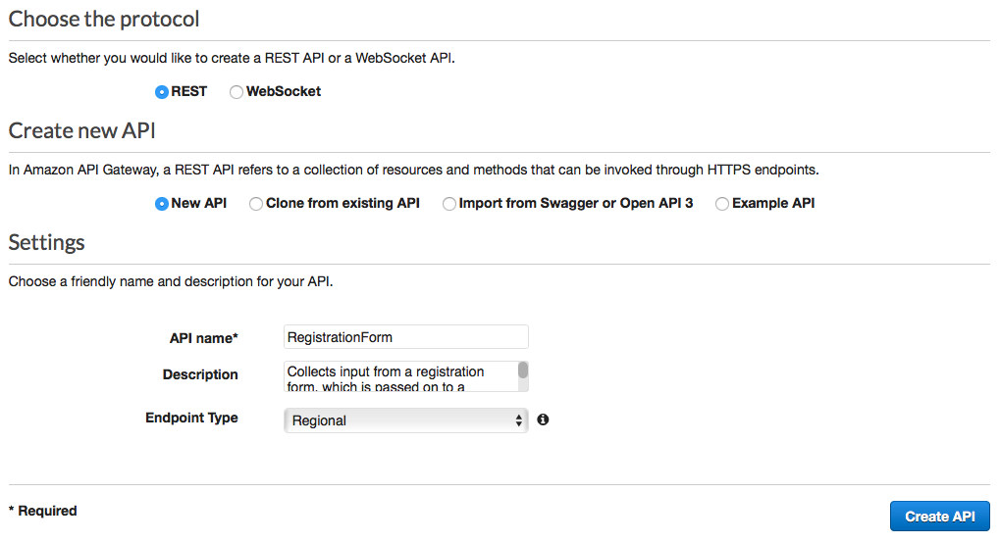
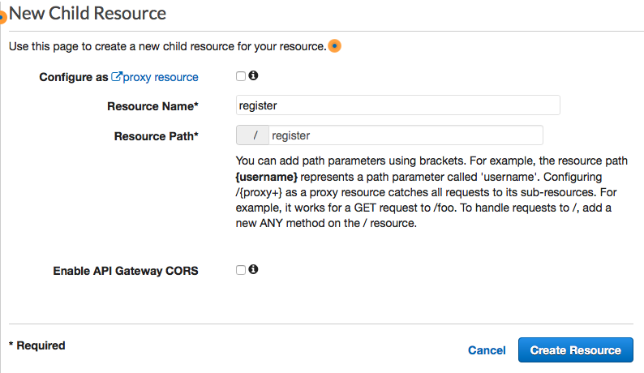
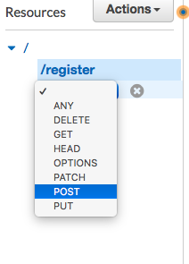
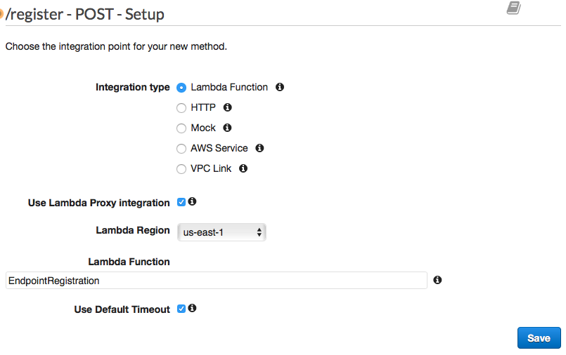
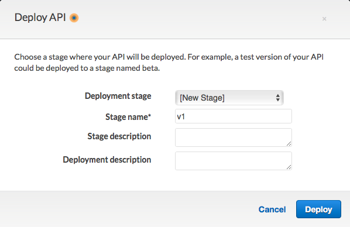
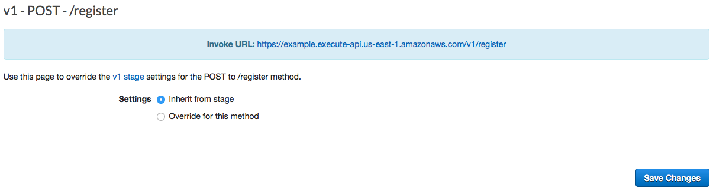
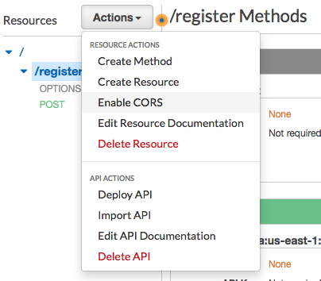

**End of support notice:** On October
30, 2026, AWS will end support for Amazon Pinpoint. After October 30, 2026, you will no
longer be able to access the Amazon Pinpoint console or Amazon Pinpoint resources (endpoints,
segments, campaigns, journeys, and analytics). For more information, see [Amazon Pinpoint end of
support](../../../console/pinpoint/migration-guide.md "../../../console/pinpoint/migration-guide.md"). **Note:** APIs related to SMS, voice,
mobile push, OTP, and phone number validate are not impacted by this change and are
supported by AWS End User Messaging.

# Set up Amazon API Gateway for SMS messaging in Amazon Pinpoint

In this section, you create a new API by using Amazon API Gateway as part of the SMS registration for Amazon Pinpoint. The registration form that you
deploy in this solution calls this API. API Gateway then passes the information that's captured on
the registration form to the Lambda function you created in [Create Lambda functions](tutorials-two-way-sms-part-3.md "tutorials-two-way-sms-part-3.md").

First, you have to create a new API in API Gateway. The following procedures show you how to
create a new REST API.

###### To create a new API

1.  Open the API Gateway console at
    [https://console.aws.amazon.com/apigateway/](https://console.aws.amazon.com/apigateway/ "https://console.aws.amazon.com/apigateway/").
2.  Choose **Create API**. Make the following selections:

        * Under **Choose the protocol**, choose
         **REST**.
        * Under **Create new API**, choose **New
         API**.
        * Under **Settings**, for **Name**,
         enter a name, such as `RegistrationForm`. For
         **Description**, optionally enter some text that
         describes the purpose of the API. For **Endpoint
         Type**, choose **Regional**. Then, choose
         **Create API**.

    An example of these settings is shown in the following image.

Now that you've created an API, you can start to add resources to it. After that, you
add a POST method to the resource, and tell API Gateway to pass the data that you receive from
this method to your Lambda function.

1. On the **Actions** menu, choose **Create
   Resource**. In the **New Child Resource** pane,
   for **Resource Name**, enter `register`,
   as shown in the following image. Choose **Create
   Resource**.

 2. On the **Actions** menu, choose **Create
Method**. From the menu that appears, choose
**POST**, as shown in the following image. Then choose the
**check mark** button.

 3. In the **/register - POST - Setup** pane, make the following
selections:

    * For **Integration type**, choose **Lambda
     Function**.
    * Choose **Use Lambda Proxy Integration**.
    * For **Lambda Region**, choose the Region that you
     created the Lambda function in.
    * For **Lambda Function**, choose the RegisterEndpoint
     function that you created in [Create Lambda functions](tutorials-two-way-sms-part-3.md "tutorials-two-way-sms-part-3.md").

An example of these settings is shown in the following image.

Choose **Save**. On the window that appears, choose
**OK** to give API Gateway permission to execute your Lambda
function.
The API is now ready to use. At this point, you have to deploy it in order to create a
publicly accessible endpoint.

1.  On the **Actions** menu, choose **Deploy
    API**. On the **Deploy API** window, make the
    following selections:

        * For **Deployment stage**, choose **[New
         Stage]**.
        * For **Stage name**, enter
         `v1`.
        * Choose **Deploy**.

    An example of these selections is shown in the following image.

 2. In the **v1 Stage Editor** pane, choose the
**/register** resource, and then choose the
**POST** method. Copy the address that's shown next to
**Invoke URL**, as shown in the following image.

 3. In the navigation pane, choose **Resources**. In the list of
resources, choose the **/register** resource. Finally, on the
**Actions** menu, choose **Enable CORS**,
as shown in the following image.

 4. On the **Enable CORS** pane, choose **Enable CORS and
replace existing CORS headers**.
**Next**: [Create
and deploy the web form](tutorials-two-way-sms-part-5.md "tutorials-two-way-sms-part-5.md")
