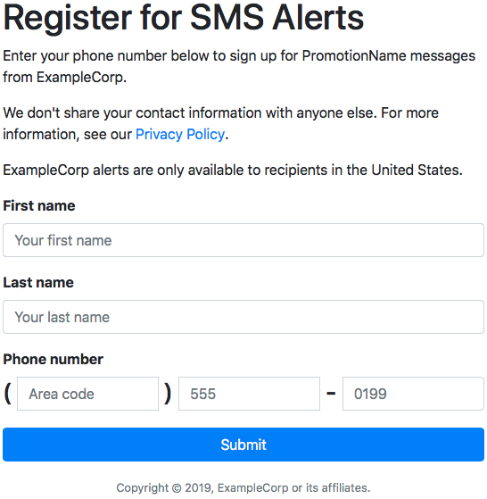
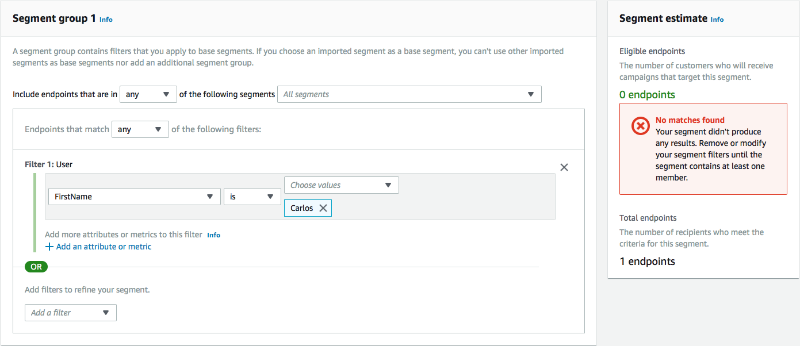

**End of support notice:** On October
30, 2026, AWS will end support for Amazon Pinpoint. After October 30, 2026, you will no
longer be able to access the Amazon Pinpoint console or Amazon Pinpoint resources (endpoints,
segments, campaigns, journeys, and analytics). For more information, see [Amazon Pinpoint end of
support](../../../console/pinpoint/migration-guide.md "../../../console/pinpoint/migration-guide.md"). **Note:** APIs related to SMS, voice,
mobile push, OTP, and phone number validate are not impacted by this change and are
supported by AWS End User Messaging.

# Create and deploy the web

form to use SMS messaging for Amazon Pinpoint

All of the components that use AWS services for SMS messaging using Amazon Pinpoint are now in place. The last
step is to create and deploy the web form that captures customer's data.

In this section, you create a JavaScript function that parses the content of the web
form that you create in the next section. After parsing the content, this function sends
the data to the API that you created in [Set up Amazon API Gateway](tutorials-two-way-sms-part-4.md "tutorials-two-way-sms-part-4.md").

###### To create the form handler

1. In a text editor, create a new file.
2. In the editor, paste the following code.

```
$(document).ready(function() {

  // Handle form submission.
  $("#submit").click(function(e) {

    var firstName = $("#firstName").val(),
        lastName = $("#lastName").val(),
        source = window.location.pathname,
        optTimestamp = undefined,
        utcSeconds = Date.now() / 1000,
        timestamp = new Date(0),
        phone = $("#areaCode").val()
              + $("#phone1").val()
              + $("#phone2").val();

    e.preventDefault();

    if (firstName == "") {
      $('#form-response').html('<div class="mt-3 alert alert-info" role="alert">Please enter your first name.</div>');
    } else if (lastName == "") {
      $('#form-response').html('<div class="mt-3 alert alert-info" role="alert">Please enter your last name.</div>');
    } else if (phone.match(/[^0-9]/gi)) {
      $('#form-response').html('<div class="mt-3 alert alert-info" role="alert">Your phone number contains invalid characters. Please check the phone number that you supplied.</div>');
    } else if (phone.length < 10) {
      $('#form-response').html('<div class="mt-3 alert alert-info" role="alert">Please enter your phone number.</div>');
    } else if (phone.length > 10) {
      $('#form-response').html('<div class="mt-3 alert alert-info" role="alert">Your phone number contains too many digits. Please check the phone number that you supplied.</div>');
    } else {
      $('#submit').prop('disabled', true);
      $('#submit').html('<span class="spinner-border spinner-border-sm" role="status" aria-hidden="true"></span>  Saving your preferences</button>');

      timestamp.setUTCSeconds(utcSeconds);

      var data = JSON.stringify({
        'destinationNumber': phone,
        'firstName': firstName,
        'lastName': lastName,
        'source': source,
        'optTimestamp': timestamp.toString()
      });

      $.ajax({
        type: 'POST',
        url: '`https://example.execute-api.us-east-1.amazonaws.com/v1/register`',
        contentType: 'application/json',
        data: data,
        success: function(res) {
          $('#form-response').html('<div class="mt-3 alert alert-success" role="alert"><p>Congratulations! You&apos;ve successfully registered for SMS Alerts from ExampleCorp.</p><p>We just sent you a message. Follow the instructions in the message to confirm your subscription. We won&apos;t send any additional messages until we receive your confirmation.</p><p>If you decide you don&apos;t want to receive any additional messages from us, just reply to one of our messages with the keyword STOP.</p></div>');
          $('#submit').prop('hidden', true);
          $('#unsubAll').prop('hidden', true);
          $('#submit').text('Preferences saved!');
        },
        error: function(jqxhr, status, exception) {
          $('#form-response').html('<div class="mt-3 alert alert-danger" role="alert">An error occurred. Please try again later.</div>');
          $('#submit').text('Save preferences');
          $('#submit').prop('disabled', false);
        }
      });
    }
  });
});
```

3. In the preceding example, replace
   `https://example.execute-api.us-east-1.amazonaws.com/v1/register`
   with the Invoke URL that you obtained in [Deploy the API](tutorials-two-way-sms-part-4.md#tutorials-two-way-sms-part-4-deploy-api "tutorials-two-way-sms-part-4.md#tutorials-two-way-sms-part-4-deploy-api").
4. Save the file.
   In this section, you create an HTML file that contains the form that customers use to
   register for your SMS program. This file uses the JavaScript form handler that you
   created in the previous section to transmit the form data to your Lambda function.

###### Important

When a user submits this form, it triggers a Lambda function that calls several
Amazon Pinpoint API operations. Malicious users could launch an attack on your form that could
cause a large number of requests to be made. If you plan to use this solution for a
production use case, you should secure it by using a system such as [Google
reCAPTCHA](https://www.google.com/recaptcha/about/ "https://www.google.com/recaptcha/about/").

###### To create the form

1. In a text editor, create a new file.
2. In the editor, paste the following code.

```
<!doctype html>
<html lang="en">

<head>
  <!-- Meta tags required by Bootstrap -->
  <meta charset="utf-8">
  <meta name="viewport" content="width=device-width, initial-scale=1, shrink-to-fit=no">

  <link rel="stylesheet" href="https://stackpath.bootstrapcdn.com/bootstrap/4.3.1/css/bootstrap.min.css" integrity="sha384-ggOyR0iXCbMQv3Xipma34MD+dH/1fQ784/j6cY/iJTQUOhcWr7x9JvoRxT2MZw1T" crossorigin="anonymous">
  <script src="https://code.jquery.com/jquery-3.3.1.slim.min.js" integrity="sha384-q8i/X+965DzO0rT7abK41JStQIAqVgRVzpbzo5smXKp4YfRvH+8abtTE1Pi6jizo" crossorigin="anonymous"></script>
  <script src="https://cdnjs.cloudflare.com/ajax/libs/popper.js/1.14.7/umd/popper.min.js" integrity="sha384-UO2eT0CpHqdSJQ6hJty5KVphtPhzWj9WO1clHTMGa3JDZwrnQq4sF86dIHNDz0W1" crossorigin="anonymous"></script>
  <script src="https://stackpath.bootstrapcdn.com/bootstrap/4.3.1/js/bootstrap.min.js" integrity="sha384-JjSmVgyd0p3pXB1rRibZUAYoIIy6OrQ6VrjIEaFf/nJGzIxFDsf4x0xIM+B07jRM" crossorigin="anonymous"></script>
  <script src="https://ajax.googleapis.com/ajax/libs/jquery/3.3.1/jquery.min.js"></script>

  <script type="text/javascript" src="`SMSFormHandler.js`"></script>
  <title>SMS Registration Form</title>
</head>

<body>
  <div class="container">
    <div class="row justify-content-center mt-3">
      <div class="col-md-6">
        <h1>Register for SMS Alerts</h1>
        <p>Enter your phone number below to sign up for PromotionName messages from ExampleCorp.</p>
        <p>We don't share your contact information with anyone else. For more information, see our <a href="http://example.com/privacy">Privacy Policy</a>.</p>
        <p>ExampleCorp alerts are only available to recipients in the United States.</p>
      </div>
    </div>
    <div class="row justify-content-center">
      <div class="col-md-6">
        <form>
          <div class="form-group">
            <label for="firstName" class="font-weight-bold">First name</label>
            <input type="text" class="form-control" id="firstName" placeholder="Your first name" required>
          </div>
          <div class="form-group">
            <label for="lastName" class="font-weight-bold">Last name</label>
            <input type="text" class="form-control" id="lastName" placeholder="Your last name" required>
          </div>
          <label for="areaCode" class="font-weight-bold">Phone number</label>
          <div class="input-group">
            <span class="h3">(&nbsp;</span>
            <input type="tel" class="form-control" id="areaCode" placeholder="Area code" required>
            <span class="h3">&nbsp;)&nbsp;</span>
            <input type="tel" class="form-control" id="phone1" placeholder="555" required>
            <span class="h3">&nbsp;-&nbsp;</span>
            <input type="tel" class="form-control" id="phone2" placeholder="0199" required>
          </div>
          <div id="form-response"></div>
          <button id="submit" type="submit" class="btn btn-primary btn-block mt-3">Submit</button>
        </form>
      </div>
    </div>
    <div class="row mt-3">
      <div class="col-md-12 text-center">
        <small class="text-muted">Copyright © 2019, ExampleCorp or its affiliates.</small>
      </div>
    </div>
  </div>
</body>

</html>
```

3. In the preceding example, replace `SMSFormHandler.js`
   with the full path to the form handler JavaScript file that you created in the
   previous section.
4. Save the file.
   Now that you've created the HTML form and the JavaScript form handler, the last step
   is to publish these files to the internet. This section assumes that you have an
   existing web hosting provider. If you don't have an existing hosting provider, you can
   launch a website by using Amazon Route 53, Amazon Simple Storage Service (Amazon S3), and Amazon CloudFront. For more
   information, see [Host a static
   website](https://aws.amazon.com/getting-started/hands-on/host-static-website/ "https://aws.amazon.com/getting-started/hands-on/host-static-website/").

If you use another web hosting provider, consult the provider's documentation for more
information about publishing webpages.

After you publish the form, you should submit some test events to make sure that it
works as expected.

###### To test the registration form

1. In a web browser, go to the location where you uploaded the registration form.
   If you used the code example from [Create the JavaScript form handler](#tutorials-two-way-sms-part-5-create-form "#tutorials-two-way-sms-part-5-create-form"), you see
   a form that resembles the example in the following image.

 2. Enter your contact information in the **First name**,
**Last name**, and **Phone number**
fields.

###### Note

When you submit the form, Amazon Pinpoint attempts to send a message to the phone
number that you specified. Because of this functionality, you should use a
real phone number to test the solution from beginning to end.

If you tested the Lambda function in [Create Lambda functions](tutorials-two-way-sms-part-3.md "tutorials-two-way-sms-part-3.md"), your Amazon Pinpoint project
already contains at least one endpoint. When you test this form, you should
either submit a different phone number on the form, or delete the existing
endpoint by using the [DeleteEndpoint](../apireference/apps-application-id-endpoints-endpoint-id.md#DeleteEndpoint "../apireference/apps-application-id-endpoints-endpoint-id.md#DeleteEndpoint") API operation. 3. Check the device that's associated with the phone number that you specified to
make sure that it received the message. 4. Open the Amazon Pinpoint console at
[https://console.aws.amazon.com/pinpoint/](https://console.aws.amazon.com/pinpoint/ "https://console.aws.amazon.com/pinpoint/"). 5. On the **All projects** page, choose the project that you
created in [Create an Amazon Pinpoint
project](tutorials-two-way-sms-part-1.md#tutorials-two-way-sms-part-1-create-project "tutorials-two-way-sms-part-1.md#tutorials-two-way-sms-part-1-create-project"). 6. In the navigation pane, choose **Segments**. On the
**Segments page**, choose **Create a
segment**. 7. In **Segment group 1**, under **Add filters to refine
your segment**, choose **Filter by user**. 8. For **Choose a user attribute**, choose
**FirstName**. Then, for **Choose
values**, choose the first name that you specified when you submitted
the form.

The **Segment estimate** section should show that there are
zero eligible endpoints, and one endpoint (under Total endpoints), as shown in
the following example. This result is expected. When the Lambda function creates
a new endpoint, the endpoint is opted out by default.

 9. On the device that received the message, reply to the message with the two-way
SMS keyword that you specified in [Enable two-way SMS](tutorials-two-way-sms-part-1.md#tutorials-two-way-sms-part-1-enable-two-way "tutorials-two-way-sms-part-1.md#tutorials-two-way-sms-part-1-enable-two-way"). Amazon Pinpoint
sends a response message immediately. 10. In the Amazon Pinpoint console, repeat steps 4 through 8. This time, when you create the
segment, you see one eligible endpoint, and one total endpoint. This result is
expected, because the endpoint is now opted in.
