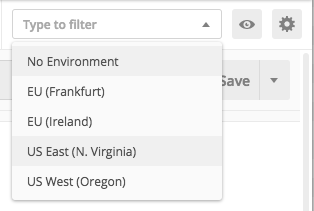
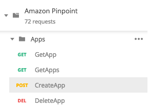
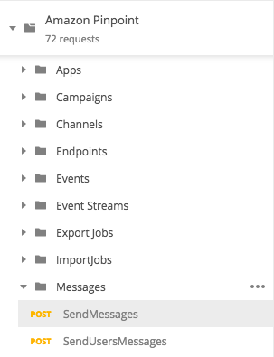

**End of support notice:** On October
30, 2026, AWS will end support for Amazon Pinpoint. After October 30, 2026, you will no
longer be able to access the Amazon Pinpoint console or Amazon Pinpoint resources (endpoints,
segments, campaigns, journeys, and analytics). For more information, see [Amazon Pinpoint end of
support](../../../console/pinpoint/migration-guide.md "../../../console/pinpoint/migration-guide.md"). **Note:** APIs related to SMS, voice,
mobile push, OTP, and phone number validate are not impacted by this change and are
supported by AWS End User Messaging.

# Send requests to the Amazon Pinpoint API

When you finish configuring and testing Postman, you can start sending additional requests
to the Amazon Pinpoint API. This section includes information that you must know before you start
sending requests. It also includes two sample requests that describe how to use the Amazon Pinpoint
collection.

###### Important

When you complete the procedures in this section, you submit requests to the Amazon Pinpoint
API. These requests create new resources in your Amazon Pinpoint account, modify existing
resources, send messages, change the configuration of your Amazon Pinpoint projects, and use other
Amazon Pinpoint features. Use caution when you carry out these requests.

You must configure most of the operations in the Amazon Pinpoint Postman collection before you
can use them. For `GET` and `DELETE` operations, you typically
only need to modify the variables that are set on the **Pre-request
Script** tab.

###### Note

When you use the IAM policy that's shown in [Create an IAM policy](tutorials-using-postman-iam-user.md#tutorials-using-postman-iam-user-create-policy "tutorials-using-postman-iam-user.md#tutorials-using-postman-iam-user-create-policy"), you
can't carry out any of the `DELETE` requests that are included in this
collection.

For example, the `GetCampaign` operation requires you to specify a
`projectId` and a
`campaignId`. On the **Pre-request
Script** tab, both of these variables are present, and are populated with
example values. Delete the example values and replace them with the applicable values
for your Amazon Pinpoint project and campaign.

Of these variables, the most commonly used is the
`projectId` variable. The value for this variable
should be the unique identifier for the project that your request applies to. To get a
list of these identifiers for your projects, refer to the response to the
`GetApps` request that you sent in the preceding step of this tutorial.
In that response, the `Id` field provides the unique identifier for a
project. To learn more about the `GetApps` operation and the meaning of each
field in the response, see [Apps](../apireference/apps.md "../apireference/apps.md") in the
_Amazon Pinpoint API Reference_.

###### Note

In Amazon Pinpoint, a "project" is the same as an "app" or "application."

For `POST` and `PUT` operations, you must also modify the
request body to include the values that you want to send to the API. For example, when
you submit a `CreateApp` request, which is a `POST` request, you
must specify a name for the project that you create. You can modify the request on the
**Body** tab. In this example, replace the value next to
`"Name"` with the name of the project. If you want to add tags to the
project, you can specify them in the `tags` object. Or, if you don't want to
add tags, you can delete the entire `tags` object.

###### Note

The `UntagResource` operation also requires you to specify URL
parameters. You can specify these parameters on the **Params** tab.
Replace the values in the **VALUE** column with the tags that you
want to delete for the specified resource.

Before you create segments and campaigns in Amazon Pinpoint, you first have to create a project.
In Amazon Pinpoint, a _project_ consists of segments, campaigns,
configurations, and data that are united by a common purpose. For example, you could use
a project to contain all of the content that's related to a particular app, or to a
specific brand or marketing initiative. When you add customer information to Amazon Pinpoint, that
information is associated with a project.

###### To create a project by sending a CreateApp API request

1. On the **Environments** menu, choose the AWS Region that
   you want to create the project in.



In this example, Postman has been configured so that the
**Environments** menu shows the following four
options:

    * US East (N. Virginia)
    * US West (Oregon)
    * Europe (Frankfurt)
    * Europe (Ireland)

2. In the **Apps** folder, choose the
   **CreateApp**
   operation>.



The **Apps** folder in the Amazon Pinpoint Postman collection are
expanded and show the following requests:

    * `GetApp`
    * `GetApps`
    * `CreateApp`
    * `DeleteApp`

3. On the **Body** tab, next to `"Name"`, replace the
   placeholder value (`"string"`) with a name for the campaign, such as
   `"MySampleProject"`.
4. Delete the comma after the campaign name, and then delete the entire
   `tags` object on lines 3 through 5. When you finish, your request
   should resemble the example that's shown in the following code snippet.

```
{
    "Name": "MySampleProject"
}
```

Postman is configured to send the request as a raw JSON payload. 5. Choose **Send**. If the campaign is created successfully, the
response pane shows a status of `201
 Created`.

```
{
    "Name": "MySampleProject"
    "Id": "12345678901234567890123456789012",
    "Arn": "arn:aws:mobiletargeting:us-east-1:123456789012:apps/12345678901234567890123456789012",
    "tags": {}
}
```

It's very common to use the Amazon Pinpoint `SendMessages` API to send transactional
messages. One advantage to sending messages by using the `SendMessages` API
as opposed to creating campaigns, is that you can send messages to any address, such as
an email address, phone number, or device token. The address that you send messages to
doesn't have to exist in your Amazon Pinpoint account. Let's compare this method to sending
messages by creating campaigns. Before you send a campaign in Amazon Pinpoint, you must add
endpoints to your Amazon Pinpoint account, create segments, create the campaign, and carry out the
campaign.

The example in this section shows you how to send a transactional email message
directly to a specific email address. You can modify this request to send messages
through other channels, such as SMS, mobile push, or voice.

###### To send an email message by submitting a SendMessages request

1. Verify that the email channel is enabled for the project and the email address
   or domain that you want to use to send and receive the message is configured.
   For more information, see [Enabling and disabling the email channel](pinpoint/latest/userguide/channels-email-setup.md "pinpoint/latest/userguide/channels-email-setup.md") and
   [Verifying email
   identities](channels-email-manage-verify.md "channels-email-manage-verify.md") in the _Amazon Pinpoint User Guide_.

###### Note

To complete the procedure in this section, you must verify and email
address 2. On the **Environments** menu, choose the AWS Region that
you want to send the message from.

In this example, Postman has been configured so that the
**Environments** menu shows the following four
options:

    * US East (N. Virginia)
    * US West (Oregon)
    * Europe (Frankfurt)
    * Europe (Ireland)

3. In the **Messages** folder, choose the
   **SendMessages** operation.

 4. On the **Pre-request Script** tab, replace the value of the
`projectId` variable with the ID of a project that already exists
in the Region that you selected in step 2 of this section. 5. On the **Body** tab, delete the example request that's shown
in the request editor. Paste the following code:

```
{
    "MessageConfiguration":{
        "EmailMessage":{
            "FromAddress":"`sender@example.com`",
            "SimpleEmail":{
                "Subject":{
                    "Data":"Sample Amazon Pinpoint message"
                },
                "HtmlPart":{
                    "Data":"<h1>Test message</h1><p>This is a sample message sent from <a href=\"https://aws.amazon.com/pinpoint\">Amazon Pinpoint</a> using the SendMessages API.</p>"
                },
                "TextPart":{
                    "Data":"This is a sample message sent from Amazon Pinpoint using the SendMessages API."
                }
            }
        }
    },
    "Addresses":{
        "`recipient@example.com`": {
            "ChannelType": "EMAIL"
        }
    }
}
```

6. In the preceding code, replace `sender@example.com`
   with your verified email address. Replace
   `recipient@example.com` with the verified email
   address that you want to send the message to.

###### Note

If your account is still in the Amazon Pinpoint email sandbox, you can only send
emails to addresses or domains that are verified in your Amazon Pinpoint account. For
more information about having your account removed from the sandbox, see
[Requesting production access for email](channels-email-setup-production-access.md "channels-email-setup-production-access.md") in the
_Amazon Pinpoint User Guide_. 7. Choose **Send**. If the message is sent successfully, the
response pane shows a status of `200 OK`.

```
{
    "ApplicationId": "12345678901234567890123456789012",
    "RequestId": "<sampleValue>",
    "Result": {
        "recipient@example.com": {
            "DeliveryStatus": "SUCCESSFUL",
            "StatusCode": 200,
            "StatusMessage": "<sampleValue>",
            "MessageId": "<sampleValue>"
        }
    }
}
```
