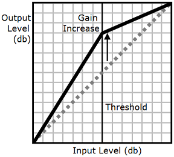
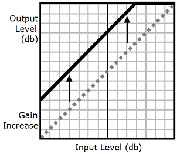

# Adding dynamic range compression

_<amazon:effect name="drc">_

This tag is supported by long-form, neural, and standard TTS formats.

Depending on the text, language, and voice used in an audio
file, the sounds range from soft to loud. Environmental sounds,
such as the sound of a moving vehicle, can often mask the softer
sounds, which makes the audio track difficult to hear clearly.
To enhance the volume of certain sounds in your audio file, use
the dynamic range compression (`drc`) tag.

The `drc` tag sets a midrange "loudness" threshold
for your audio, and increases the volume (the gain) of the
sounds around that threshold. It applies the greatest gain
increase closest to the threshold, and the gain increase is
lessened farther away from the threshold.


This makes the middle-range sounds easier to hear in a noisy
environment, which makes the entire audio file clearer.

The `drc` tag is a Boolean parameter (it's either
present or it isn't). It uses the syntax:
`<amazon:effect name="drc">` and is closed
with `</amazon:effect>`.

You can use the `drc` tag with any voice or
language supported by Amazon Polly. You can apply it to an entire
section of the recording, or for only a few words. For
example:

```
<speak>
     Some audio is difficult to hear in a moving vehicle, but <amazon:effect name="drc"> this audio
     is less difficult to hear in a moving vehicle.</amazon:effect>
</speak>
```

###### Note

When you use "`drc`" in the `amazon:effect` syntax, it is case-sensitive.

###### Using `drc` with the `prosody

volume` Tag

As the following graphic shows, the `prosody
 volume` tag evenly increases the volume of an
entire audio file from the original level (dotted line) to
an adjusted level (solid line). To further increase the
volume of certain parts of the file, use the
`drc` tag with the `prosody
 volume` tag. Combining tags doesn't affect the
settings of the `prosody volume` tag.


When you use the `drc` and `prosody
 volume` tags together, Amazon Polly applies the
`drc` tag first, increasing the middle-range
sounds (those near the threshold). It then applies the
`prosody volume` tag and further increases the
volume of the entire audio track evenly.


To use the tags together, nest one inside the other. For
example:

```
<speak>
     <prosody volume="loud">This text needs to be understandable and loud. <amazon:effect name="drc">
     This text also needs to be more understandable in a moving car.</amazon:effect></prosody>
</speak>
```

In this text, the `prosody volume` tag increases
the volume of the entire passage to "loud." The `drc`
tag enhances the volume of the middle-range values in the second
sentence.

###### Note

When using the `drc` and `prosody
 volume` tags together, use standard XML practices
for nesting tags.
