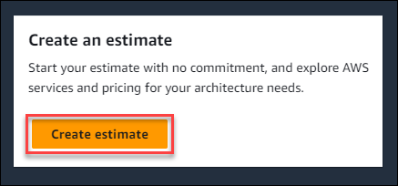
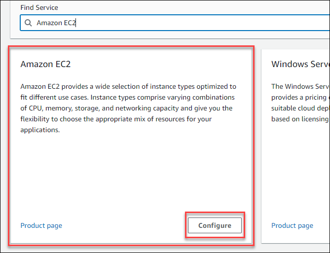
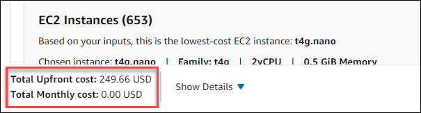
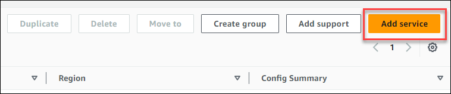
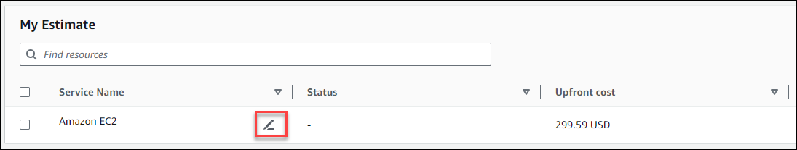

# Create and configure an estimate

AWS Pricing Calculator allows you to generate detailed estimates for your projected AWS usage and costs across a variety of services. The
following procedures provide a step-by step process on how to to create a new estimate, configure the specific AWS services
you want to include, and add services like Support plans based on your technical support requirements.

###### Topics

- [Create an estimate](#create-estimate "#create-estimate")
- [Configure a service](#configure-service "#configure-service")
- [Add more services](#Add-more "#Add-more")
- [Edit your inputs](#update-inputs "#update-inputs")

## Create an estimate

###### To create your estimate

1. Open AWS Pricing Calculator at [https://calculator.aws/#/](https://calculator.aws/#/ "https://calculator.aws/#/").
2. Choose **Create estimate**.

 3. On the **Add service** page, find the service that you want.
Then, choose **Configure**. For more information,
see [Configure a service](#configure-service "#configure-service"). 4. Add a **Description** for the estimated service. 5. Select a **Region**. 6. Enter your sevice specifications. 7. Choose **Save and add service**. 8. To view the estimate you created, choose **View summary**.

## Configure a service

This section shows how to configure a service you're creating an estimate for. In
this example, we're adding Amazon EC2 using the Amazon EC2 **Quick estimate**
option.

###### To configure a service for your

estimate

1. Open the **Add service** page at [https://calculator.aws/#/addService](https://calculator.aws/#/addService "https://calculator.aws/#/addService")
   .
2. Enter `Amazon EC2` in the search bar and choose
   **Configure**.

 3. In the **Description** field, enter a description for
your estimate. 4. Choose a **Region**. 5. In the EC2 specifications section, update the parameters based on your use
case requirements. 6. At this stage you can view the total upfront and monthly costs. These costs
are based on the current EC2 parameters you selected.

 7. (Optional) Choose **Show calculations** to view the breakeven
analysis and utilization summary of your estimate. 8. (Optional) In the **Amazon EBS** section, choose the storage for each
Amazon EC2 instance, and enter the storage amount.

###### Note

If you aren't adding Amazon EBS volumes, enter `0`. 9. Choose **Save and add service**.

## Add more services

You can add more services to your estimate based on your use case requirements.
For process examples and tutorials that show estimates for specific services, see
[Estimate examples for services](estimate-examples.md "estimate-examples.md").

###### To add more services to your estimate

1. Open the **My estimate** page at [https://calculator.aws/#/estimate](https://calculator.aws/#/estimate "https://calculator.aws/#/estimate")
   .
2. Choose **Add Service**.

 3. Search for a service and choose **Configure**. 4. Enter the service parameters. Then, choose **Save and add service**. 5. Repeat this process as needed.

## Edit your inputs

You can edit the inputs for a service added to your estimate.

###### To edit the inputs for a service

1. Open the **My Estimate** page at [https://calculator.aws/#/estimate](https://calculator.aws/#/estimate "https://calculator.aws/#/estimate")
   .
2. In the **My Estimate** section, locate the service you want
   to update. Then, choose the **Edit** icon.

 3. Edit your service inputs. Then, choose **Save** to return to your
**My Estimate** page.
