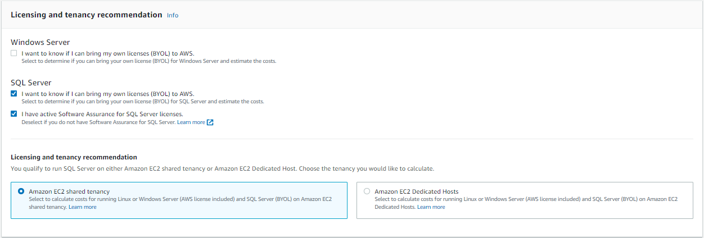

# Tutorial: Generating estimates for Windows Servers and SQL Servers on EC2

This tutorial shows you how to use the Microsoft Windows Server and Microsoft SQL
Server on Amazon EC2 in AWS Pricing Calculator to generate an estimate.

## Procedure

###### Tasks

- [Step 1: Choose your AWS Region](#estimate-workload-tutorial-region "#estimate-workload-tutorial-region")
- [Step 2: Choose your licensing and
  tenancy recommendation](#estimate-workload-tutorial-step1 "#estimate-workload-tutorial-step1")
- [Step 3: Configure your machine
  specifications](#estimate-workload-tutorial-step2 "#estimate-workload-tutorial-step2")
- [Step 4: Choose a pricing
  strategy](#estimate-workload-tutorial-step3 "#estimate-workload-tutorial-step3")
- [Step 5: Review calculations and cost
  details](#estimate-workload-tutorial-step4 "#estimate-workload-tutorial-step4")
- [Step 6: Add a Windows LI and SQL Server LI to your estimate](#estimate-workload-tutorial-step5 "#estimate-workload-tutorial-step5")

### Step 1: Choose your AWS Region

###### To name your estimate and select your Region

1. Open the **Configure Windows Server and SQL Server on Amazon EC2** section of AWS Pricing Calculator at
   [https://calculator.aws/#/createCalculator/EC2WinSQL](https://calculator.aws/#/createCalculator/EC2WinSQL "https://calculator.aws/#/createCalculator/EC2WinSQL").
2. Enter the following estimate description: `Workload_SQL_BYOL`.
3. Make sure that your location type is set to **Region**. Then, choose the
   Region `US East (Ohio)`.

###### Note

All AWS resources are priced based on the Region you choose.

### Step 2: Choose your licensing and

tenancy recommendation

In this section, you can specify your license details to determine your cost-optimized tenancy qualifications. For more information about
licensing and tenancy supported by AWS Pricing Calculator, see [Licensing and tenancy
recommendations](windows-workload-estimates.md#estimate-workload-tenancy "windows-workload-estimates.md#estimate-workload-tenancy").

###### To determine your licensing and tenancy recommendations for this

example

1. Open the **Configure Windows Server and SQL Server on Amazon EC2** section of AWS Pricing Calculator at
   [https://calculator.aws/#/createCalculator/EC2WinSQL](https://calculator.aws/#/createCalculator/EC2WinSQL "https://calculator.aws/#/createCalculator/EC2WinSQL").
2. In the **Licensing and tenancy recommendation** section, clear
   the **Windows Server** checkbox.
3. Under **SQL Server**, select both options.
4. Keep the default selection of the shared tenancy.

You will notice that the recommended tenancy options are
**Shared** and **Dedicated
Hosts**. You can use the [Amazon EC2 Dedicated Hosts calculator](https://calculator.aws/#/EC2DedicatedHosts "https://calculator.aws/#/EC2DedicatedHosts") to estimate Dedicated Host tenancy.

### Step 3: Configure your machine

specifications

In this step, you can input machine specifications to configure your AWS Pricing Calculator estimate.

The following table provides an example workload scenario to show several capabilities in the AWS Pricing Calculator.
You can use these values for the purpose of this tutorial.

| Host description | vCPUs | Ram | Storage (GB) | IOPS  | Software               | Optimize vCPUs | Quantity | Passive node count |
| ---------------- | ----- | --- | ------------ | ----- | ---------------------- | -------------- | -------- | ------------------ |
| Server 1         | 16    | 800 | 5000         | 60000 | SQL Enterprise Edition | 16             | 10       | 5                  |
| Server 2         | 16    | 64  | 3000         | 15000 | SQL Standard Edition   | 16             | 8        | 4                  |
| Server 3         | 8     | 16  | 1000         |       | SQL Web Edition        | 8              | 10       | 0                  |
| Server 4         | 4     | 32  | 500          |       | Windows                | N/A            | 8        | N/A                |

###### To specify your machine specifications for this example

1. Open the **Configure Windows Server and SQL Server on Amazon EC2** section of AWS Pricing Calculator at
   [https://calculator.aws/#/createCalculator/EC2WinSQL](https://calculator.aws/#/createCalculator/EC2WinSQL "https://calculator.aws/#/createCalculator/EC2WinSQL").
2. In the **Configure machine specifications** section, choose the
   **Add new machine specification** button.
3. For **Machine description**, keep the name `Server 1`.
4. For **Operating system**, choose **Windows
   Server**.
5. For **SQL Server edition (BYOL)**, choose **SQL
   Server Enterprise**.
6. Under **Storage volumes per specifications**, enter the
   storage amount (GiB) as `5000` and
   **IOPS** as `60000`.

For more information, see [Machine
specifications details](#estimate-workload-tutorial-step2-machinedetails "#estimate-workload-tutorial-step2-machinedetails"). 7. For **Amazon EC2 instance type**, choose the **Obtain an Amazon EC2 instance type
recommendation**.

For more information, see [Amazon EC2 instance
type details](#estimate-workload-tutorial-step2-ec2details "#estimate-workload-tutorial-step2-ec2details"). 8. For **Optimize vCPU**, keep the optimize CPU value as
`16`.

For more information, see [Benefits of
Optimize vCPUs](#estimate-workload-tutorial-step2-optcpudetails "#estimate-workload-tutorial-step2-optcpudetails"). 9. For **Quantity**, enter `10`. 10. For number of passive instances, choose **5**. 11. Choose **Add machine** to add more machine specification
types.

For this tutorial, add the remaining three workloads from the example workload table.

#### Machine

specifications details

If you enter the storage size (GB) only, the calculator provides you with the
most cost-effective Amazon Elastic Block Store (Amazon EBS) storage option. If you enter a value
between `16000` and `64000` for IOPS,
the AWS Pricing Calculator recommends the io2 EBS volume type. Anything value beyond that
range, AWS Pricing Calculator recommends io2 Block Express with tiered pricing. For more
information, see [Amazon EBS volume
types](../../../AWSEC2/latest/UserGuide/ebs-volume-types.md "../../../AWSEC2/latest/UserGuide/ebs-volume-types.md").

#### Amazon EC2 instance

type details

You can choose **Obtain an Amazon EC2 instance type
recommendation** for the server type specifications. AWS
recommendations always default to the latest, cost-optimized instances for
Windows Server and SQL Server workloads.

You can also choose **Search** for an Amazon EC2 instance type if
you want the ability to filter the instance types. You can filter by instance
category, memory, CPU, and other options.

#### Benefits of

Optimize vCPUs

You have the flexibility to specify a custom number of vCPUs while using the
same memory, storage, and bandwidth of a full-sized instance. This means that
BYOL customers can optimize vCPU-based licensing costs.

Even though the CPU optimized instance has the same price as the instance
that's not optimized for CPU, it offers flexibility to choose the CPU count, so
you can bring the right SQL Server license to avoid extra costs. For example, an
`x1e.8xlarge` instance has 32 vCPUs by default. But you can
specify `x1e.8xlarge` with Optimize CPU value to 16, 14, or 12.

The passive SQL Server nodes allow for additional cost optimization. A passive
SQL Server node doesn't serve SQL Server data or run active SQL Server
workloads. If you bring SQL Server to AWS with Software Assurance, you aren’t
required to license SQL Server on a passive node.

### Step 4: Choose a pricing

strategy

In this step, you use the pricing strategy section in AWS Pricing Calculator to choose a
pricing model.

###### To choose a pricing strategy for this example

1. Open the **Configure Windows Server and SQL Server on Amazon EC2** section of AWS Pricing Calculator at
   [https://calculator.aws/#/createCalculator/EC2WinSQL](https://calculator.aws/#/createCalculator/EC2WinSQL "https://calculator.aws/#/createCalculator/EC2WinSQL").
2. In the **Choose a pricing strategy** section - under **Pricing model**,
   choose **Standard Reserved Instance**.
3. Under **Reservation term**, choose **1 year**.
4. Under **Payment options**, choose **No Upfront**.

###### Note

This is a default pricing strategy that offers up to 75 percent savings over
On-Demand pricing. For more information, see [Amazon EC2 pricing](https://aws.amazon.com/ec2/pricing/ "https://aws.amazon.com/ec2/pricing/").

### Step 5: Review calculations and cost

details

At this stage in the example tutorial, you can view the breakdown your cost estimates.

###### To view the calculation and cost details of this example

1. Open the **Configure Windows Server and SQL Server on Amazon EC2** section of AWS Pricing Calculator at
   [https://calculator.aws/#/createCalculator/EC2WinSQL](https://calculator.aws/#/createCalculator/EC2WinSQL "https://calculator.aws/#/createCalculator/EC2WinSQL").
2. To view the breakdown of the calculations, select the arrow next **Show calculations**.
3. The view the cost details of the EC2 instance, storage, and BYOL SQL license specifications, select
   the arrow next to **Cost details** section.
4. After you review the calculations and cost details of all four example workloads, choose **Save and add service**.

At this point, you successfully estimated workload costs for Windows Server
License Included and SQL Server Bring Your Own License (BYOL) licensing. If want to clone your existing estimate to generate an
estimate for the License Included option for an SQL Server, navigate to [Step 6: Add a Windows LI and SQL Server LI to your estimate](#estimate-workload-tutorial-step5 "#estimate-workload-tutorial-step5").

### Step 6: Add a Windows LI and SQL Server LI to your estimate

###### To add a Windows LI and SQL Server LI to your estimate

1. Navigate to the **My Estimate** section in AWS Pricing Calculator.
2. Select the checkbox of the service you want to duplicate. Then, choose **Duplicate**.
3. Choose the **Edit** icon on the duplicate version of the estimate.
4. For the **Estimate details** description, enter `Workload_LI`.
5. Keep the **Region** as is.
6. In the **Licensing and tenancy recommendation** section,
   keep the **Windows Server** and **SQL
   Server** check boxes cleared.
7. For the SQL Server section, review and adjust the machine
   specifications.
8. Review the new monthly cost estimate and aggregated monthly costs.
9. Choose **Update**.

On the **My Estimate** page, you can now compare the price under
both the licensing options. In this example, the shared tenancy with Windows License Included and
SQL Server BYOL option is approximately half of the cost of shared tenancy with
Windows License Included and SQL Server License Included.

You have now completed the tutorial for using the Microsoft Windows Server and
Microsoft SQL Server to generate a pricing estimate.
