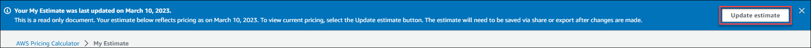
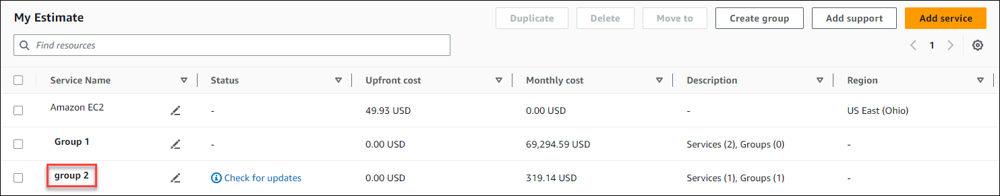

# Sharing your estimate

You can create a unique, public link for each estimate that you create. Use this link to
share the estimate with stakeholders or access the estimate again at a later time. Estimates
are saved to AWS public servers.

Any changes you make to an estimate requires you to save again. AWS Pricing Calculator doesn't automatically save to the
same link to prevent unwanted overwrites. Alternatively, you can use the shared link as a template for common use
cases, and use it as a starting point to build complex estimates.

###### Note

- Make sure that you save your estimate links because your estimates can't be accessed
  without them.
- Estimates that are exported as a PDF or JSON file contain a share link to your
  estimate.
- Estimate links aren't auto-saved with updates. If you make changes to an estimate, generate a new estimate link.
- Estimate links created on or after May 31, 2023, remain valid for one year. Estimate links created before this date remain valid
  for three years.

###### Topics

- [Sharing an estimate link](#create-estimate-link "#create-estimate-link")
- [Updating a saved estimate](#update-estimate-link "#update-estimate-link")

## Sharing an estimate link

###### To generate a public share link

1. Open AWS Pricing Calculator at [https://calculator.aws/#/](https://calculator.aws/#/ "https://calculator.aws/#/").
2. Create an estimate by adding one or more services. For more information, see
   [Create an estimate](create-configure-estimate.md#create-estimate "create-configure-estimate.md#create-estimate").
3. Open the **My Estimate** page at [https://calculator.aws/#/estimate](https://calculator.aws/#/estimate "https://calculator.aws/#/estimate")

. 4. Choose **Share**. 5. Read the **Public server acknowledgment** and choose **Agree and Continue**.

(Optional) You can select **Don't show me this again** for future
visits. 6. Choose **Copy public link** to copy your generated link.

We recommend you document your shared links with a brief description of the estimate.

## Updating a saved estimate

The total cost of your previously saved estimates can become out of date over time. This is because of pricing
changes or updates to services within the AWS Pricing Calculator. You can update your estimates to reflect the latest
costs and keep them updated.

###### To update a previously saved estimate

1. Open your saved estimate in AWS Pricing Calculator. To do this, copy your unique link into your browser's navigation bar.
2. In the banner that shows when your estimate was last updated, choose **Update estimate**.

 3. In the **My Estimate** section, check the **Status** column for updates.
There are four types of status values:

    * **Required inputs** — an update was made to a service within the estimate.
     This means that your current estimate is out of date and requires action. If you have services
     with a **Required inputs** status, skip to step 4.
    * **Cost updated** — a pricing model or a cost calculation change occurred to a service
     that impacts your estimate total. No action is required because Pricing Calculator automatically updates your estimate
     with these changes.
    * **Read-only** — an update was made to a service within the estimate.
     However, direct updates to that service estimate isn't supported. To view an up-to-date estimate that contains
     the latest service changes, re-create the service estimate. For more information about how to create a new
     estimate, see [Creating an estimate link](save-share-estimate.md#create-estimate-link "save-share-estimate.md#create-estimate-link").
    * **Check for updates** — an update was made to a service within a group. Your
     current estimate is out of date and requires action. If you have groups with a **Check for updates**
     status, select the group name to view the service impacted. Then, skip to step 4.

 4. If you have services with a **Required inputs** status or you want to modify a specific service, select
the edit icon beside the service name. 5. Make your changes to the service. Then, choose **Update**. 6. Choose **Share** to save your changes.

###### Note

- When you save your estimate, a new estimate link is generated. The updates aren't saved to the original shared link.
- For more information about updates to services in AWS Pricing Calculator, see [Service Updates](https://calculator.aws/#/serviceUpdates "https://calculator.aws/#/serviceUpdates").
