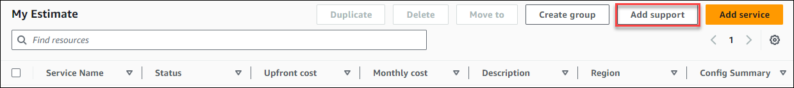
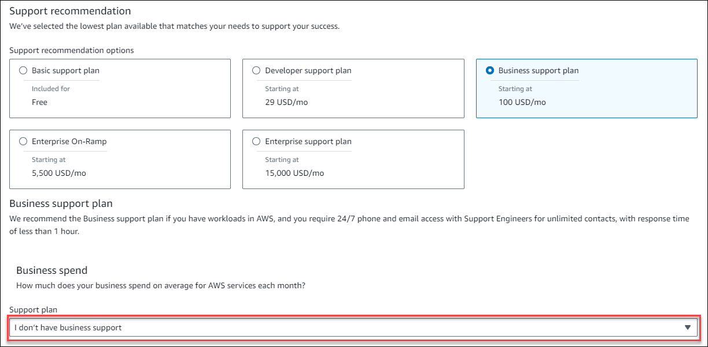

# Adding Support costs to your estimates

You can add Support costs to your estimates using the AWS Pricing Calculator. You can either directly
choose your preferred support plan, or complete the recommendations that match your usage
needs. You can change your Support within the calculator at any time.

## Procedure

###### To add Support costs to your estimates

1. Open AWS Pricing Calculator at [https://calculator.aws/#/](https://calculator.aws/#/ "https://calculator.aws/#/").
2. Choose **Create estimate**.
3. Add a service to your estimate. For more information, see [Create an estimate](create-configure-estimate.md#create-estimate "create-configure-estimate.md#create-estimate")
4. In your **My Estimate** page, choose **Add support**.

 5. (Optional) Enter a description for your support plan estimate. 6. (Optional) Choose an **Enhanced technical support** level from the dropdown list that appears. 7. (Optional) Choose a **High severity response** time from the dropdown list that appears..

###### Note

Some of the Support recommendation options might not be available. This depends on the
**Enhanced technical support** level
and **High severity response** times you selected. 8. Choose a **Support recommendation** option. 9. If you chose a **Business support plan** or **Enterprise support plan**, choose the range of how much your business or enterprise spends on
average for AWS services each month.

 10. (Optional) Choose **Show calculations** to review the calculations behind the estimates. 11. Choose **Add to my estimate**. 12. If you chose a **Business support plan** or **Enterprise support plan**, choose **Confirm** in the prompt that appears.
Then, choose **Add to my estimate**.
