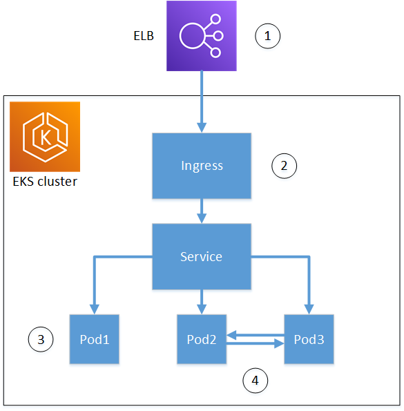

# Concepts

The following diagram shows some of the options available for using TLS in an Amazon EKS
cluster. The example cluster sits behind a load balancer. The numbers identify possible
endpoints for TLS-secured communications.

1. **Termination at the load balancer**

Elastic Load Balancing (ELB) is integrated with the AWS Certificate Manager service. You don't need to
install `cert-manager` on the load balancer. You can provision ACM with
a private CA, sign a certificate with the private CA, and install the certificate
using the ELB console. AWS Private CA certificates are automatically renewed.

As an alternative, you can provide a private certificate to a non-AWS load
balancer to terminate TLS.

This provides encrypted communication between a remote client and the load
balancer. Data after the load balancer is passed unencrypted to the Amazon EKS
cluster. 2. **Termination at the Kubernetes ingress
controller**

The ingress controller is inside the Amazon EKS cluster and acts as a load balancer and
router. To use the ingress controller as the cluster's endpoint for external
communication, you must:

    * Install both `cert-manager` and
     `aws-privateca-issuer`
    * Provision the controller with a TLS private certificate from the
     AWS Private CA.

Communications between the load balancer and the ingress controller are encrypted,
data passes unencrypted to the cluster's resources. 3. **Termination at a pod**

Each pod is a group of one or more containers that share storage and network
resources. If you install both `cert-manager` and
`aws-privateca-issuer` and provision the cluster with a private CA,
Kubernetes can install a signed TLS private certificate on pods as needed. A TLS
connection terminating at a pod is unavailable to other pods in the cluster by
default. 4. **Secure communications between pods.**

You can provision multiple pods with certificates to allow them to communicate
with one another. The following scenarios are possible:

    * Provisioning with Kubernetes generated self-signed certificates. This
     secures communications between pods, but self-signed certificates don't
     satisfy HIPAA or FIPS requirements.
    * Provisioning with certificates signed by AWS Private CA. This requires installing
     both `cert-manager` and `aws-privateca-issuer`.
     Kubernetes can then install signed mTLS certificates on the pods as
     needed.
