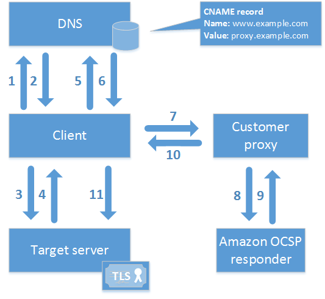

# Customize OCSP URL for AWS Private CA

###### Note

This topic is for customers who want to customize the public URL of the Online
Certificate Status Protocol (OCSP) responder endpoint for branding or other
purposes. If you plan to use the default configuration of AWS Private CA managed
OCSP, you can skip this topic and follow the configuration instructions in [Configure revocation](create-CA.md#PcaCreateRevocation "create-CA.md#PcaCreateRevocation").

By default, when you enable OCSP for AWS Private CA, each certificate that you issue
contains the URL for the AWS OCSP responder. This allows clients requesting a
cryptographically secure connection to send OCSP validation queries directly to
AWS. However, in some cases it might be preferable to state a different URL in
your certificates while still ultimately submitting OCSP queries to AWS.

###### Note

For information about using a certificate revocation list (CRL) as an
alternative or a supplement to OCSP, see [Configure revocation](create-CA.md#PcaCreateRevocation "create-CA.md#PcaCreateRevocation") and [Planning a
certificate revocation list (CRL)](crl-planning.md "crl-planning.md").

Three elements are involved in configuring a custom URL for OCSP.

- **CA configuration** – Specify a custom OCSP
  URL in the `RevocationConfiguration` for your CA as described in
  [Example 2: Create a CA with OCSP and a custom CNAME
  enabled](create-CA.md#example_2 "create-CA.md#example_2") in [Create a private CA in AWS Private CA](create-CA.md "create-CA.md").
- **DNS** – Add a CNAME record to your domain
  configuration to map the URL appearing in the certificates to a proxy server
  URL. For more information, see [Example 2: Create a CA with OCSP and a custom CNAME
  enabled](create-CA.md#example_2 "create-CA.md#example_2") in [Create a private CA in AWS Private CA](create-CA.md "create-CA.md").
- **Forwarding proxy server** – Set up a proxy
  server that can transparently forward OCSP traffic that it receives to the
  AWS OCSP responder.
  The following diagram illustrates how these elements work together.

As shown in the diagram, the customized OCSP validation process involves the
following steps:

1. Client queries DNS for the target domain.
2. Client receives the target IP.
3. Client opens a TCP connection with target.
4. Client receives target TLS certificate.
5. Client queries DNS for the OCSP domain listed in the certificate.
6. Client receives proxy IP.
7. Client sends OCSP query to proxy.
8. Proxy forwards query to the OCSP responder.
9. Responder returns certificate status to the proxy.
10. Proxy forwards certificate status to the client.
11. If certificate is valid, client begins TLS handshake.

###### Tip

This example can be implemented using [Amazon CloudFront](../../../AmazonCloudFront/latest/DeveloperGuide.md "../../../AmazonCloudFront/latest/DeveloperGuide.md") and [Amazon Route 53](../../../Route53/latest/DeveloperGuide.md "../../../Route53/latest/DeveloperGuide.md") after you
have configured a CA as described above.

1. In CloudFront, create a distribution and configure it as follows:
   - Create an alternate name that matches your custom
     CNAME.
   - Bind your certificate to it.
   - Set
     `ocsp.acm-pca.`<region>`.amazonaws.com`
     as the origin.
     - To use IPv6 connections, use the dualstack endpoint
       `acm-pca-ocsp.`<region>`.api.aws`

   - Apply the `Managed-CachingDisabled` policy.
   - Set **Viewer protocol policy** to
     **HTTP and HTTPS**.
   - Set **Allowed HTTP methods** to
     **GET, HEAD, OPTIONS, PUT, POST, PATCH,
     DELETE**.

2. In Route 53, create a DNS record that maps your custom CNAME to the URL
   of the CloudFront distribution.

## Using OCSP over IPv6

The default AWS Private CA OCSP responder URL is IPv4-only. To use OCSP over
IPv6, configure a custom OCSP URL for your CA. The URL can be either:

- The FQDN of the dualstack PCA OCSP responder, which takes the form
  `acm-pca-ocsp.`region-name`.api.aws`
- A CNAME record that you have configured to point at the dualstack OCSP
  responder, as explained above.
