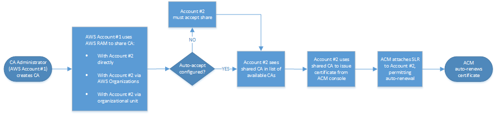
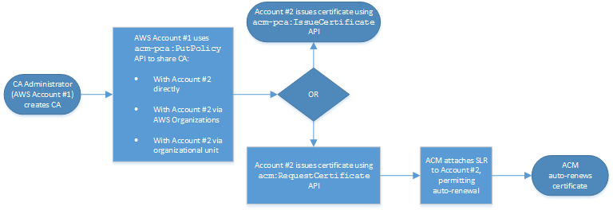

# Attach a policy for cross-account access

When the CA administrator and the certificate issuer reside in different AWS
accounts, the CA administrator must share CA access. This is accomplished by
attaching a resource-based policy to the CA. The policy grants issuance permissions
to a specific principal, which can be an AWS account owner, an IAM user, an
AWS Organizations ID, or an organizational unit ID.

A CA administrator can attach and manage policies in the following ways:

- In the management console, using AWS Resource Access Manager (RAM), which is a standard
  method for sharing AWS resources across accounts. When you share a CA
  resource in AWS RAM with a principal in another account, the required
  resource-based policy is attached to the CA automatically. For more
  information about RAM, see the [AWS RAM User Guide](../../../ram/latest/userguide.md "../../../ram/latest/userguide.md").

###### Note

You can easily open the RAM console by choosing a CA and then choosing
**Actions**, **Manage resource
shares**.

- Programmatically, using the PCA APIs [PutPolicy](../APIReference/API_PutPolicy.md "../APIReference/API_PutPolicy.md"), [GetPolicy](../APIReference/API_GetPolicy.md "../APIReference/API_GetPolicy.md"), and [DeletePolicy](../APIReference/API_DeletePolicy.md "../APIReference/API_DeletePolicy.md").
- Manually, using the PCA commands [put-policy](../../../cli/latest/reference/acm-pca/put-policy.md "../../../cli/latest/reference/acm-pca/put-policy.md"), [get-policy](../../../cli/latest/reference/acm-pca/get-policy.md "../../../cli/latest/reference/acm-pca/get-policy.md"), and [delete-policy](../../../cli/latest/reference/acm-pca/delete-policy.md "../../../cli/latest/reference/acm-pca/delete-policy.md") in the AWS CLI.
  Only the console method requires RAM access.

###### Cross-account case 1: Issuing a managed certificate from the console

In this case, the CA administrator uses AWS Resource Access Manager (AWS RAM) to share CA access
with another AWS account, which allows that account to issue managed ACM
certificates. The diagram shows that AWS RAM can share the CA directly with the
account, or indirectly through an AWS Organizations ID in which the account is a
member.

After RAM shares a resource through AWS Organizations, the recipient principal must accept
the resource for it to take effect. The recipient can configure AWS Organizations to accept
offered shares automatically.

###### Note

The recipient account is responsible for configuring autorenewal in ACM.
Typically, on the first occasion a shared CA is used, ACM installs a
service-linked role that permits it to make unattended certificate calls on
AWS Private CA. If this fails (usually due to a missing permission), certificates
from the CA are not renewed automatically. Only the ACM user can resolve the
problem, not the CA administrator. For more information, see [Using a Service Linked Role (SLR) with
ACM](../../../acm/latest/userguide/acm-slr.md "../../../acm/latest/userguide/acm-slr.md").

###### Cross-account case 2: Issuing managed and unmanaged certificates using the

API or CLI

This second case demonstrates the sharing and issuance options that are
possible using the AWS Certificate Manager and AWS Private CA API. All of these operations can
also be carried out using the corresponding AWS CLI commands.

Because the API operations are being used directly in this example, the
certificate issuer has a choice of two API operations to issue a certificate. The
PCA API action `IssueCertificate` results in an unmanaged certificate
that will not be automatically renewed and must be exported and manually installed.
The ACM API action [RequestCertificate](../../../acm/latest/APIReference/API_RequestCertificate.md "../../../acm/latest/APIReference/API_RequestCertificate.md") results in a managed certificate that can be easily
installed on ACM integrated services and renews automatically.

###### Note

The recipient account is responsible for configuring auto-renewal in ACM.
Typically, on the first occasion a shared CA is used, ACM installs a
service-linked role that allows it to make unattended certificate calls on
AWS Private CA. If this fails (usually due to a missing permission), certificates
from the CA will not renew automatically, and only the ACM user can resolve
the problem, not the CA administrator. For more information, see [Using a Service Linked Role (SLR) with
ACM](../../../acm/latest/userguide/acm-slr.md "../../../acm/latest/userguide/acm-slr.md").
