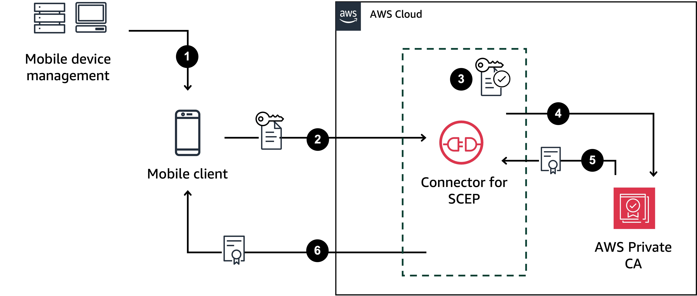
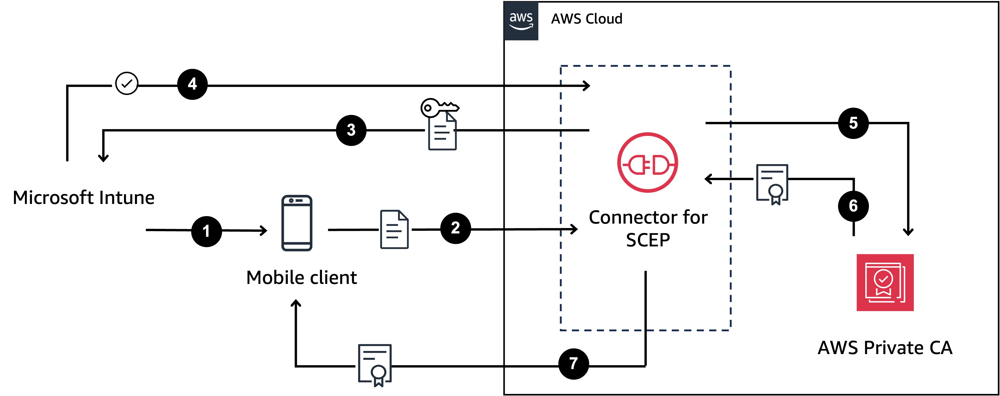

# Configure your MDM system for

Connector for SCEP

Simple Certificate Enrollment Protocol (SCEP) is a standard protocol used for certificate
enrollment and renewal. Connector for SCEP is a [RFC 8894](https://www.rfc-editor.org/rfc/rfc8894.html "https://www.rfc-editor.org/rfc/rfc8894.html")-based SCEP server
that automatically issues certificates from AWS Private Certificate Authority to your SCEP clients. When you create
a connector, Connector for SCEP provides an HTTPS endpoint for SCEP clients to request certificates
from. The clients authenticate using a challenge password that's included as part of their
certificate signing request (CSR) to the service. You can use Connector for SCEP with popular mobile
device management (MDM) systems, including Microsoft Intune, Omnissa Workspace ONE and Jamf Pro, to
enroll mobile devices. It's designed to work with any client or endpoint that supports
SCEP.

Connector for SCEP offers two types of connectors—general-purpose and Connector for SCEP for Microsoft Intune. The following
sections describe how they work, and how to configure your MDM system to use them.

## General-purpose

connector

A general-purpose connector is designed to work with mobile device endpoints that
support SCEP, except for Microsoft Intune, which has a dedicated connector. With
general-purpose connectors, such as Jamf Pro or Omnissa Workspace ONE, you manage the SCEP
challenge passwords. The following diagram uses a mobile device management (MDM) system
as an example, but the same functionality applies to other SCEP-enabled systems or
devices.

1. The MDM system (or other device or system) sends a SCEP profile to the mobile
   client. A SCEP profile contains configuration parameters that define the
   certificate profile, such as certificate validity period, challenge password,
   and other information relevant to the issuance of certificates.
2. The mobile client requests a certificate and also sends a certificate signing
   request (CSR) that includes a challenge password.
3. Connector for SCEP validates the challenge password. If it's valid, then the service
   requests a certificate from AWS Private CA on behalf of the mobile client.
4. AWS Private CA issues the certificate and sends it to Connector for SCEP.
5. Connector for SCEP sends the issued certificate to the mobile client.

## AWS Private CA Connector for SCEP for Microsoft Intune

AWS Private CA Connector for SCEP for Microsoft Intune is designed for use with Microsoft Intune. With the Connector for SCEP for Microsoft Intune connector
type, you'll use Microsoft Intune to manage your SCEP challenge passwords. For more
information about using Connector for SCEP with Microsoft Intune, see [Configure Microsoft Intune for Connector for SCEP](connector-for-scep-intune.md "connector-for-scep-intune.md").

To use Connector for SCEP with Microsoft Intune, you must enable specific functionalities using
the Microsoft Intune API, and possess a valid Microsoft Intune license. You should also
review the [Microsoft Intune® App Protection Policies](https://learn.microsoft.com/en-us/mem/intune/apps/app-protection-policy "https://learn.microsoft.com/en-us/mem/intune/apps/app-protection-policy").

1. Microsoft Intune sends a SCEP profile to the mobile client. The profile
   contains an encrypted challenge password that the mobile client places into the
   CSR.
2. The mobile client requests a certificate and sends the CSR to Connector for SCEP.
3. Connector for SCEP sends the CSR to Microsoft Intune for authorization.
4. Microsoft Intune decrypts the challenge password in the CSR. If it's valid,
   Microsoft Intune sends approval to Connector for SCEP to issue the certificate to the
   mobile client.
5. Connector for SCEP requests a certificate from AWS Private CA on behalf of the mobile
   client.
6. AWS Private CA issues the certificate and sends it to Connector for SCEP.
7. Connector for SCEP sends the issued certificate to the mobile client.

###### Topics

- [Configure Jamf Pro for Connector for SCEP](connector-for-scep-general-purpose.md "connector-for-scep-general-purpose.md")
- [Configure Microsoft Intune for Connector for SCEP](connector-for-scep-intune.md "connector-for-scep-intune.md")
- [Configure Omnissa Workspace ONE for Connector for SCEP](connector-for-scep-omnissa.md "connector-for-scep-omnissa.md")
