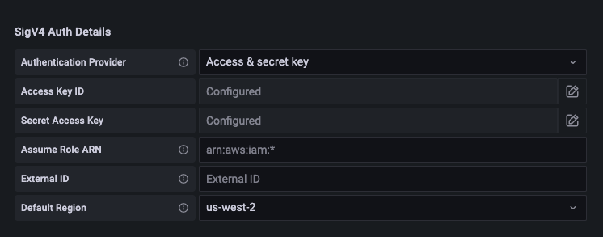
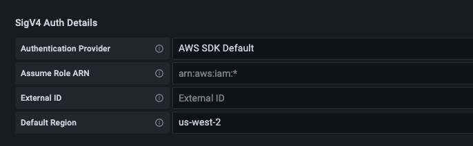

# Set up Grafana open source or

Grafana Enterprise for use with Amazon Managed Service for Prometheus

You can use an instance of Grafana to query your metrics in Amazon Managed Service for Prometheus. This topic
takes you through how to query metrics from Amazon Managed Service for Prometheus using a standalone instance of
Grafana.

## Prerequisites

**Grafana instance** – You must have a Grafana
instance that is capable of authenticating with Amazon Managed Service for Prometheus.

Amazon Managed Service for Prometheus supports the use of Grafana version 7.3.5 and later to query metrics in
a workspace. Versions 7.3.5 and later include support for AWS Signature Version 4
(SigV4) authentication.

To check your Grafana version, enter the following command, replacing
`grafana_install_directory` with the path to your
Grafana installation:

```
`grafana_install_directory`/bin/grafana-server -v
```

If you do not already have a standalone Grafana, or need a newer version, you can
install a new instance. For instructions to set up a standalone Grafana, see [Install
Grafana](https://grafana.com/docs/grafana/latest/installation/ "https://grafana.com/docs/grafana/latest/installation/") in the Grafana documentation. For information about getting
started with Grafana, see [Getting started with Grafana](https://grafana.com/docs/grafana/latest/getting-started/getting-started/ "https://grafana.com/docs/grafana/latest/getting-started/getting-started/") in the Grafana documentation.

**AWS account** – You must have an
AWS account with the correct permissions to access your Amazon Managed Service for Prometheus metrics.

To set up Grafana to work with Amazon Managed Service for Prometheus, you must be logged on to an account that
has the **AmazonPrometheusQueryAccess** policy or the
`aps:QueryMetrics`, `aps:GetMetricMetadata`,
`aps:GetSeries`, and `aps:GetLabels`permissions. For more
information, see [IAM permissions and policies](AMP-and-IAM.md "AMP-and-IAM.md").

The next section describes setting up authentication from Grafana in more
detail.

## Step 1: Set up AWS

SigV4

Amazon Managed Service for Prometheus works with AWS Identity and Access Management (IAM) to secure all calls to Prometheus APIs with
IAM credentials. By default, the Prometheus data source in Grafana assumes that
Prometheus requires no authentication. To enable Grafana to take advantage of
Amazon Managed Service for Prometheus authentication and authorization capabilities, you will need to enable
SigV4 authentication support in the Grafana data source. Follow the steps on this
page when you are using a self-managed Grafana open-source or a Grafana enterprise
server. If you are using Amazon Managed Grafana, SIGv4 authentication is fully automated. For
more information about Amazon Managed Grafana, see [What
is Amazon Managed Grafana?](../../../grafana/latest/userguide/what-is-Amazon-Managed-Service-Grafana.md "../../../grafana/latest/userguide/what-is-Amazon-Managed-Service-Grafana.md")

To enable SigV4 on Grafana, start Grafana with the
`AWS_SDK_LOAD_CONFIG` and `GF_AUTH_SIGV4_AUTH_ENABLED`
environment variables set to `true`. The
`GF_AUTH_SIGV4_AUTH_ENABLED` environment variable overrides the
default configuration for Grafana to enable SigV4 support. For more information, see
[Configuration](https://grafana.com/docs/grafana/latest/administration/configuration/ "https://grafana.com/docs/grafana/latest/administration/configuration/") in the Grafana documentation.

**Linux**

To enable SigV4 on a standalone Grafana server on Linux, enter the following
commands.

```
export AWS_SDK_LOAD_CONFIG=true
```

```
export GF_AUTH_SIGV4_AUTH_ENABLED=true
```

```
cd `grafana_install_directory`
```

```
./bin/grafana-server
```

**Windows**

To enable SigV4 on a standalone Grafana on Windows using the Windows command
prompt, enter the following commands.

```
set AWS_SDK_LOAD_CONFIG=true
```

```
set GF_AUTH_SIGV4_AUTH_ENABLED=true
```

```
cd `grafana_install_directory`
```

```
.\bin\grafana-server.exe
```

## Step 2: Add the

Prometheus data source in Grafana

The following steps explain how to set up the Prometheus data source in Grafana to
query your Amazon Managed Service for Prometheus metrics.

###### To add the Prometheus data source in your Grafana server

1. Open the Grafana console.
2. Under **Configurations**, choose **Data
   sources**.
3. Choose **Add data source**.
4. Choose **Prometheus**.
5. For the HTTP URL, specify the **Endpoint - query URL**
   displayed in the workspace details page in the Amazon Managed Service for Prometheus console.
6. In the HTTP URL that you just specified, remove the
   `/api/v1/query` string that is appended to the URL, because
   the Prometheus data source will automatically append it.

The correct URL should look similar to
**https://aps-workspaces.us-west-2.amazonaws.com/workspaces/ws-1234a5b6-78cd-901e-2fgh-3i45j6k178l9**. 7. Under **Auth**, select the toggle for **SigV4
Auth** to enable it. 8. You can either configure SigV4 authorization by specifying your long-term
credentials directly in Grafana, or by using a default provider chain.
Specifying your long-term credentials directly gets you started quicker, and
the following steps give those instructions first. Once you are more
familiar with using Grafana with Amazon Managed Service for Prometheus, we recommend that you use a
default provider chain, because it provides better flexibility and security.
For more information about setting up your default provider chain, see
[Specifying Credentials](../../../sdk-for-go/v1/developer-guide/configuring-sdk.md#specifying-credentials "../../../sdk-for-go/v1/developer-guide/configuring-sdk.md#specifying-credentials").

    * To use your long-term credentials directly, do the following:


    	1. Under **SigV4 Auth Details**, for
    	 **Authentication Provider** choose
    	 **Access & secret key**.
    	2. For **Access Key ID**, enter your AWS
    	 access key ID.
    	3. For **Secret Access Key**, enter your
    	 AWS secret access key.
    	4. Leave the **Assume Role ARN** and
    	 **External ID** fields blank.
    	5. For **Default Region**, choose the Region
    	 of your Amazon Managed Service for Prometheus workspace. This Region should match the
    	 Region contained in the URL that you listed in step
    	 5.
    	6. Choose **Save & Test**.


    	You should see the following message: **Data
    	 source is working**


    	The following screenshot shows the Access key, Secret key
    	 SigV4 auth detail setting.


    	
    * To use a default provider chain instead (recommended for a
     production environment), do the following:


    	1. Under **SigV4 Auth Details**, for
    	 **Authentication Provider** choose
    	 **AWS SDK Default**.
    	2. Leave the **Assume Role ARN** and
    	 **External ID** fields blank.
    	3. For **Default Region**, choose the Region
    	 of your Amazon Managed Service for Prometheus workspace. This Region should match the
    	 Region contained in the URL that you listed in step
    	 5.
    	4. Choose **Save & Test**.


    	You should see the following message: **Data
    	 source is working**


    	If you do not see that message, the next section provides
    	 troubleshooting tips for connecting.


    	The following screenshot shows the SDK default SigV4 auth
    	 detail setting.


    	

9. Test a PromQL query against the new data source:
   1. Choose **Explore**.
   2. Run a sample PromQL query such as:

   ```
   prometheus_tsdb_head_series
   ```

## Step 3: (optional)

Troubleshooting if Save & Test doesn't work

In the previous procedure, if you see an error when you choose **Save
& Test**, check the following.

**HTTP Error Not Found**

Make sure that the workspace ID in the URL is correct.

**HTTP Error Forbidden**

This error means that the credentials are not valid. Check the following:

- Check that the Region specified in **Default Region** is
  correct.
- Check your credential for typos.
- Make sure that the credential that you are using has the
  **AmazonPrometheusQueryAccess** policy. For more
  information, see [IAM permissions and policies](AMP-and-IAM.md "AMP-and-IAM.md").
- Make sure that the credential that you are using has access to this
  Amazon Managed Service for Prometheus workspace.

**HTTP Error Bad Gateway**

Look at the Grafana server log to troubleshoot this error. For more information,
see [Troubleshooting](https://grafana.com/docs/grafana/latest/troubleshooting/ "https://grafana.com/docs/grafana/latest/troubleshooting/") in the Grafana documentation.

If you see `**Error http: proxy error:
 NoCredentialProviders: no valid providers in
 chain**`, the default credential provider chain was not
able to find a valid AWS credential to use. Make sure you have set up your
credentials as documented in [Specifying Credentials](../../../sdk-for-go/v1/developer-guide/configuring-sdk.md#specifying-credentials "../../../sdk-for-go/v1/developer-guide/configuring-sdk.md#specifying-credentials"). If you want to use a shared configuration, make
sure that the `AWS_SDK_LOAD_CONFIG` environment is set to
`true`.
