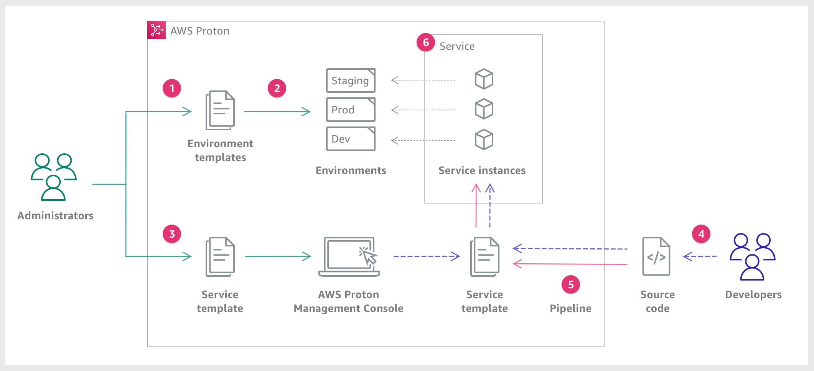

End of support notice: On October 7, 2026, AWS will end support for AWS Proton. After October
7, 2026, you will no longer be able to access the AWS Proton console or AWS Proton resources. Your deployed infrastructure
will remain intact. For more information, see [AWS Proton Service Deprecation and Migration
Guide](proton-end-of-support.md "proton-end-of-support.md").

# What is AWS Proton?

###### AWS Proton is:

- **Automated infrastructure as code provisioning and deployment of serverless and container-based applications**

The AWS Proton service is a two-pronged automation framework. As an administrator, you create _versioned service templates_ that
define standardized infrastructure and deployment tooling for serverless and container-based applications. As an application developer, you can select
from the available _service templates_ to automate your application or service deployments.

AWS Proton identifies all existing _service instances_ that are using an outdated template version for you. As an administrator,
you can request AWS Proton to upgrade them with one click.

- **Standardized infrastructure**

Platform teams can use AWS Proton and versioned infrastructure as code templates. They can use these templates to define and manage standard
application stacks that contain the architecture, infrastructure resources, and the CI/CD software deployment pipeline.

- **Deployments integrated with CI/CD**

When developers use the AWS Proton self-service interface to select a _service template_, they're selecting a standardized
application stack definition for their code deployments. AWS Proton automatically provisions the resources, configures the CI/CD pipeline, and deploys
the code into the defined infrastructure.

## AWS Proton for platform teams

As an administrator, you or members of your platform team, create _environment templates_ and _service
templates_ containing infrastructure as code. The _environment template_ defines shared infrastructure used by multiple
applications or resources. The _service template_ defines the type of infrastructure that's needed to deploy and maintain a single
application or microservice in an _environment_. An AWS Proton _service_ is an instantiation of a _service
template_, which normally includes several _service instances_ and a _pipeline_. An AWS Proton
_service instance_ is an instantiation of a _service template_ in a specific _environment_. You
or others in your team can specify which _environment templates_ are compatible with a given _service template_. For
more information about _templates_, see [AWS Proton templates](ag-templates.md "ag-templates.md").

You can use the following infrastructure as code providers with AWS Proton:

- [CloudFormation](../../../AWSCloudFormation/latest/UserGuide/Welcome.md "../../../AWSCloudFormation/latest/UserGuide/Welcome.md")
- [Terraform](https://www.terraform.io/ "https://www.terraform.io/")

## AWS Proton for developers

As an application developer, you select a standardized _service template_ that AWS Proton uses to create a
_service_ that deploys and manages your application in a _service instance_. An AWS Proton
_service_ is an instantiation of a _service template_, which normally includes several _service
instances_ and a _pipeline_.

## AWS Proton workflow

The following diagram is a visualization of the main AWS Proton concepts discussed in the preceding paragraph. It also offers a high-level overview of
what constitutes a simple AWS Proton workflow.

As an **Administrator**, you create and register an **Environment Template**
with AWS Proton, which defines the shared resources.

AWS Proton deploys one or more **Environments**, based on an **Environment
Template**.

As an **Administrator**, you create and register a **Service Template**
with AWS Proton, which defines the related infrastructure, monitoring, and CI/CD resources as well as compatible **Environment
Templates**.

As a **Developer**, you select a registered **Service Template** and
provide a link to your **Source code** repository.

AWS Proton provisions the **Service** with a **CI/CD Pipeline** for your
**Service instances**.

AWS Proton provisions and manages the **Service** and the **Service
Instances** that are running the **Source code** as was defined in the selected **Service
Template**. A **Service Instance** is an instantiation of the selected **Service
Template** in an **Environment** for a single stage of a **Pipeline** (for example
Prod).
