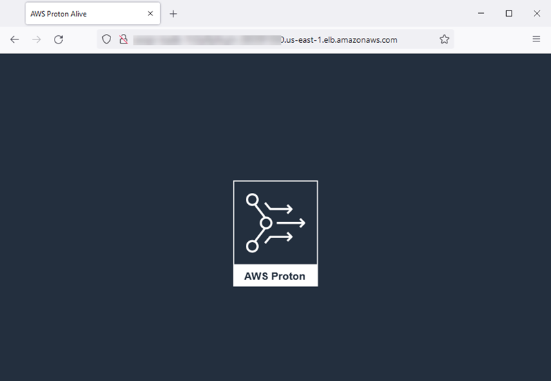

End of support notice: On October 7, 2026, AWS will end support for AWS Proton. After October
7, 2026, you will no longer be able to access the AWS Proton console or AWS Proton resources. Your deployed infrastructure
will remain intact. For more information, see [AWS Proton Service Deprecation and Migration
Guide](proton-end-of-support.md "proton-end-of-support.md").

# Getting started with the AWS CLI

To get started with AWS Proton using the AWS CLI, follow this tutorial. The tutorial demonstrates a public facing load-balanced AWS Proton service based on
AWS Fargate. The tutorial also provisions a CI/CD pipeline that deploys a static website with a displayed image.

Before you start, be sure you are set up correctly. For details, see [Prerequisites](getting-started-prerequisites.md "getting-started-prerequisites.md").

## Step 1: Register an environment template

In this step, as an administrator, you register an example environment template, which contains an Amazon Elastic Container Service (Amazon ECS) cluster and an Amazon Virtual Private Cloud
(Amazon VPC) with two public/private subnets.

###### To register an environment template

1. Fork the [AWS Proton Sample CloudFormation Templates](https://github.com/aws-samples/aws-proton-cloudformation-sample-templates/ "https://github.com/aws-samples/aws-proton-cloudformation-sample-templates/") repository into your
   GitHub account or organization. This repository includes the environment and service templates that we use in this tutorial.

Then, register your forked repository with AWS Proton. For more information, see [Create a link to your repository](ag-create-repo.md "ag-create-repo.md"). 2. Create an environment template.

The environment template resource tracks environment template versions.

```
`$` `aws proton create-environment-template \
 --name "fargate-env" \
 --display-name "Public VPC Fargate" \
 --description "VPC with public access and ECS cluster"`
```

3. Create a template sync configuration.

AWS Proton sets up a sync relationship between your repository and your environment template. It then creates template version 1.0 in
`DRAFT` status.

```
`$` `aws proton create-template-sync-config \
 --template-name "fargate-env" \
 --template-type "ENVIRONMENT" \
 --repository-name "`your-forked-repo`" \
 --repository-provider "GITHUB" \
 --branch "`your-branch`" \
 --subdirectory "environment-templates/fargate-env"`
```

4. Wait for the environment template version to be successfully registered.

When this command returns with an exit status of `0`, version registration is complete. This is useful in scripts to ensure you can
successfully run the command in the next step.

```
`$` `aws proton wait environment-template-version-registered \
 --template-name "fargate-env" \
 --major-version "1" \
 --minor-version "0"`
```

5. Publish the environment template version to make it available for environment creation.

```
`$` `aws proton update-environment-template-version \
 --template-name "fargate-env" \
 --major-version "1" \
 --minor-version "0" \
 --status "PUBLISHED"`
```

## Step 2: Register a service template

In this step, as an administrator, you register an example service template, which contains all the resources required to provision an Amazon ECS
Fargate service behind a load balancer and a CI/CD pipeline that uses AWS CodePipeline.

###### To register a service template

1. Create a service template.

The service template resource tracks service template versions.

```
`$` `aws proton create-service-template \
 --name "load-balanced-fargate-svc" \
 --display-name "Load balanced Fargate service" \
 --description "Fargate service with an application load balancer"`
```

2. Create a template sync configuration.

AWS Proton sets up a sync relationship between your repository and your service template. It then creates template version 1.0 in
`DRAFT` status.

```
`$` `aws proton create-template-sync-config \
 --template-name "load-balanced-fargate-svc" \
 --template-type "SERVICE" \
 --repository-name "`your-forked-repo`" \
 --repository-provider "GITHUB" \
 --branch "`your-branch`" \
 --subdirectory "service-templates/load-balanced-fargate-svc"`
```

3. Wait for the service template version to be successfully registered.

When this command returns with an exit status of `0`, version registration is complete. This is useful in scripts to ensure you can
successfully run the command in the next step.

```
`$` `aws proton wait service-template-version-registered \
 --template-name "load-balanced-fargate-svc" \
 --major-version "1" \
 --minor-version "0"`
```

4. Publish the service template version to make it available for service creation.

```
`$` `aws proton update-service-template-version \
 --template-name "load-balanced-fargate-svc" \
 --major-version "1" \
 --minor-version "0" \
 --status "PUBLISHED"`
```

## Step 3: Deploy an environment

In this step, as an administrator, you instantiate an AWS Proton environment from the environment template.

###### To deploy an environment

1. Get an example spec file for the environment template that you registered.

You can download the file `environment-templates/fargate-env/spec/spec.yaml` from the template example repository.
Alternatively, you can fetch the entire repository locally and run the **create-environment** command from the
`environment-templates/fargate-env` directory. 2. Create an environment.

AWS Proton reads input values from your environment spec, combines them with your environment template, and provisions environment resources in
your AWS account using your AWS Proton service role.

```
`$` `aws proton create-environment \
 --name "fargate-env-prod" \
 --template-name "fargate-env" \
 --template-major-version 1 \
 --proton-service-role-arn "arn:aws:iam::`123456789012`:role/`AWSProtonServiceRole`" \
 --spec "file://spec/spec.yaml"`
```

3. Wait for the environment to successfully deploy.

```
`$` `aws proton wait environment-deployed --name "fargate-env-prod"`
```

## Step 4: Deploy a service [application developer]

In the previous steps, an administrator registered and published a service template and deployed an environment. As an application developer, you
can now create an AWS Proton service and deploy it into the AWS Proton environment

###### To deploy a service

1. Get an example spec file for the service template that the administrator registered.

You can download the file `service-templates/load-balanced-fargate-svc/spec/spec.yaml` from the template example repository.
Alternatively, you can fetch the entire repository locally and run the **create-service** command from the
`service-templates/load-balanced-fargate-svc` directory. 2. Fork the [AWS Proton Sample Services](https://github.com/aws-samples/aws-proton-sample-services/ "https://github.com/aws-samples/aws-proton-sample-services/") repository into your GitHub account or
organization. This repository includes the application source code that we use in this tutorial. 3. Create a service.

AWS Proton reads input values from your service spec, combines them with your service template, and provisions service resources in your AWS
account in the environment that is specified in the spec. An AWS CodePipeline pipeline deploys your application code from the repository that you specify
in the command.

```
`$` `aws proton create-service \
 --name "static-website" \
 --repository-connection-arn \
 "arn:aws:codestar-connections:us-east-1:`123456789012`:connection/`your-codestar-connection-id`" \
 --repository-id "`your-GitHub-account`/aws-proton-sample-services" \
 --branch-name "`main`" \
 --template-major-version 1 \
 --template-name "load-balanced-fargate-svc" \
 --spec "file://spec/spec.yaml"`
```

4. Wait for the service to successfully deploy.

```
`$` `aws proton wait service-created --name "static-website"`
```

5. Retrieve outputs and view your new website.

Run the following command:

```
`$` `aws proton list-service-instance-outputs \
 --service-name "static-website" \
 --service-instance-name load-balanced-fargate-svc-prod`
```

The command's output should be similar to the following:

```
{
    "outputs": [
        {
            "key": "ServiceURL",
            "valueString": "http://`your-service-endpoint`.us-east-1.elb.amazonaws.com"
        }
    ]
}
```

The value of the `ServiceURL` instance output is the endpoint to your new service website. Use your browser to navigate to it. You
should see the following graphic on a static page:



## Step 5: Clean up (optional)

In this step, when you're done exploring the AWS resources that you created as part of this tutorial, and to save on costs associated with these
resources, you delete them.

###### To delete tutorial resources

1. To delete the service, run the following command:

```
`$` `aws proton delete-service --name "static-website"`
```

2. To delete the environment, run the following command:

```
`$` `aws proton delete-environment --name "fargate-env-prod"`
```

3. To delete the service template, run the following commands:

```
`$` `aws proton delete-template-sync-config \
 --template-name "load-balanced-fargate-svc" \
 --template-type "SERVICE"`
`$` `aws proton delete-service-template --name "load-balanced-fargate-svc"`
```

4. To delete the environment template, run the following commands:

```
`$` `aws proton delete-template-sync-config \
 --template-name "fargate-env" \
 --template-type "ENVIRONMENT"`
`$` `aws proton delete-environment-template --name "fargate-env"`
```
