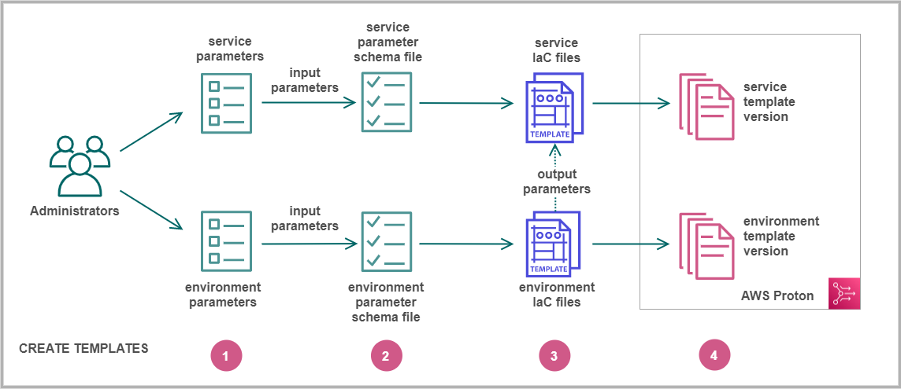

End of support notice: On October 7, 2026, AWS will end support for AWS Proton. After October
7, 2026, you will no longer be able to access the AWS Proton console or AWS Proton resources. Your deployed infrastructure
will remain intact. For more information, see [AWS Proton Service Deprecation and Migration
Guide](proton-end-of-support.md "proton-end-of-support.md").

# Authoring templates and creating bundles for AWS Proton

AWS Proton provisions resources for you based on infrastructure as code (IaC) files. You describe infrastructure in reusable IaC files. To make the files
reusable for different environments and applications, you author them as _templates_, define input parameters, and use these parameters
in IaC definitions. When you later create a provisioning resource (environment, service instance, or component), AWS Proton uses a rendering engine, which
combines input values with a template to create an IaC file that is ready to provision.

Administrators author most templates as _template bundles_, and then upload and register them into AWS Proton. The remainder of this page
discusses these AWS Proton template bundles. _Directly defined components_ are an exception—developers create them and provide IaC
template files directly. For more information about components, see [AWS Proton components](ag-components.md "ag-components.md").

###### Topics

- [Template bundles](#ag-template-bundles "#ag-template-bundles")
- [AWS Proton parameters](parameters.md "parameters.md")
- [AWS Proton infrastructure as code files](ag-infrastructure-tmp-files.md "ag-infrastructure-tmp-files.md")
- [Schema file](ag-schema.md "ag-schema.md")
- [Wrap up template files for AWS Proton](ag-wrap-up.md "ag-wrap-up.md")
- [Template bundle considerations](template-considerations.md "template-considerations.md")

## Template bundles

As an administrator, you [create and register templates](template-create.md "template-create.md") with AWS Proton. You use these templates to create
environments and services. When you create a service, AWS Proton provisions and deploys service instances to selected environments. For more information, see
[AWS Proton for platform teams](Welcome.md#ag-admin "Welcome.md#ag-admin").

To create and register a template in AWS Proton, you upload a template bundle that contains the infrastructure as code (IaC) files that AWS Proton needs to
provision and environment or service.

A _template bundle_ contains the following:

- An [Infrastructure as code (IaC) file](ag-infrastructure-tmp-files.md "ag-infrastructure-tmp-files.md") with a [manifest YAML
  file](ag-wrap-up.md "ag-wrap-up.md") that lists the _IaC file_.
- A [schema YAML file](ag-schema.md "ag-schema.md") for your IaC file input parameter definitions.

A CloudFormation environment template bundle contains one IaC file.

A CloudFormation service template bundle contains one IaC file for service instance definitions and another optional IaC file for a pipeline
definition.

Terraform environment and service template bundles can contain multiple IaC files each.

AWS Proton requires an input parameter schema file. When you use AWS CloudFormation to create your IaC files, you use [Jinja](https://jinja.palletsprojects.com/en/2.11.x/ "https://jinja.palletsprojects.com/en/2.11.x/") syntax to reference your input parameters. AWS Proton provides parameter namespaces that you
can use to reference [parameters](parameters.md "parameters.md") in your IaC files.

The following diagram shows an example of steps that you can take to create a _template_ for AWS Proton.

Identify [input parameters](parameters.md "parameters.md").

Create a [schema file](ag-schema.md "ag-schema.md") to define your input parameters.

Create [IaC files](ag-infrastructure-tmp-files.md "ag-infrastructure-tmp-files.md") that reference your input parameters. You can reference
environment IaC file _outputs_ as _inputs_ for your service IaC files.

[Register a template version](template-create.md "template-create.md") with AWS Proton and upload your template bundle.
