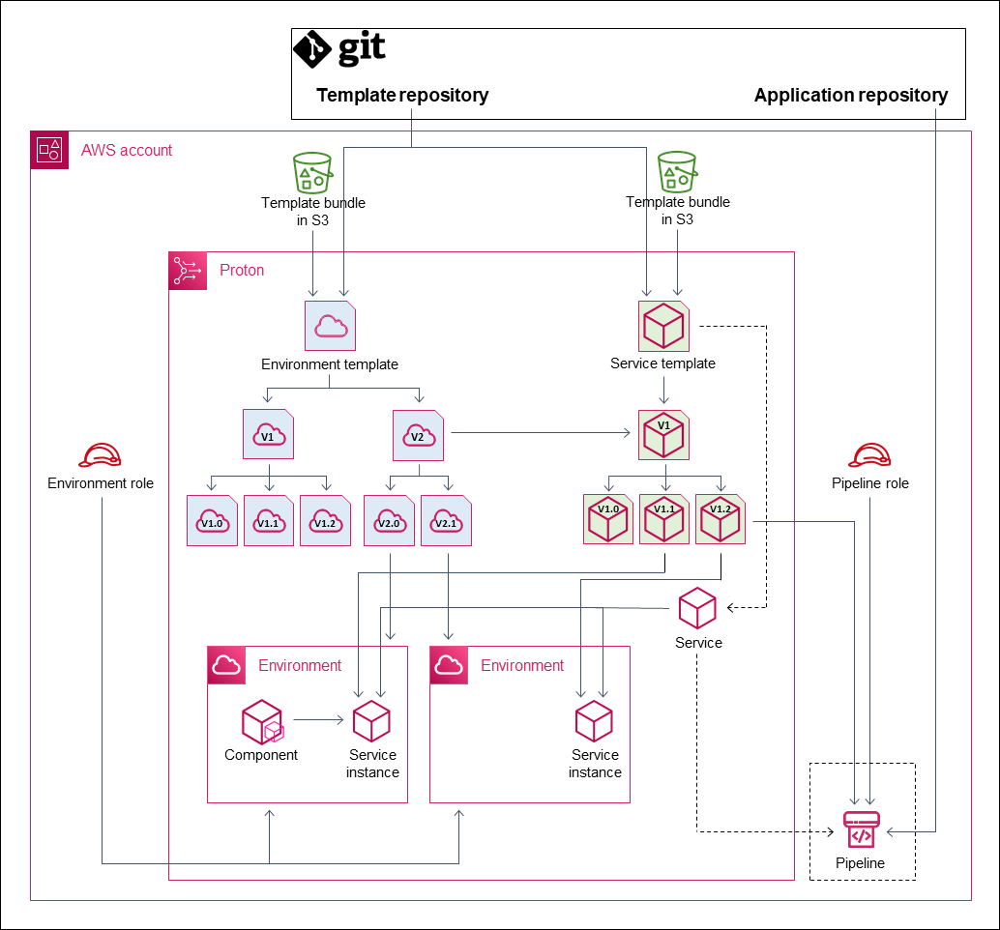

End of support notice: On October 7, 2026, AWS will end support for AWS Proton. After October
7, 2026, you will no longer be able to access the AWS Proton console or AWS Proton resources. Your deployed infrastructure
will remain intact. For more information, see [AWS Proton Service Deprecation and Migration
Guide](proton-end-of-support.md "proton-end-of-support.md").

# AWS Proton objects

The following diagram shows the main AWS Proton objects and their relationship to other AWS and third-party objects. The arrows represent the
direction of data flow (the inverse direction of dependency).

We follow the diagram with brief descriptions and reference links for these AWS Proton objects.

- Environment template – A collection of environment template versions that can be used to create AWS Proton
  environments.

For more information, see [Template authoring and bundles](ag-template-authoring.md "ag-template-authoring.md") and [AWS Proton templates](ag-templates.md "ag-templates.md").

- Environment template version – A specific version of an environment template. Takes a _template
  bundle_ as input, either from an S3 bucket or from a Git repository. The bundle specifies Infrastructure as Code (IaC) and related input
  parameters for an AWS Proton environment.

For more information, see [Versioned templates](ag-template-versions.md "ag-template-versions.md"), [Register and publish templates](template-create.md "template-create.md"), and [Template sync configurations](ag-template-sync-configs.md "ag-template-sync-configs.md").

- Environment – The set of shared AWS infrastructure resources and access policies that AWS Proton services are
  deployed into. AWS resources are provisioned by using an environment template version invoked with specific parameter values. Access policies are
  provided in a service role.

For more information, see [AWS Proton environments](ag-environments.md "ag-environments.md").

- Service template – A collection of service template versions that can be used to create AWS Proton
  services.

For more information, see [Template authoring and bundles](ag-template-authoring.md "ag-template-authoring.md") and [AWS Proton templates](ag-templates.md "ag-templates.md").

- Service template version – A specific version of a service template. Takes a _template
  bundle_ as input, either from an S3 bucket or from a Git repository. The bundle specifies Infrastructure as Code (IaC) and related input
  parameters for an AWS Proton service.

A service template version also specifies these constraints on service instances based on the version:

    + Compatible environment templates – Instances can only run in environments based on these compatible
     environment templates.
    + Supported component sources – The types of components that developers can associate with
     instances.

For more information, see [Versioned templates](ag-template-versions.md "ag-template-versions.md"), [Register and publish templates](template-create.md "template-create.md"), and [Template sync configurations](ag-template-sync-configs.md "ag-template-sync-configs.md").

- Service – A collection of service instances that run an application using resources specified in a service
  template, and optionally a CI/CD pipeline that deploys the application code into these instances.

In the diagram, the dashed line from **Service template** means that the service passes the template through to service instances
and the pipeline.

For more information, see [AWS Proton services](ag-services.md "ag-services.md").

- Service instance – The set of AWS infrastructure resources that run an application in a specific AWS Proton
  environment. AWS resources are provisioned by using a service template version invoked with specific parameter values.

For more information, see [AWS Proton services](ag-services.md "ag-services.md") and [Update a service instance](ag-svc-instance-update.md "ag-svc-instance-update.md").

- Pipeline – An optional CI/CD pipeline that deploys an application into the instances of a service, with
  access policies to provision this pipeline. Access policies are provided in a service role. A service doesn't always have an associated AWS Proton
  pipeline—you can choose to manage your app code deployments outside of AWS Proton.

In the diagram, the dashed line from **Service** and the dashed box around **Pipeline** mean that if you choose
to manage your CI/CD deployments yourself, the AWS Proton pipeline may not be created, and your own pipeline may not be within your AWS account.

For more information, see [AWS Proton services](ag-services.md "ag-services.md") and [Update a service pipeline](ag-svc-pipeline-update.md "ag-svc-pipeline-update.md").

- Component – A developer-defined extension to a service instance. Specifies additional AWS infrastructure
  resources that a particular application might need, in addition to the resources provided by the environment and the service instance. Platform teams
  control the infrastructure that a component can provision by attaching a component role to the environment.

For more information, see [AWS Proton components](ag-components.md "ag-components.md").
