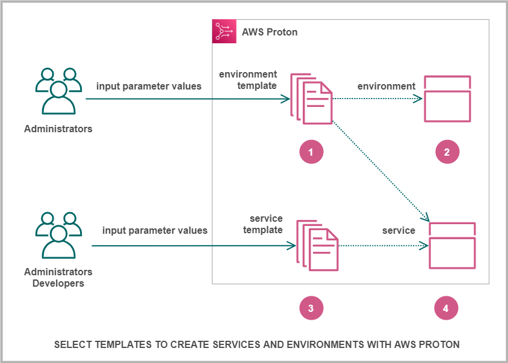

End of support notice: On October 7, 2026, AWS will end support for AWS Proton. After October
7, 2026, you will no longer be able to access the AWS Proton console or AWS Proton resources. Your deployed infrastructure
will remain intact. For more information, see [AWS Proton Service Deprecation and Migration
Guide](proton-end-of-support.md "proton-end-of-support.md").

# How AWS Proton works

With AWS Proton, you provision _environments_, and then _services_ running in those environments. Environments and
services are based on environment and service _templates_, respectively, that you choose in your AWS Proton versioned template library.

When you, as an administrator, select an environment template with AWS Proton, you provide values for required _input
parameters_.

AWS Proton uses the environment template and parameter values to provision your environment.

When you, as a developer or administrator, select a service template with AWS Proton, you provide values for required input parameters.
You also select an environment to deploy your application or service to.

AWS Proton uses the service template, and both your service and selected environment parameter values, to provision your service.

You provide values for the input parameters to customize your template for re-use and multiple use cases, applications, or services.

To make this work, you create environment or service template bundles and upload them to registered environment or service templates,
respectively.

[Template bundles](ag-template-authoring.md#ag-template-bundles "ag-template-authoring.md#ag-template-bundles") contain everything AWS Proton needs to provision environments or services.

When you create an environment or service template, you upload a template bundle that contains the parametrized infrastructure as code (IaC) files that
AWS Proton uses to provision environments or services.

When you select an environment or service template to create or update an environment or service, you provide values for the template bundle IaC file
parameters.

###### Topics

- [AWS Proton objects](ag-works-objects.md "ag-works-objects.md")
- [How AWS Proton provisions infrastructure](ag-works-prov-methods.md "ag-works-prov-methods.md")
- [AWS Proton terminology](terminology.md "terminology.md")
