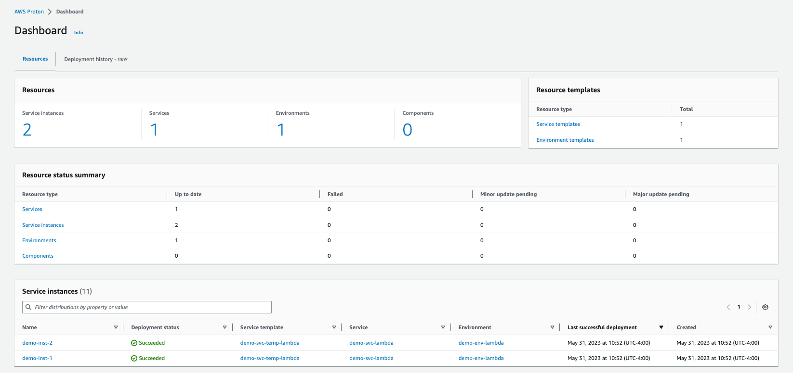
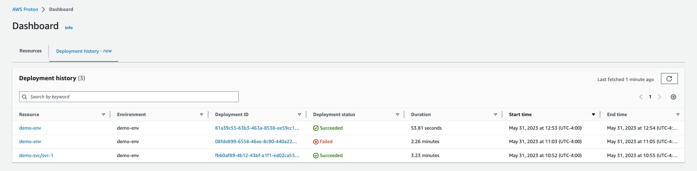

End of support notice: On October 7, 2026, AWS will end support for AWS Proton. After October
7, 2026, you will no longer be able to access the AWS Proton console or AWS Proton resources. Your deployed infrastructure
will remain intact. For more information, see [AWS Proton Service Deprecation and Migration
Guide](proton-end-of-support.md "proton-end-of-support.md").

# Keep infrastructure up to date with the AWS Proton dashboard

The AWS Proton dashboard provides a summary of AWS Proton resources in your AWS account, with a particular focus on
_staleness_—how updated deployed resources are. A deployed resource is up to date when it uses the recommended
version of its associated template. An out-of-date deployed resource might need a major or minor template version update.

## View the dashboard in the AWS Proton console

To view the AWS Proton dashboard, open the [AWS Proton console](https://console.aws.amazon.com/proton/ "https://console.aws.amazon.com/proton/"), and then, in the navigation pane,
choose **Dashboard**.

### Resources

The first tab of the dashboard displays counts of all resources in your account. The resources tab shows the number of your service
instances, services, environments, and components, as well as your resource templates. It also breaks down resource counts for each
deployed resource type by the status of resources of that type. A service instance table shows details of each service
instance—its deployment status, the AWS Proton resources that it's associated with, the updates that are available to it, and some
time stamps.

You can filter the service instance list by any table property. For example, you can filter to see service instances with
deployments within a specific time window, or service instances that are out of date relative to major or minor version
recommendations.

Choose a service instance name to navigate to the service instance detail page, where you can act to make appropriate version
updates. Choose any other AWS Proton resource name to navigate to its detail page, or choose a resource type to navigate to the respective
resource list.

### Deployment history

The deployment history tab lets you see details about your deployments. In the deployment history table, you can keep track of the
deployment status, as well as environment and deployment ID. You can choose the resource name or the deployment ID to see even more
details, such as a deployment status message and resource outputs. The table also allows you to filter on any table property.
