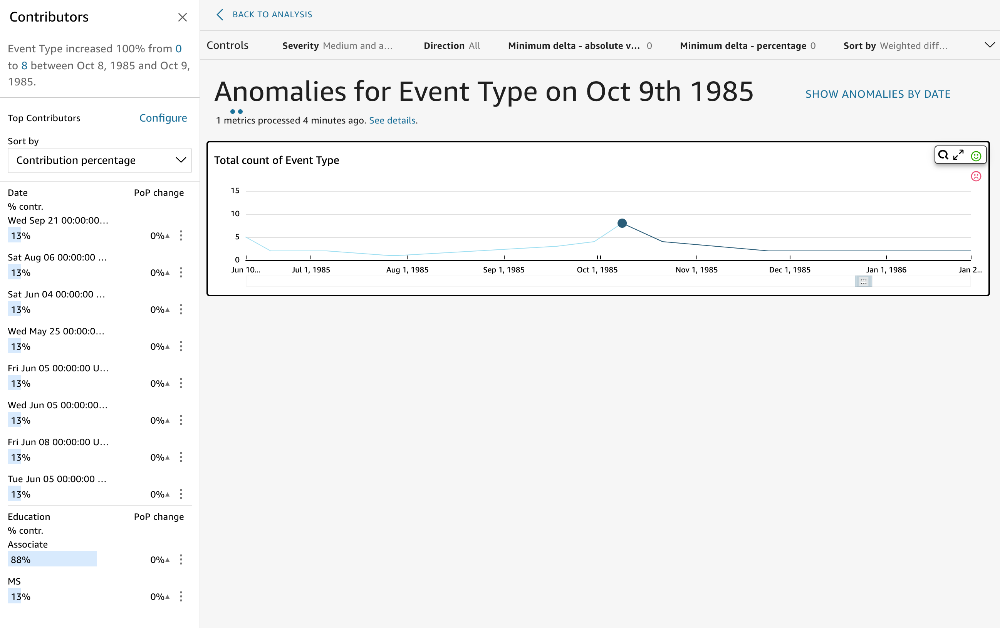

# Exploring outliers and key drivers with

ML-powered anomaly detection and contribution analysis

You can interactively explore the anomalies (also known as outliers) in your
analysis, along with the contributors (key drivers). The analysis is available for
you to explore after the ML-powered anomaly detection runs. The changes you make in
this screen aren't saved when you go back to the analysis.

To begin, choose **Explore anomalies** in the insight. The
following screenshot shows the anomalies screen as it appears when you first open
it. In this example, contributors analysis is set up and shows two key
drivers.

The sections of the screen include the following, from top left to bottom
right:

- **Contributors** displays key drivers. To see this
  section, you need to have contributors set up in your anomaly configuration.
- **Controls** contains settings for anomaly
  exploration.
- **Number of anomalies** displays outliers detected over
  time. You can hide or show this chart section.
- **Your field names** for category or dimension fields act
  as titles for charts that show anomalies for each category or dimension.
  The following sections provide detailed information for each aspect of exploring
  anomalies.

###### Topics

- [Exploring contributors (key
  drivers)](exploring-anomalies-key-drivers.md "exploring-anomalies-key-drivers.md")
- [Setting controls for anomaly
  detection](exploring-anomalies-controls.md "exploring-anomalies-controls.md")
- [Showing and hiding anomalies by
  date](exploring-anomalies-by-date.md "exploring-anomalies-by-date.md")
- [Exploring
  anomalies per category or dimension](exploring-anomalies-per-category-or-dimension.md "exploring-anomalies-per-category-or-dimension.md")
