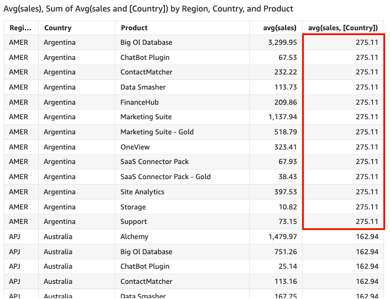

# avg

The `avg` function averages the set of numbers in the specified measure,
grouped by the chosen dimension or dimensions. For example,
`avg(salesAmount)` returns the average for that measure grouped by the
(optional) chosen dimension.

## Syntax

```
avg(*decimal*, [*group-by level*])
```

## Arguments

_decimal_

The argument must be a measure. Null values are omitted from the
results. Literal values don't work. The argument must be a field.

_group-by level_

(Optional) Specifies the level to group the aggregation by. The level
added can be any dimension or dimensions independent of the dimensions
added to the visual.

The argument must be a dimension field. The group-by level must be
enclosed in square brackets `[ ]`. For more information, see
[Level-aware calculation - aggregate (LAC-A)
functions](../../../quicksight/latest/user/level-aware-calculations-aggregate.md "../../../quicksight/latest/user/level-aware-calculations-aggregate.md").

## Examples

The following example calculates the average sales.

```
avg({Sales})
```

You can also specify at what level to group the computation using one or more
dimensions in the view or in your dataset. This is called a LAC-A function. For more
information about LAC-A functions, see [Level-aware calculation - aggregate (LAC-A)
functions](../../../quicksight/latest/user/level-aware-calculations-aggregate.md "../../../quicksight/latest/user/level-aware-calculations-aggregate.md"). The following example calculates the average sales at the
Country level, but not across other dimensions (Region or Product) in the
visual.

```
avg({Sales}, [{Country}])
```


