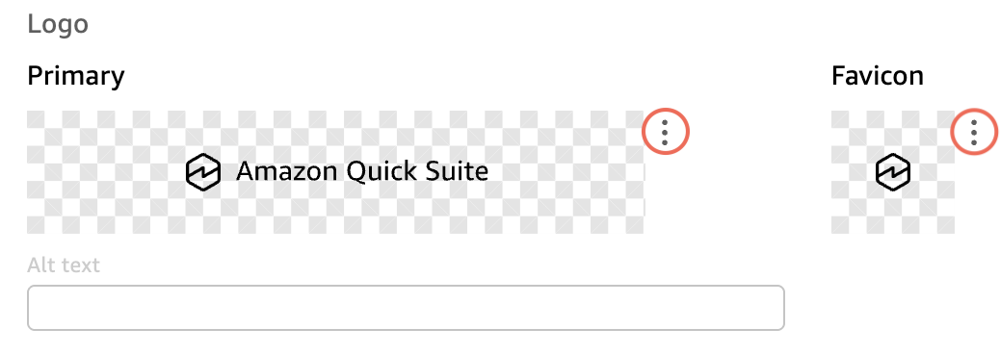
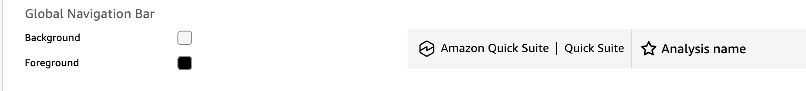

# Amazon Quick brand customization

Amazon Quick allows account admins to customize their application's branding and
visual theme to align with their organization's guidelines. This customization includes
the following visual elements to create a cohesive look and feel across all
non-administrative Amazon Quick console pages, schedules, alerts, and email reports.

- Logo
- Favicon
- Associated alt text for visual assets
  The following list shows the different areas customizable theme colors are grouped
  into.

###### Brand colors

- **Global navigation bar** colors are applied to the
  topmost bar in the Amazon Quick UI and include the company logo that is diaplayed in
  the standard and embedded Amazon Quick consoles.
- **Application bar** colors are applied to the
  secondary navigation bar that contains contextual actions.

###### Interaction colors

- **Accent** colors are applied to interactive elements
  like buttons, borders, and icons.

###### Surface colors

- **Primary** colors are applied to high-emphasis
  surfaces like the homepage background and text.
- **Secondary** colors are applied to practical
  surfaces like borders, backgrounds, and form fields. Secondary colors are used
  alongside primary colors.

###### Status colors

- **Success** colors are applied to success
  messages.
- **Danger** colors are applied to error
  messages.
- **Warning** colors are applied to warning
  messages.
- **Info** colors are applied to informational
  messages.

###### Data visualization colors

- **Dimension** colors are used to identify
  associations between data columns that share the same role.
- **Measure** colors are used to idenfity metrics or
  measured values.

###### Features

- **Visualization** colors are applied to the
  **Visualization** icon.
- **Insight** colors are applied to the
  **Insight** icon.
- **Connection** colors are applied to the
  **Connection** icon.
- **Automation** colors are applied to the
  **Automation** icon.
  Use the following sections to get started with brand customization in Amazon Quick.

###### Topics

- [Permisisons for Amazon Quick brand
  customization](#brand-customization-permissions "#brand-customization-permissions")
- [Create a custom brand in
  Amazon Quick](#brand-customization-create "#brand-customization-create")
- [Setting a default theme for
  Amazon Quick analyses with the Amazon Quick APIs](customizing-quicksight-default-theme.md "customizing-quicksight-default-theme.md")

## Permisisons for Amazon Quick brand

customization

To set up a brand, you must be granted an Admin role through IAM Identity Center or IAM. Admins
whose roles are granted to them within Amazon Quick can't create brands. To learn
more about integrating your account with IAM Identity Center, see [Configure your Amazon Quick account with IAM Identity Center](../../../quicksight/latest/user/sec-identity-management-identity-center.md "../../../quicksight/latest/user/sec-identity-management-identity-center.md"). For
information about admin roles and capabilities, see [Understanding Amazon Quick subscriptions and
roles](../../../quicksight/latest/user/user-types.md#subscription-role-mapping "../../../quicksight/latest/user/user-types.md#subscription-role-mapping").

Admin users can only manage brands that are in the same capacity Region as their
Amazon Quick account.

The IAM role that you use to create a brand in Amazon Quick must contain
`quicksight:*` or granular action permissions to manage brands in the
admin console. The following granular permissions are required for admins to work with
Amazon Quick brands:

- `quicksight:CreateBrand`
- `quicksight:UpdateBrand`
- `quicksight:DescribeBrand`
- `quicksight:DescribeBrandPublishedVersion`
- `quicksight:UpdateBrandPublishedVersion`
- `quicksight:DeleteBrand`
- `quicksight:ListBrands`
- `quicksight:UpdateBrandAssignment`
- `quicksight:DescribeBrandAssignment`
- `quicksight:DeleteBrandAssignment`

After you confirm that your Admin role contains the required permissions, you can
[Create a custom brand](../../../quicksight/latest/user/brand-customization-create.md "../../../quicksight/latest/user/brand-customization-create.md") in the Amazon Quick admin
console.

## Create a custom brand in

Amazon Quick

Use the following procedure to create a custom brand in Amazon Quick.

1. Open the [Quick console](https://quicksight.aws.amazon.com/ "https://quicksight.aws.amazon.com/").
2. Choose the user icon at the top right, and then choose **Manage
   Quick**.
3. Choose **Customize application**.
4. On the **Customize application** page that opens, choose
   **ADD BRAND**. The **Brand settings** page
   opens.
5. Navigate to the **Brand Info** section.
6. For **Brand name**, enter a name for the brand. The brand
   name can contain up to 512 characters.
7. (Optional) For **Brand description**, enter a description for
   the custom brand. The brand description can contain up to 512 characters.
8. Navigate to the **Logo** section.

 9. For **Primary**, choose the ellipsis (three dots) next to the
primary icon, and then choose **Replace image**. 10. In the **Choose image** pop up that opens, perform one of the
following actions:

    1. Drag and drop image into the **Drag an image here**
     box.
    2. Choose **Select a file** to select a file from your
     computer.
    3. Enter a public URL or Amazon S3 URI in the text bar.The image that you choose must be a `.jpeg`, `.png`, or

`.svg` format and can't exceed 1MB.

When you are finished choosing an image, choose
**Apply**. 11. For **Favicon**, choose the ellipsis (three dots) next to the
favicon, and then choose **Replace image**. 12. In the **Choose image** pop up that opens, perform one of the
following actions:

    1. Drag and drop image into the **Drag an image here**
     box.
    2. Choose **Select a file** to select a file from your
     computer.
    3. Enter a public URL or Amazon S3 URI in the text bar.The image that you choose must be a `.jpeg`, `.png`, or

`.svg` format and can't exceed 1MB.

When you are finished choosing an image, choose
**Apply**. 13. (Optional) For **Alt text**, enter alt text to display with
the logo. The alt text can contain up to 512 characters. 14. To make changes to the theme colors of the brand, navigate to the
**Appearance** pane on the left and choose
**Theme**. 15. The **Theme settings** page appears and displays all parts of
a Amazon Quick theme that can be customized.
The following image shows the
configuration settings of the global navigation bar.

 16. To change the background color of an area, navigate to the item that you want
to change and choose the **Background** color swatch. 17. In the **Custom color** pop up that appears, choose a color
from the color gradient or enter a hex code value in the
**HEX** bar, and then choose
**APPLY**. 18. To change the foreground color of an area, navigate to the item that you want
to change and choose the **Foreground** color swatch. 19. In the **Custom color** pop up that appears, choose a color
from the color gradient or enter a hex code value in the
**HEX** bar, and then choose
**APPLY**. 20. When you are finished configuring a custom brand, choose
**PUBLISH** to publish and apply the brand customization to
all Amazon Quick user accounts. If you don't want to publish the brand,
choose **SAVE** to save the brand for later.

When you finish creating a brand in Amazon Quick, the new brand appears in the brands
table on the **Customize application** page of the Quick admin
console. The **Status** column of the brands table indicates which
brand is currently published to the Quick account. To make changes to a custom
brand, locate the brand that you want to change in the brands table, choose the ellipsis
(three dots) icon in the **Actions** column, and then choose
**Publish**, **Edit**, or
**Delete**.

Once you publish a brand, it can take up to 10 minutes for the new
brand to propagate across all users.
