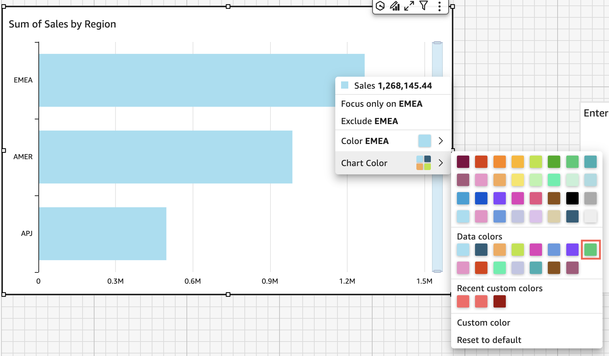
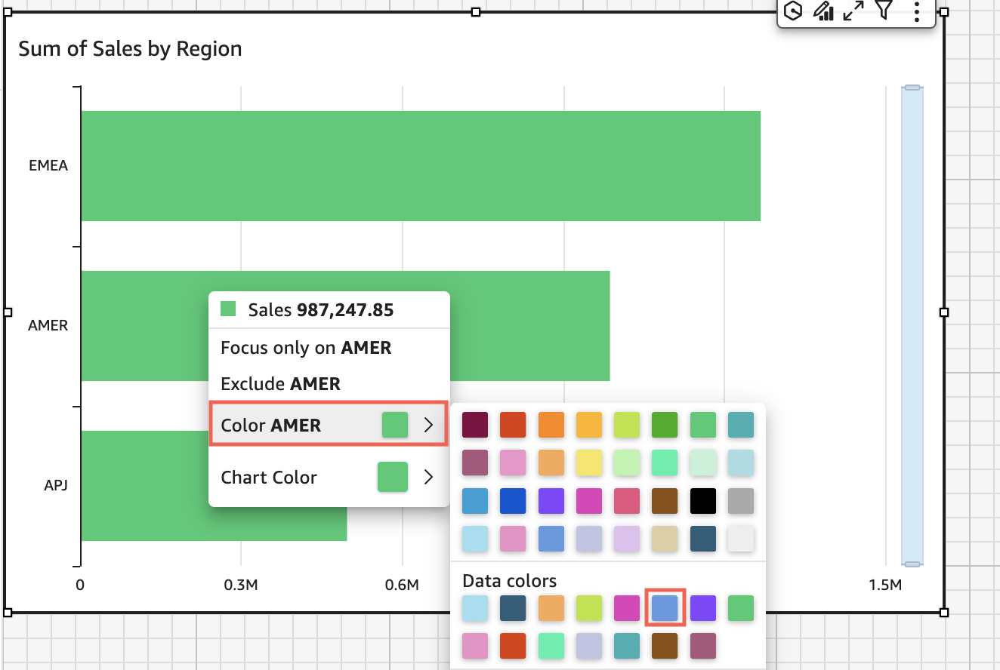
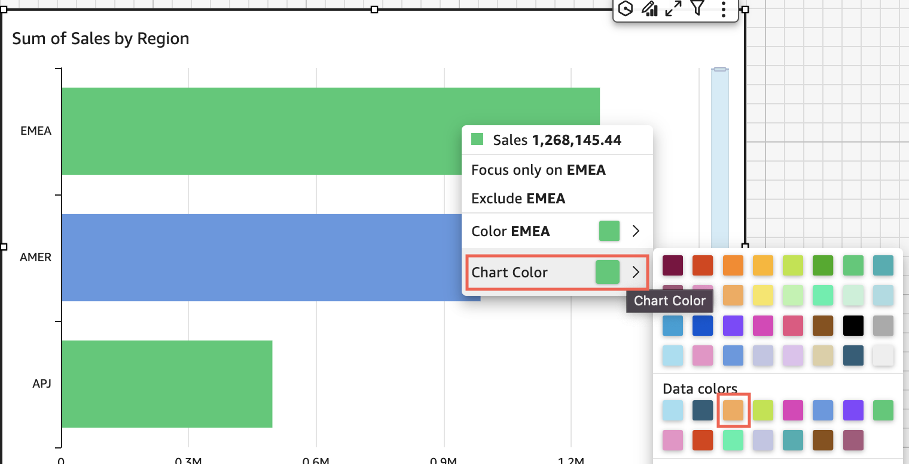
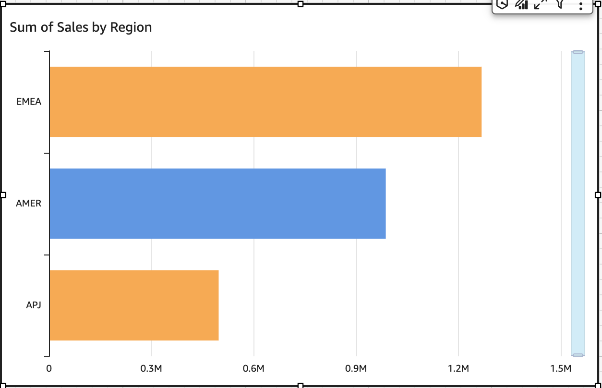
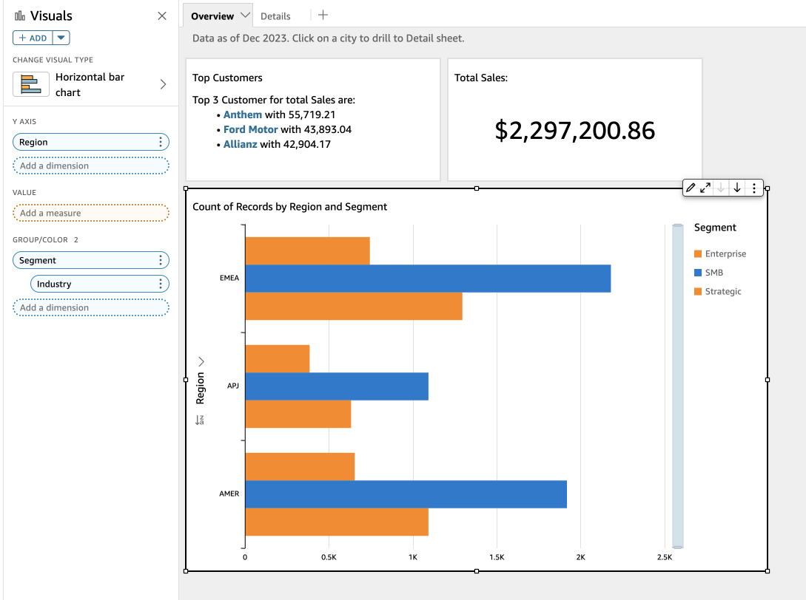
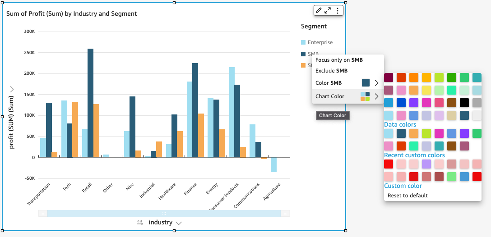

# Colors in visual types in

Quick

You can change the color of one, some, or all elements on the following types of
charts:

- Bar charts
- Donut charts
- Gauge charts
- Heat maps
- Line charts
- Scatter plots
- Tree maps
  To change colors on bar charts, donut charts, gauge charts, line charts, and scatter
  plots, see [Changing colors on charts](#format-colors-on-charts "#format-colors-on-charts").

To change colors on heat maps and tree maps, see [Changing colors on heat
maps and tree maps](#format-colors-on-heatmaps-and-treemaps "#format-colors-on-heatmaps-and-treemaps").

## Changing colors on charts

You can change the chart color used by all elements on the chart, and also change
the color of individual elements. When you set the color for an individual element,
it overrides the chart color.

For example, suppose that you set the chart color to green.

All of the bars turn green. Even though you choose the first bar, the chart color
applies to all the bars. Then you set the color for the **SMB** bar
to blue.

Looking at the result, you decide that you need more contrast between the green
and blue bars, so you change the chart color to orange. If you are changing the
chart color, it doesn't matter which bar you choose to open the context menu
from.

The **SMB** bar remains blue. This is because it was directly
configured. The remaining bars turn orange.

When you change the color of an element that is grouped, the color for that
element is changed in all of the groups. An example is a bar in a clustered bar
chart. In the following example, Customer Segment is moved out of the
**Y-axis** and into the **Group/Color** field
well. Customer Region is added as the **Y-axis**. The chart color
stays orange, and SMB stays blue for all Customer Regions.

If your visual has a legend that shows categories (dimensions), you can click on
the values in the legend to see a menu of available actions. For example, suppose
that your bar chart has a field in the **Color** or
**Group/Color** field well. The bar chart menu displays the
actions that you can choose by clicking or right-clicking on a bar, such as the
following:

- Focusing on, or excluding, visual elements
- Changing colors of visual elements
- Drilling down into a hierarchy
- Custom actions activated from the menu, including filtering or URL
  actions

Following is an example of using the legend to change the color for a
dimension.

### Setting new colors for a visual

Use the following procedure to change the colors for a visual.

###### To change the colors for a visual

1. On the analysis page, choose the visual that you want to
   modify.
2. To change the chart color, choose any element on the visual, and then
   choose **Chart Color**.

To select elements, do the following:

    * On a bar chart, choose any bar.
    * On a line chart, choose the end of a line.
    * On a scatter plot, choose an element. The field must be in
     the **Group/Color** section of **Field
     wells**.

3. Choose the color that you want to use. You can choose a color from the
   existing palette, or you can choose a custom color. To use a custom
   color, enter the hexadecimal code for that color.

All elements on the visual are changed to use this color, except for
any that have previously had their color individually set. In that case,
the element color overrides the chart color. 4. To change the color for a single element on the visual, choose that
element, choose **Color <field name>**, and then
choose the color that you want to use. You can choose a color from the
existing palette, or you can choose a custom color. To use a custom
color, enter the hexadecimal code for that color.

Repeat this step until you have set the color on all elements that you
want to modify. To change the color back to the color it was originally,
choose **Reset to default**.

### Setting visual colors back to

defaults

Use the following procedure to return to using the default colors on a
visual.

###### To return to default colors on a visual

1. On the analysis page, choose the visual that you want to
   modify.
2. Choose **Chart Color**, choose any element on the
   visual, and then choose **Reset to Default**. Doing
   this changes the chart color back to the default color for that visual
   type.

All elements on the visual are changed to the default color for the
visual type, except for any that have previously had their color
individually set. In that case, the element color setting overrides the
chart color setting. 3. To change the color for a single element back to the default, choose
that element, choose **Color <field name>**, and
then choose **Reset to Default**.

The default color for individual elements is the chart color if you
have specified one, or the default color for the visual type
otherwise.

## Changing colors on heat

maps and tree maps

###### To change the colors that display on a heat map or a tree map

1. Choose the heat map or tree map that you want to edit.
2. Choose **Expand** for the settings menu, and choose the
   cog icon to open the **Properties** panel.
3. For **Color**, choose the settings that you want to
   use:
4. For **Gradient color** or **Discrete
   color**, choose the color square next to the color bar, and
   then choose the color that you want to use. Repeat for each color square.
   The bar holds two colors by default.
5. Select the **Enable 3 colors** check box if you want to
   add a third color. A new square appears in the middle of the color bar.

You can enter a number that defines the midpoint between the two main
gradient colors. If you add a value, the middle color represents the number
you entered. If you leave this blank, the middle color acts like the other
colors in the gradient. 6. Select the **Enable steps** check box if you want to
limit the chart to the colors that you chose. Doing this changes the label
on the color bar from **Gradient color** to
**Discrete color**. 7. For **Color for Null Value**, choose a color to depict
NULL values. This option is only available on heat maps.
