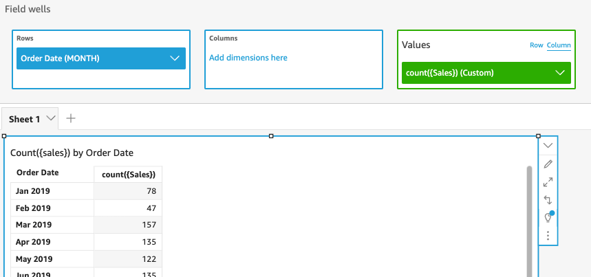
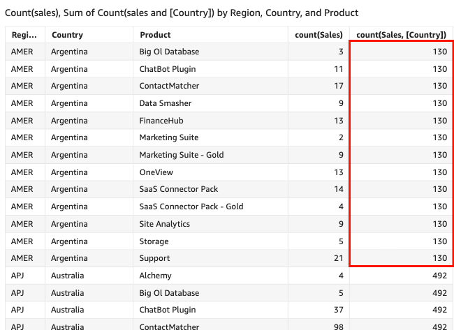

# count

The `count` function calculates the number of values in a dimension or
measure, grouped by the chosen dimension or dimensions. For example, `count(product
 type)` returns the total number of product types grouped by the (optional)
chosen dimension, including any duplicates. The `count(sales)` function
returns the total number of sales completed grouped by the (optional) chosen dimension,
for example salesperson.

## Syntax

```
count(*dimension or measure*, [*group-by level*])
```

## Arguments

_dimension or measure_

The argument must be a measure or a dimension. Null values are omitted
from the results. Literal values don't work. The argument must be a
field.

_group-by level_

(Optional) Specifies the level to group the aggregation by. The level
added can be any dimension or dimensions independent of the dimensions
added to the visual.

The argument must be a dimension field. The group-by level must be
enclosed in square brackets `[ ]`. For more information, see
[Level-aware calculation - aggregate (LAC-A)
functions](../../../quicksight/latest/user/level-aware-calculations-aggregate.md "../../../quicksight/latest/user/level-aware-calculations-aggregate.md").

## Examples

The following example calculates the count of sales by a specified dimension in
the visual. In this example, the count of sales by month are shown.

```
count({Sales})
```



You can also specify at what level to group the computation using one or more
dimensions in the view or in your dataset. This is called a LAC-A function. For more
information about LAC-A functions, see [Level-aware calculation - aggregate (LAC-A)
functions](../../../quicksight/latest/user/level-aware-calculations-aggregate.md "../../../quicksight/latest/user/level-aware-calculations-aggregate.md"). The following example calculates the count of sales at the
Country level, but not across other dimensions (Region or Product) in the
visual.

```
count({Sales}, [{Country}])
```


