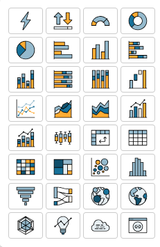
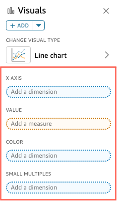

# Adding visuals to Quick Sight analyses

A _visual_ is a graphical representation of your
data. You can create a wide variety of visuals in an analysis, using different datasets
and visual types.

After you have created a visual, you can modify it in a range of ways to customize it
to your needs. Possible customizations include changing what fields map to visual
elements, changing the visual type, sorting visual data, or applying a filter.

Quick Sight supports up to 50 datasets in a single analysis, and up to 50 visuals in
a single sheet, and a limit of 20 sheets per analysis.

You can create a visual in several ways. You can select the fields that you want and
use AutoGraph to let Amazon Quick Sight determine the most appropriate visual type. Or you can
choose a specific visual type and choose fields to populate it. If you aren't sure
what questions your data can answer for you, you can choose
**Suggested** on the tool bar and choose a visual that Amazon Quick Sight
suggests. Suggested visuals are ones that we think are of interest, based on a
preliminary examination of your data. For more information about AutoGraph, see [Using AutoGraph](autograph.md "autograph.md").

You can add more visuals to the workspace by choosing **Add**, then **Add visual**. Visuals created
after June 21, 2018, are smaller in size, fitting two on each row. You can resize the
visuals and drag them to rearrange them.

To create a useful visual, it helps to know what question you are trying to answer as
specifically as possible. It also helps to use the smallest dataset that can answer that
question. Doing so helps you create simpler visuals that are easier to analyze.

## Fields as dimensions and measures

In the **Visuals** pane, dimension fields have blue icons and
measure fields have orange icons. _Dimensions_ are
text or date fields that can be items, like products. Or they can be attributes that
are related to measures and can be used to partition them, like sales date for sales
figures. _Measures_ are numeric values that you use
for measurement, comparison, and aggregation. You typically use a combination of
dimension and measure fields to produce a visual, for example sales totals (a
measure) by sales date (a dimension). For more information about the types of fields
expected by the different visual types, see the specific visual type topics in the
[Visual types in Amazon Quick Sight](working-with-visual-types.md "working-with-visual-types.md") section. For more information about
changing a field's measure or dimension setting, see [Setting fields as a dimensions or
measures](setting-dimension-or-measure.md "setting-dimension-or-measure.md").

## Field limitations

You can only use one date field per visual. This limitation applies to all visual
types.

You can't use the same field for more than one dimension field well or drop
target on a visual. For more information about how expected field type is indicated
by field wells and drop targets, see [Using visual field controls](using-visual-field-controls.md "using-visual-field-controls.md").

## Searching for fields

If you have a long field list in the **Fields list** pane, you
can search to locate a specific field. To do so, choose the search icon at the top
of the **Data** pane and then enter a search term into the search
box. Any field whose name contains the search term is shown. Search is
case-insensitive and wildcards aren't supported. Choose the cancel icon
(**X**) to the right of the search box to return to viewing all
fields.

## Adding a visual

Use the following procedure to create a new visual.

###### To create a new visual

1. Open the [Quick console](https://quicksight.aws.amazon.com/ "https://quicksight.aws.amazon.com/").
2. On the Quick homepage, choose the analysis that you want to
   add a visual to.
3. On the analysis page, choose the dataset that you want to use from the
   dataset list at the top of the **Data** pane. For more
   information, see [Adding a dataset to an
   analysis](adding-a-data-set-to-an-analysis.md "adding-a-data-set-to-an-analysis.md").
4. Open the **Visualize** pane, choose
   **Add**, and then choose **Add
   visual**.

A new, blank visual is created and receives focus. 5. Use one of the following options:

    * Choose the fields to use from the **Data** pane
     at left. If the fields aren't visible, choose
     **Visualize** to display it. Amazon Quick Sight creates
     the visual, using the visual type it determines is most compatible
     with the data you selected.
    * Choose the dropdown arrow next to the **ADD**
     button to choose a visual type. After the visual is created, choose
     the fields that you want to populate it.

    	1. Choose the icon of a visual type from the **Visual
    	 types** pane.

    	

    	The field wells display the fields that are visualized.

    	
    	2. From the **Data** pane, drag the fields
    	 that you want to use to the appropriate field wells.
    	 Typically, you want to use dimension or measure fields as
    	 indicated by the color of the target field well. If you
    	 choose to use a dimension field to populate a
    	 **Value** field well, the
    	 **Count** aggregate function is
    	 automatically applied to it to create a numeric
    	 value.

    	Amazon Quick Sight creates the visual using the visual type you
    	 selected.
    * Create a visual using a suggestion.

    On the tool bar, choose **Suggested**, then
     choose a suggested visual.
