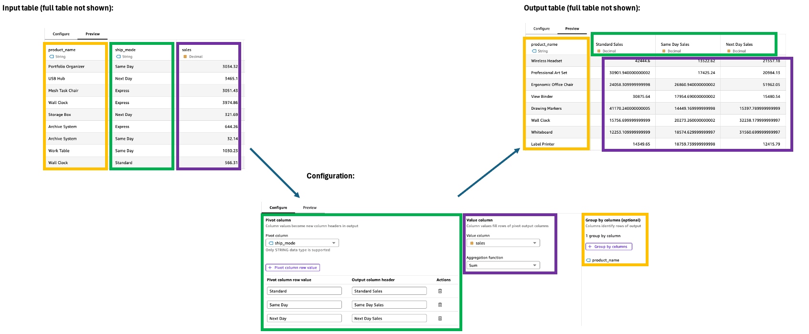
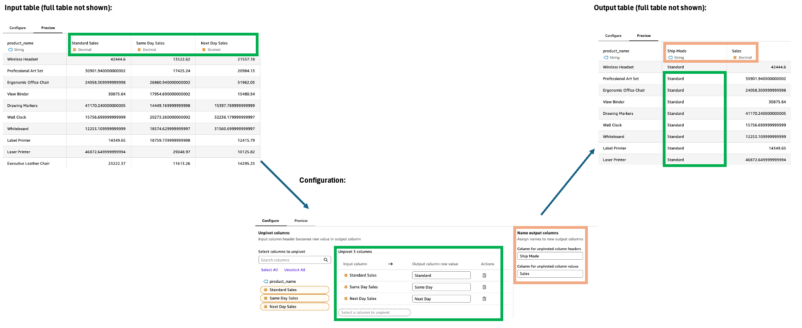

# Data preparation steps

Amazon Quick Sight's data preparation experience offers eleven powerful step types that enable you to transform
your data systematically. Each step serves a specific purpose in the data preparation workflow.

Steps can be configured through an intuitive interface in the **Configuation** pane, with immediate feedback
visible in the **Preview** pane. Steps can be combined sequentially to create sophisticated data transformations
without requiring SQL expertise.

Each step can receive input from either a physical table or the output of a previous step. Most steps accept
a single input, with Append and Join steps being the exceptions–these require exactly two inputs.

## Input

The Input step initiates your data preparation workflow in Quick Sight by allowing you to select and
import data from multiple sources for transformation in subsequent steps.

**Input options**

- **Add Dataset**

Leverage existing Quick Sight datasets as input sources, building upon data that has already
been prepared and optimized by your team.

- **Add Data Source**

Connect directly to databases such as Amazon Redshift, Athena, RDS, or other supported sources
by selecting specific database objects and providing connection parameters.

- **Add File Upload**

Import data directly from local files in formats such as CSV, TSV, Excel, or JSON.

**Configuration**

The Input step requires no configuration. The **Preview** pane displays your imported data along with source
information, including connection details, table name, and column metadata.

**Usage notes**

- Multiple Input steps can exist within a single workflow.
- You can add Input steps at any point in your workflow.

## Add Calculated Columns

The Add Calculated Columns step enables you to create new columns using row-level expressions
that perform calculations on existing columns. You can create new columns using scalar (row-level)
functions and operators, and apply row-level calculations that reference existing columns.

**Configuration**

To configure the Add Calculated Columns step, in the **Configuration** pane:

1. Name your new calculated column.
2. Build expressions using the calculation editor, which supports row-level functions and operators
   (such as [ifelse](ifelse-function.md "ifelse-function.md") and [round](round-function.md "round-function.md")).
3. Save your calculation.
4. Preview the expression results.
5. Add more calculated columns as needed.

**Usage notes**

- Only scalar (row-level) calculations are supported in this step.
- In SPICE, calculated columns are materialized and function as standard columns in subsequent steps.

## Change Data Type

Quick Sight simplifies data type management by supporting four abstract data types: `date`,
`decimal`, `integer`, and `string`. These abstract types eliminate complexity
by automatically mapping various source data types to their Quick Sight equivalents. For instance,
`tinyint`, `smallint`, `integer`, and `bigint` are all mapped to
`integer`, while `date`, `datetime`, and `timestamp` are mapped
to `date`.

This abstraction means you only need to understand Quick Sight's four data types, as Quick Sight handles
all underlying data type conversions and calculations automatically when interacting with different data sources.

**Configuration**

To configure the Change Data Type step, in the **Configuration** pane:

1. Select a column to convert.
2. Choose the target data type (`string`, `integer`, `decimal`, or
   `date`).
3. For date conversions, specify format settings and preview results based on input formats. See
   the [supported date formats](supported-data-types-and-values.md "supported-data-types-and-values.md") in Quick Sight.
4. Add additional columns to convert as needed.

**Usage notes**

- Convert multiple columns' data types in a single step for efficiency.
- When using SPICE, all data type changes are materialized in the imported data.

## Rename Columns

The Rename Columns step enables you to modify column names to be more descriptive, user-friendly, and
consistent with your organization's naming conventions.

**Configuration**

To configure the Rename Columns step, in the **Configuration** pane:

1. Select a column to name.
2. Enter a new name for the selected column.
3. Add more columns to rename as needed.

**Usage notes**

- All column names must be unique within your dataset.

## Select Columns

The Select Columns step enables you to streamline your dataset by including, excluding, and reordering columns.
This helps optimize your data structure by removing unnecessary columns and organizing the remaining ones in a logical
sequence for analysis.

**Configuration**

To configure the Select Columns step, in the **Configuration** pane:

1. Choose specific columns to include in your output.
2. Select columns in your preferred order to establish sequence.
3. Use **Select All** to include remaining columns in their original order.
4. Exclude unwanted columns by leaving them unselected.

**Key Features**

- Output columns appear in the order of selection.
- **Select All** preserves the original column sequence.

**Usage notes**

- Unselected columns are removed from subsequent steps.
- Optimize dataset size by removing unnecessary columns.

## Append

The Append step vertically combines two tables, similar to a SQL UNION ALL operation. Quick Sight
automatically matches columns by name rather than sequence, enabling efficient data consolidation even
when tables have different column orders or varying numbers of columns.

**Configuration**

To configure the Append step, in the **Configuration** pane:

1. Select two input tables to append.
2. Review the output column sequence.
3. Examine which columns are present in both tables versus single tables.

**Key features**

- Matches columns by name instead of sequence.
- Retains all rows from both tables, including duplicates.
- Supports tables with different numbers of columns.
- Follows Table 1's column sequence for matching columns, then adds unique columns from Table 2.
- Shows clear source indicators for all columns

**Usage notes**

- Use a Rename step first when appending columns with different names.
- Each Append step combines exactly two tables; use additional Append steps for more tables.

## Join

The Join step horizontally combines data from two tables based on matching values in specified
columns. Quick Sight supports Left Outer, Right Outer, Full Outer, and Inner Join types, providing
flexible options for your analytical needs. The step includes intelligent column conflict resolution
that automatically handles duplicate column names. While self-joins aren't available as a specific join
type, you can achieve similar results using workflow divergence.

**Configuration**

To configure the Join step, in the **Configuration** pane:

1. Select two input tables to join.
2. Choose your join type (Left Outer, Right Outer, Full Outer, or Inner).
3. Specify join keys from each table.
4. Review auto-resolved column name conflicts.

**Key features**

- Supports multiple join types for different analytical needs.
- Automatically resolves duplicate column names.
- Accepts calculated columns as join keys.

**Usage notes**

- Join keys must have compatible data types; use the Change Data Type step if needed.
- Each Join step combines exactly two tables; use additional Join steps for more tables.
- Create a Rename step after the Join to customize auto-resolved column headers.

## Aggregate

The Aggregate step enables you to summarize data by grouping columns and applying aggregation operations.
This powerful transformation condenses detailed data into meaningful summaries based on your specified dimensions.
Quick Sight simplifies complex SQL operations through an intuitive interface, offering comprehensive aggregation
functions including advanced string operations like `ListAgg` and `ListAgg distinct`.

**Configuration**

To configure the Aggregate step, in the **Configuration** pane:

1. Select columns to group by.
2. Choose aggregation functions for measure columns.
3. Customize output column names.
4. For `ListAgg` and `ListAgg distinct`:
   1. Select the column to aggregate.
   2. Choose a separator (comma, dash, semicolon, or vertical line).

5. Preview the summarized data.

**Supported functions per data type**

| Data Type | Supported Functions                                                                        |
| --------- | ------------------------------------------------------------------------------------------ |
| Numeric   | `Average`, `Sum` `Count`, `Count Distinct` `Max`, `Min`                              |
| Date      | `Count`, `Count Distinct` `Max`, `Min` `ListAgg`, `ListAgg distinct` (for date only) |
| String    | `ListAgg`, `ListAgg distinct` `Count`, `Count Distinct` `Max`, `Min`                 |

**Key features**

- Applies different aggregation functions to columns within the same step.
- **Group by** without aggregation functions acts as SQL SELECT DISTINCT.
- `ListAgg` concatenates all values; `ListAgg distinct` includes only unique values.
- `ListAgg` functions maintain ascending sort order by default.

**Usage notes**

- Aggregation significantly reduces row count in your dataset.
- `ListAgg` and `ListAgg distinct` support `date` values but not
  `datetime`.
- Use separators to customize string concatenation output.

## Filter

The Filter step enables you to narrow down your dataset by including only rows that meet specific criteria.
You can apply multiple filter conditions within a single step, all combining through `AND` logic to help
focus your analysis on relevant data.

**Configuration**

To configure the Filter step, in the **Configuration** pane:

1. Select a column to filter.
2. Choose a comparison operator.
3. Specify filter values based on the column's data type.
4. Add additional filter conditions across different columns if needed.

###### Note

- String filters with "is in" or "is not in": Enter multiple values (one per line).
- Numeric and date filters: Enter single values (except "between" which requires two values).

**Supported operators per data type**

| Data Type           | Supported Operators                                                                                                      |
| ------------------- | ------------------------------------------------------------------------------------------------------------------------ |
| Integer and Decimal | Equals, Does not equal Greater than, Less than Is greater than or equal to, Is less than or equal to Is between |
| Date                | After, Before Is between Is after or equal to, Is before or equal to                                               |
| String              | Equals, Does not equal Starts with, Ends with Contains, Does not contain Is in, Is not in                       |

**Usage notes**

- Apply multiple filter conditions in a single step.
- Mix conditions across different data types.
- Preview filtered results in real-time.

## Pivot

The Pivot step transforms row values into unique columns, converting data from a long format to a wide
format for easier comparison and analysis. This transformation requires specifications for value filtering,
aggregation, and grouping to manage the output columns effectively.

**Configuration**

To configure the Pivot step, use the following in the **Configuration** pane:

1. **Pivot column**: Select the column whose values will become column
   headers (e.g., Category).
2. **Pivot column row value**: Filter specific values to include
   (e.g., Technology, Office Supplies).
3. **Output column header**: Customize new column headers (defaults
   to pivot column values).
4. **Value column**: Select the column to aggregate (e.g., Sales).
5. **Aggregation function**: Choose the aggregation method (e.g., Sum).
6. **Group by**: Specify organizing columns (e.g., Segment).

**Supported operators per data type**

| Data Type           | Supported Operators                                                                           |
| ------------------- | --------------------------------------------------------------------------------------------- |
| Integer and Decimal | `Average`, `Sum` `Count`, `Count Distinct` `Max`, `Min`                                 |
| Date                | `Count`, `Count Distinct` `Max`, `Min` `ListAgg`, `ListAgg distinct` (date values only) |
| String              | `ListAgg`, `ListAgg distinct` `Count`, `Count Distinct` `Max`, `Min`                    |

**Usage notes**

- Each pivoted column contains aggregated values from the value column.
- Customize column headers for clarity.
- Preview transformation results in real-time.

## Unpivot

The Unpivot step transforms columns into rows, converting wide data into a longer, narrower format.
This transformation helps organize data spread across multiple columns into a more structured format for
easier analysis and visualization.

**Configuration**

To configure the Unpivot step, in the **Configuration** pane:

1. Select columns to unpivot into rows.
2. Define output column row values. The default is the original column name. Some examples
   include Technology, Office Supplies, and Furniture.
3. Name the two new outputs columns.
   - **Unpivoted column header**: The name for former
     column names (e.g., Category)
   - **Unpivoted column values**: The name for the
     unpivoted values (e.g., Sales)

**Key features**

- Retains all non-unpivoted columns in the output.
- Creates two new columns automatically: one for former column names and one for their
  corresponding values.
- Transforms wide data into long format.

**Usage notes**

- All unpivoted columns must have compatible data types.
- Row count typically increases after unpivoting.
- Preview changes in real-time before applying them.
