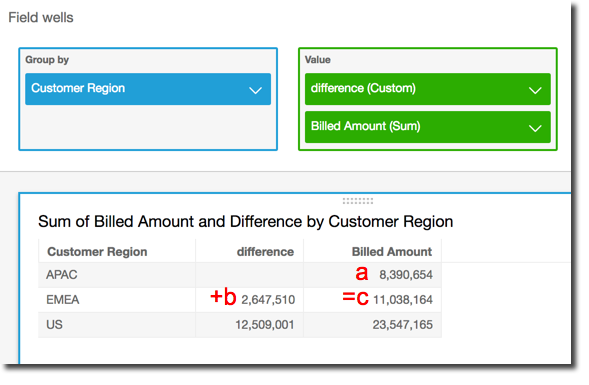

# difference

The `difference` function calculates the difference between a measure based
on one set of partitions and sorts, and a measure based on another.

The `difference` function is supported for use with analyses based on
SPICE and direct query data sets.

## Syntax

The brackets are required. To see which arguments are optional, see the following
descriptions.

```
difference
	(
	     `measure`
	     ,`[ sortorder_field ASC_or_DESC, ... ]`
	     ,`lookup_index`,
	     ,`[ partition field, ... ]`
	)
```

## Arguments

_measure_

An aggregated measure that you want to see the difference for.

_sort order field_

One or more measures and dimensions that you want to sort the data by,
separated by commas. You can specify either ascending
(`ASC`) or descending
(`DESC`) sort order.

Each field in the list is enclosed in {} (curly braces), if it is more
than one word. The entire list is enclosed in [ ] (square
brackets).

_lookup index_

The lookup index can be positive or negative, indicating a following
row in the sort (positive) or a previous row in the sort (negative). The
lookup index can be 1–2,147,483,647. For the engines MySQL,
MariaDB and Aurora MySQL-Compatible Edition, the lookup index is limited to just

1.

_partition field_

(Optional) One or more dimensions that you want to partition by,
separated by commas.

Each field in the list is enclosed in {} (curly braces), if it is more
than one word. The entire list is enclosed in [ ] (square
brackets).

## Example

The following example calculates the difference between of `sum({Billed
 Amount})`, sorted by `Customer Region` ascending, compared to
the next row, and partitioned by `Service Line`.

```
difference(
     sum( {Billed Amount} ),
     [{Customer Region} ASC],
     1,
     [{Service Line}]
)
```

The following example calculates the difference between `Billed Amount`
compared to the next line, partitioned by (`[{Customer Region}]`). The
fields in the table calculation are in the field wells of the visual.

```
difference(
     sum( {Billed Amount} ),
     [{Customer Region} ASC],
     1
)
```

The red highlights show how each amount is added ( a + b = c ) to show the
difference between amounts a and c.


