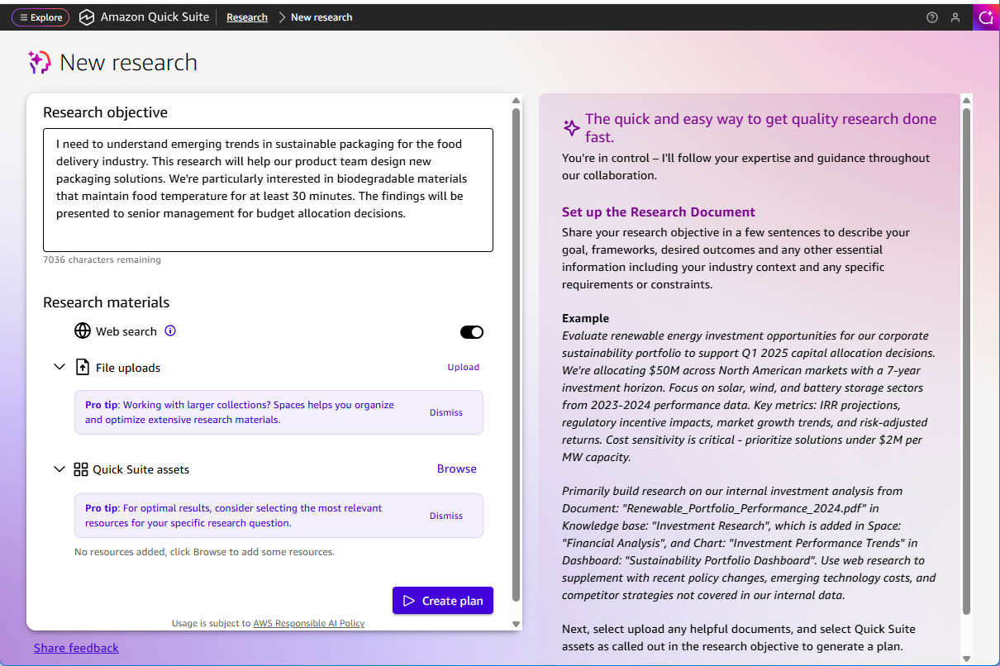

# Enter research objective

The first step in creating a new research project is to define your research objective. A well-written research objective helps Quick Research understand what information you're looking for and guides the AI in selecting relevant sources and generating focused results.

###### To enter your research objective

1. In the main navigation bar, choose **Research**.
2. In the Quick Research interface, choose **New Research**.

 3. In the **Research objective** field, enter a clear description of what you want to research.

Describe your research goal by stating what you want to achieve, for whom, and why. For best results, mention your intended audience, and any key metrics or focus areas that will help deliver exactly what you need.

Share your research objective in a few sentences to describe your goal frameworks, desired outcomes and any other essential information including your industry context and any specific requirements or constraints. If you have preferences for specific websites to include or exclude from your research, mention those as well.

_Example:_ I need to understand emerging trends in sustainable packaging for the food industry. This research will help our product team design new packaging solutions. We're particularly interested in biodegradable materials that maintain food temperature for at least 30 minutes. The findings will be presented to senior management for budget allocation decisions. 4. After entering your research objective, select what materials to use in **Research materials**, then choose **Create plan** to create your draft plan.

## Tips for writing a good research objective

Follow these guidelines to create effective research objectives:

- Be specific about what you want to learn or understand
- Include relevant context about your industry, market, or domain
- Specify the time frame if relevant (e.g., "recent trends," "2024 data")
- Mention the intended use of the research (e.g., "for strategic planning," "to inform product decisions")
- Use clear, concise language and avoid ambiguous terms
- Include any specific aspects or angles you want to explore

Example of a well-written research objective: "Analyze the current state of artificial intelligence adoption in healthcare, focusing on diagnostic imaging applications, regulatory challenges, and market opportunities for 2024-2025."
