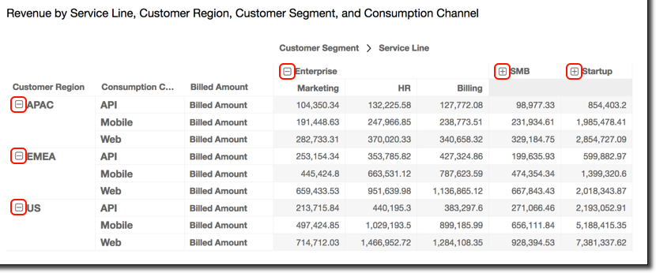

# Expanding and collapsing pivot

table clusters

If you are using grouped columns or rows in a pivot table, you can expand or
collapse a group to show or hide its data in the visual.

###### To expand or collapse a pivot table group

1.  On the analysis page, choose the pivot table visual that you want to
    edit.
2.  Choose one of the following:

        * To collapse a group, choose the collapse icon near the name of the
         field.
        * To expand a group, choose the expand icon near the name of the
         field. The collapse icon shows a minus sign. The expand icon shows a
         plus sign.

    In the following screenshot, `Customer Region` and the
    `Enterprise` segment are expanded, and `SMB` and
    `Startup` are collapsed. When a group is collapsed, its data
    is summarized in the row or column.

