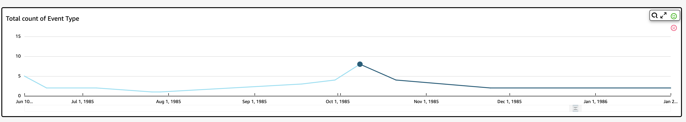

# Exploring

anomalies per category or dimension

The main section of the **Explore anomalies** screen is
locked to the lower right of the screen. It remains here no matter how many
other sections of the screen are open. If multiple anomalies exist, you can
scroll out to highlight them. The chart displays anomalies in color ranges and
shows where they occur over a period of time.

Each category or dimension has a separate chart that uses the field name as
the chart title. Each chart contains the following components:

- **Configure alerts** – If you are
  exploring anomalies from a dashboard, select this button to subscribe to
  alerts and contribution analysis (if configured). You can set up the
  alerts for the level of severity (medium, high, and so on). You can get
  the top five alerts for **Higher than expected**,
  **Lower than expected**, or ALL. Dashboard readers
  can configure alerts for themselves. If you open the **Explore
  Anomalies** page doesn't display this button if you opened
  the page from an analysis.

###### Note

The ability to configure alerts is available only in published
dashboards.

- **Status** – Under the
  **Anomalies** header, the status label displays
  information on the last run. For example, you might see "Anomalies for
  Revenue on November 17, 2018." This label tells you how many metrics
  were processed and how long ago. You can choose the link to learn more
  about the details, such as how many metrics were ignored.
