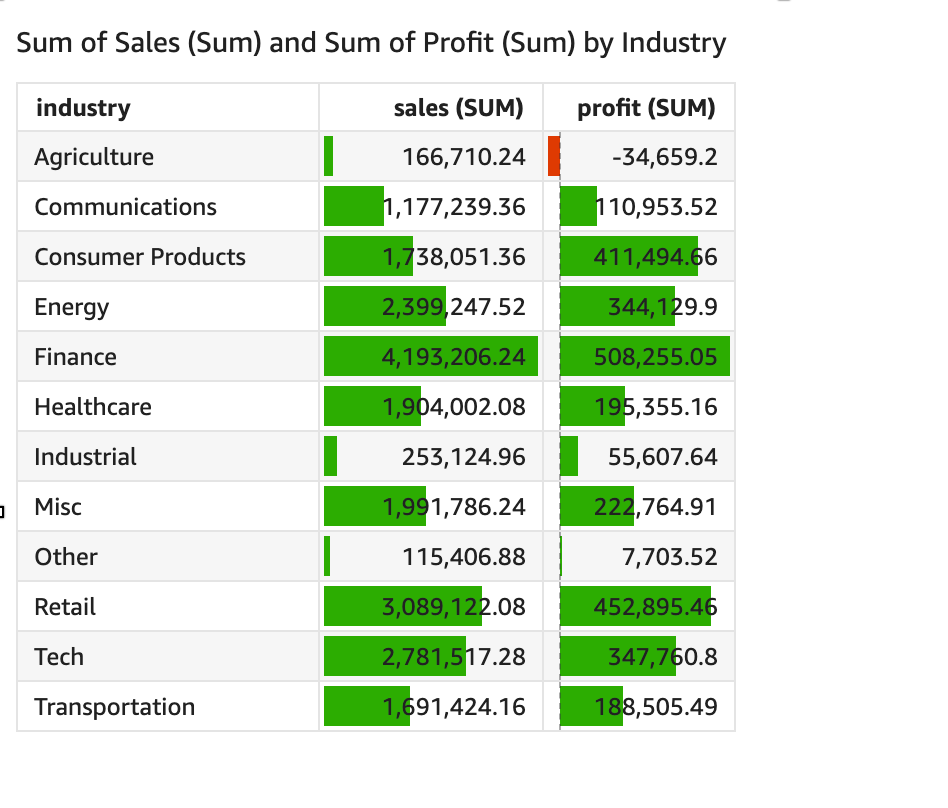

# Adding data bars to tables in

Quick

You can use data bars to add visual context to your table visuals in Amazon Quick. By
injecting color into your tables, data bars can make it easier to visualize and compare
data in a range of fields. _Data bars_ are bars of different colors
or shades that you add to the cells of a table. The bars are measured relative to the
range of all cells in a single column, which is similar to a bar chart. You can use data
bars to highlight a fluctuating trend, such as profit per quarter during the
year.

You can only apply data bars to fields that are added to the
**Values** field well of the visual. You can't apply data bars
to items that are added to group bys.

You can create up to 200 different data bar configurations for a single table.

###### To add data bars to a table

1. On the analysis page, choose the visual that you want to format.
2. On the menu in the upper-right corner of the visual, select the
   **Format visual** icon. The **Format
   visual** pane opens.
3. In the **Properties** pane, open the
   **Visuals** dropdown list and choose **ADD DATA
   BARS**.
4. In the **Data bars** popup that appears, choose the value
   field that you want represented by the data bars. You can only choose from
   fields that are added to the **Values** field well of the
   visual.
5. (Optional) Choose the icon labeled **Positive color** to
   select the color that you want to represent positive value data bars. The
   default color is green.
6. (Optional) Choose the icon labeled **Negative color** to
   select the color that you want to represent negative value data bars. The
   default color is red.
   When you create data bars, they are named for the field values that they are
   representing. For example, if you add data bars to represent the profit of a product
   over time, the data bar configuration is labeled "Profit". In the
   **Visuals** pane of the **Properties** menu, data
   bars are listed in the order that they are created.

###### To remove data bars from a visual

1. On the menu in the upper-right corner of the visual, select the
   **Format visual** icon. The **Properties**
   pane opens.
2. In the **Properties** pane, open the
   **Visuals** dropdown list and choose the data bar that you
   want to remove.
3. Choose **REMOVE DATA BARS**.
