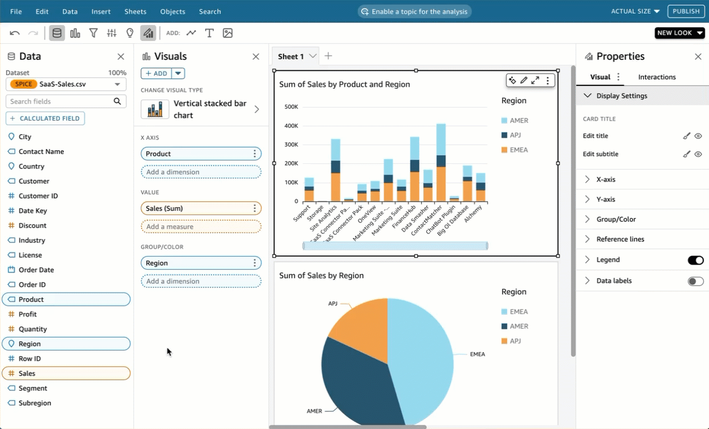

# Working with field level coloring in

Amazon Quick

With field level coloring, you can assign specific colors to specific field values
across all visuals in a Quick analysis or dashboard. Colors are assigned on
a per-field basis to simplify the process of setting colors and ensure consistency
across all visuals that use the same field. For example, let's say you're a
shipping company that wants to create a set of visuals that track shipping rates in
different regions. With field level coloring, you can assign each region a different
color to represent the field across all visuals in an analysis or dashboard. This way,
account readers quickly learn what field colors they're looking for and have an
easier time finding the information that they need.

Quick authors can configure up to 50 field based colors per field. Colors
that are defined at the visual level take precedence over field based colors. This means
that if the author sets a color for a value on the visual, that color will override the
field based colors configuration for that individual visual.

###### To apply field level coloring to a legacy account

1. In the **Fields** pane of the analysis, choose the ellipsis
   (three dots) next to the field that you want to assign a color to, and then
   choose **Edit field colors**.
2. In the **Edit field colors** pane that appears, choose the
   value that you want to assign a color to and choose the color that you want. You
   can apply colors to every value that appears in the **Field
   values** pane.
3. When you are finished assigning colors to the fields that you want, choose
   **Apply**.
   If you want to reset the color value of a field, open the **Edit field
   colors** pane and choose the refresh icon next to the field that you want
   to reset. You can reset all color values in an analysis by choosing **RESET
   COLORS**.

You can view a list of unused colors that can be configured to new fields by choosing
**Show unused colors** in the **Edit field
colors** pane. When you reset a field's color, the discarded color is
added to the **Unused colors** list and can be assigned to a new
field.
