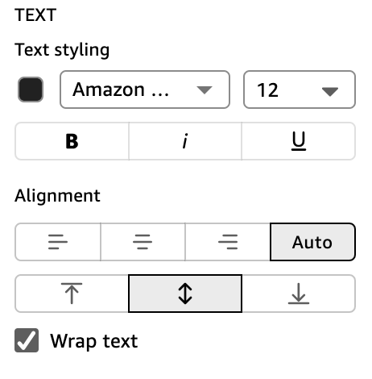

# Cell formatting

## Row height

You can customize table row height.

###### To customize the height of rows in a table or pivot table

1. In the **Properties** pane, choose
   **Cells**.

The **Cells** section expands to show options for
customizing cells. 2. For **Row height**, enter a number in pixels. You can
enter a whole number from 8 through 500.

## Cell text

You can customize the formatting for cell text within a table.

###### To format the cell text in a

table or pivot table

1. In the **Properties** pane, choose
   **Cells**.

The **Cells** section expands to show options for
customizing cells. 2. For **Text**, do one or more of the following:

    * To change the color of the cell text, choose the color swatch
     underneath **Text styling**, and then choose
     the color that you want the table text to be.
    * To change the font or font size of the cell text, open the
     **Font** or **Font size**
     dropdown and choose the font or font size that you want.
    * To bold, italicize, or underline the cell text, choose the
     appropriate icon from the style bar.
    * To wrap text in headers that are too long to fit, select
     **Wrap text**. Wrapping text in cells
     doesn't automatically increase the row height. Follow the
     previous procedure for increasing row height.
    * To change the horizontal alignment of text in cells, choose a
     horizontal alignment icon. You can choose left alignment, center
     alignment, right alignment, or automatic alignment. Horizontal
     alignment can only be configured for the
     **Rows** fields of a hierarchy pivot
     table.
    * To change the vertical alignment of text in cells, choose a
     vertical alignment icon. You can choose top alignment, middle
     alignment, bottom alignment, or automatic. For tabular pivot
     tables, the value for **Automatic** is
     vertical. For hierarchy pivot tables, the value for
     **Automatic** is middle.

    

## Cell background

color

You can customize table cells' background color.

###### To customize the background color of cells in a table or pivot

table

1. In the **Properties** pane, choose
   **Cells**.

The **Cells** section expands to show options for
customizing cells. 2. For **Background**, do one or more of the
following:

    * To alternate background colors between rows, select
     **Alternate row colors**. Clearing this
     option means that all cells have the same background
     color.
    * If you choose to alternate background colors between rows,
     choose a color for **Odd rows** and a color for
     **Even rows** by choosing the background
     color icon for each and selecting a color. You can choose one of
     the provided colors, reset the background color to the default
     color, or create a custom color.
    * If you choose not to alternate background colors between rows,
     choose the background color icon and select a color for all
     cells. You can choose one of the provided colors, reset the
     background color to the default color, or create a custom
     color.

## Cell borders

You can customize table cells' borders.

###### To customize the borders for cells in a table or pivot table

1. In the **Properties** pane, choose
   **Cells**.

The **Cells** section expands to show options for
customizing cells. 2. For **Borders**, do one or more of the
following:

    * To customize the type of border that you want, choose a border
     type icon. You can choose no borders, horizontal borders only,
     vertical borders only, or all borders.
    * To customize the border thickness, choose a border
     thickness.
    * To customize the border color, choose the border color icon,
     and then choose a color. You can choose one of the provided
     colors, reset the border color to the default color, or create a
     custom color.
