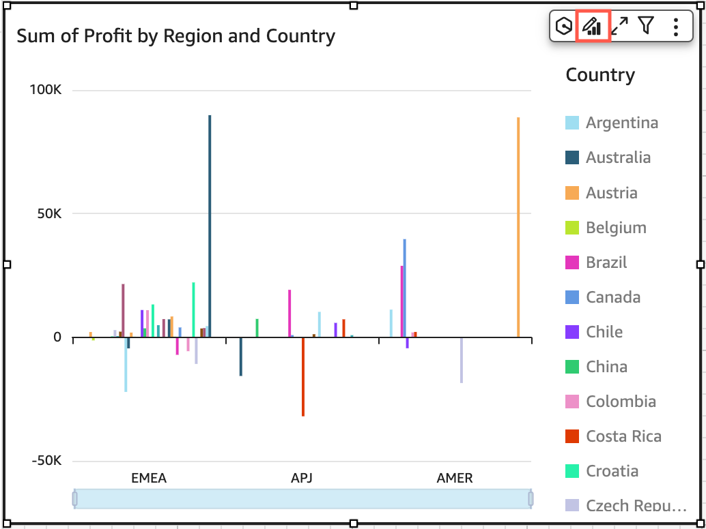

# Table and pivot table formatting options in

Quick

You can customize tables and pivot tables in Quick to meet your business
needs. You can customize table headers, cells, and totals by specifying the color, size,
wrap, and alignment of text in each. You can also specify the height of rows in a table,
add borders and grid lines, and add custom background colors. In addition, you can
customize how to display totals and subtotals.

If you have applied conditional formatting to a table or pivot table, it takes
precedence over any other styling you configure.

When you export table or pivot table visuals to Microsoft Excel, the formatting
customizations that you applied to the visual aren't reflected in the downloaded Excel
file.

###### To format a table or pivot table

- In your analysis, choose the table or pivot table that you want to customize,
  and then choose the **Format visual** icon.

The **Properties** pane opens at left.
Following, you can find descriptions for options for customizing each area of your
table or pivot table in the **Properties** pane.

###### Topics

- [Headers](format-tables-headers.md "format-tables-headers.md")
- [Cell formatting](format-tables-pivot-tables-cells.md "format-tables-pivot-tables-cells.md")
- [Totals and subtotals](format-tables-pivot-tables-totals.md "format-tables-pivot-tables-totals.md")
- [Row and column size
  in tables and pivot tables in Quick](format-tables-pivot-tables-resize-rows-columns.md "format-tables-pivot-tables-resize-rows-columns.md")
- [Customize pivot table
  data](format-tables-pivot-tables-layout-options.md "format-tables-pivot-tables-layout-options.md")
