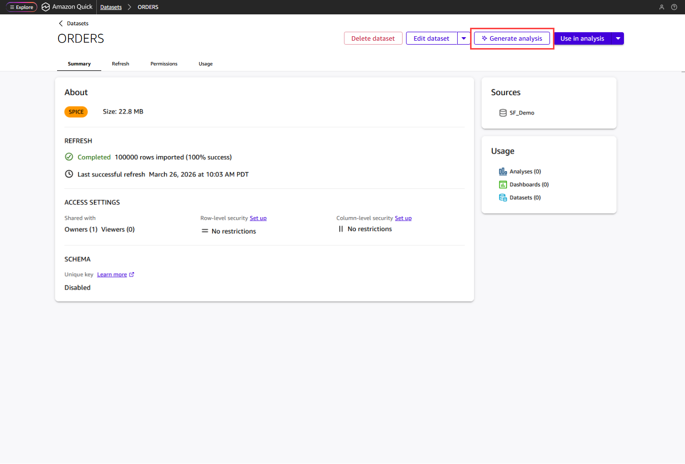
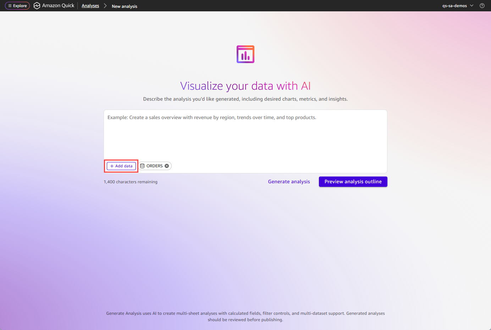
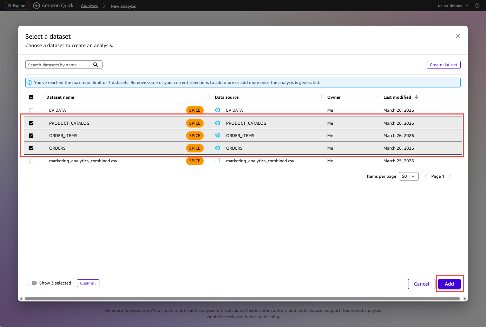
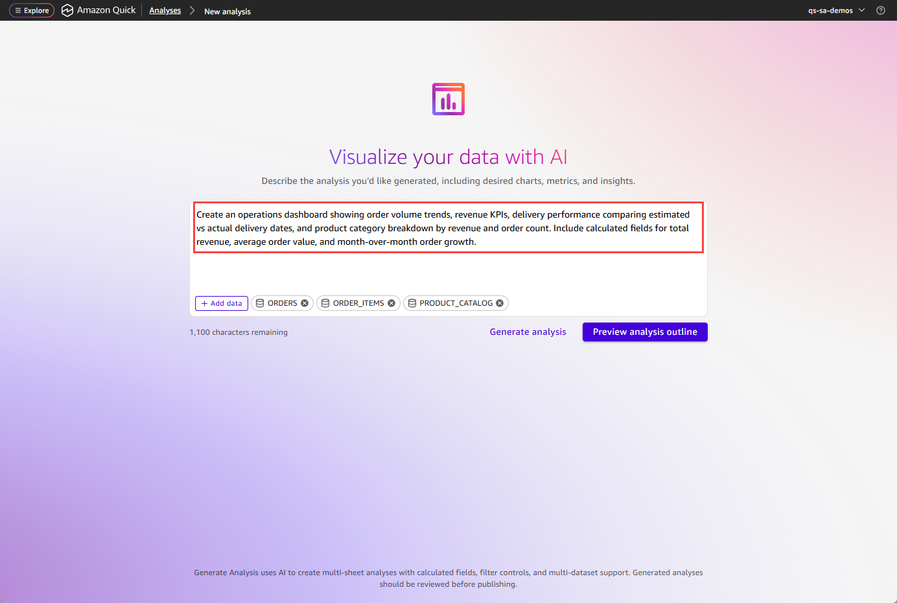
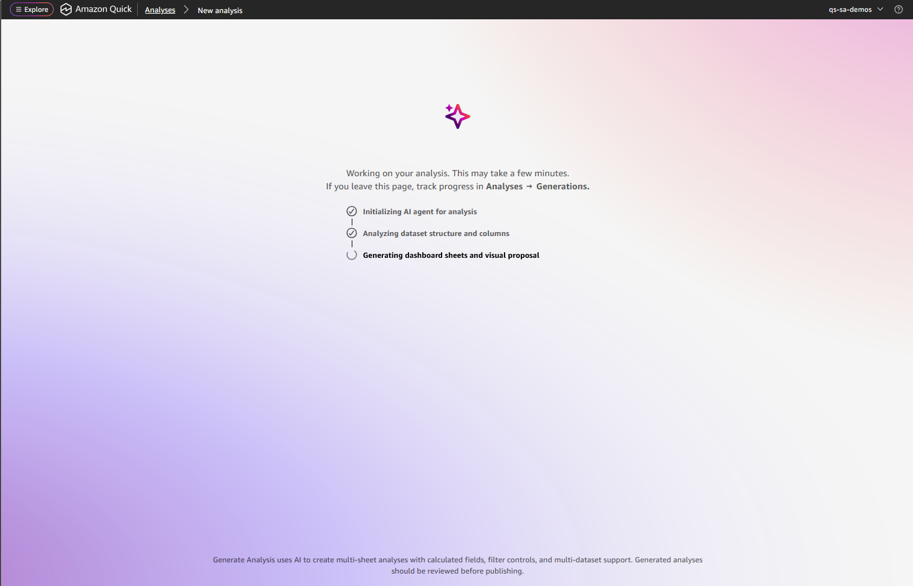
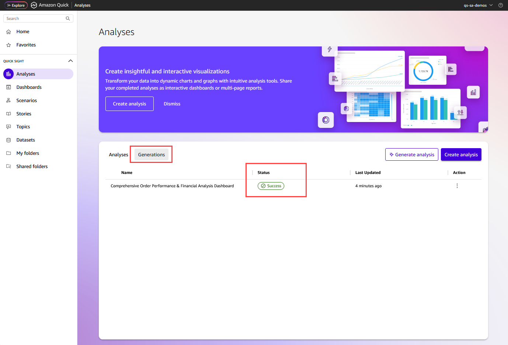
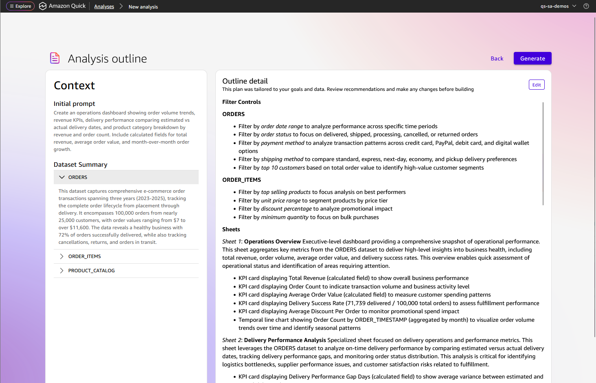
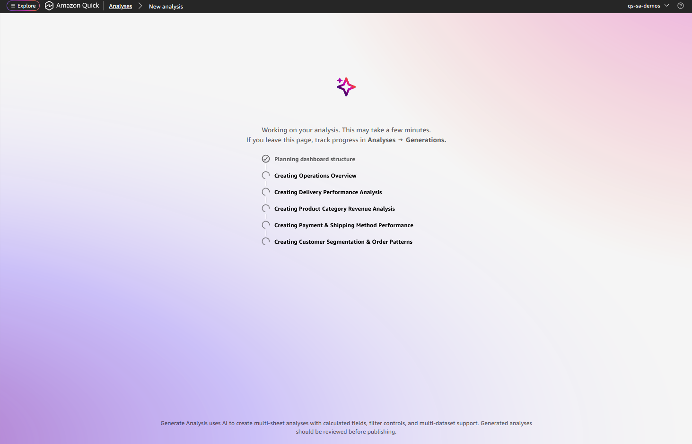
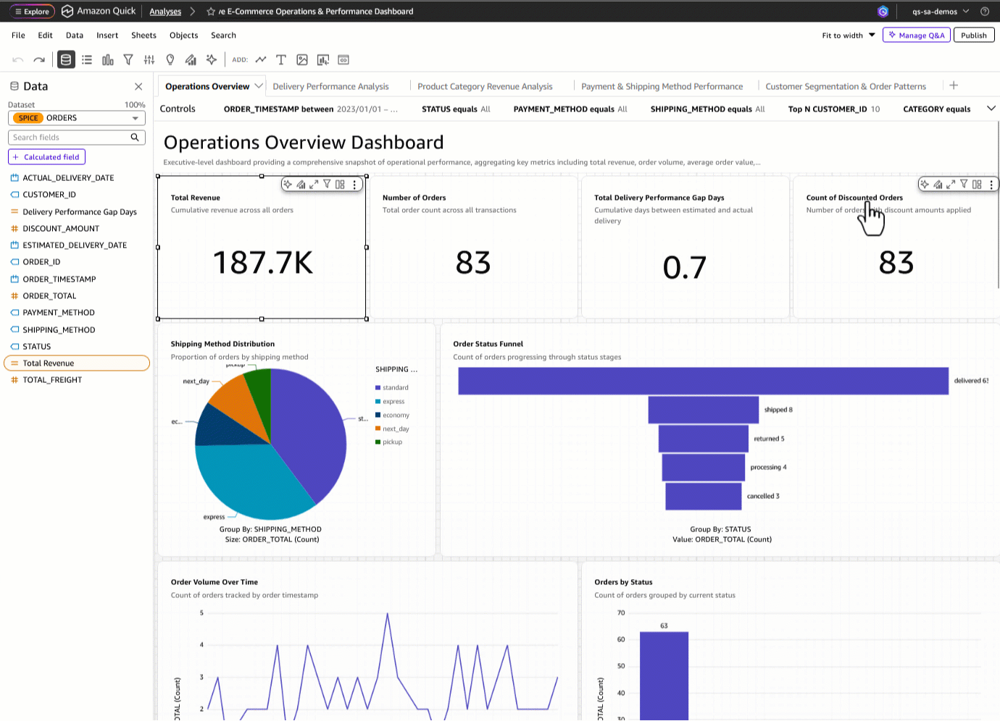

# Generating an analysis with natural language prompts

With Quick Sight, you can generate multi-sheet analyses from natural language prompts.
Describe the analysis you want, and Quick Sight creates multiple organized sheets with
visuals, filter controls, and calculated fields such as year-over-year growth and
month-over-month comparisons.

Before generation begins, you can review and modify an interactive plan that
outlines the proposed structure.

The generated output is a native Quick Sight analysis. It works with existing
publishing workflows, embedding patterns, CI/CD pipelines, and point-and-click
editing in the analysis surface. After generation, you can refine each visual.

## Prerequisites

To generate an analysis from a natural language prompt, you need the
following:

- An AWS account
- Amazon Quick Enterprise Edition with at least one Author Pro user
- At least one dataset in your Quick Sight account

## Generating an analysis

Use the following procedure to generate an analysis from a natural language
prompt.

###### To generate an analysis from a natural language prompt

1. Do one of the following:

   - Open a dataset and choose **Generate
     analysis**.
   - From the **Analyses** page, choose
     **Generate analysis**.

 2. Choose **Add data** to select one to three datasets for
the analysis. If your data spans multiple tables (for example, orders in one
dataset and products in another), you can select them together.

 3. Enter a natural language prompt that describes the analysis that you want
to create. You can describe the business questions that you want answered,
the metrics that you care about, and how you want the information organized
across sheets.

Example prompt:

"Create an operations dashboard showing order volume trends, revenue KPIs,
delivery performance comparing estimated vs actual delivery dates, and
product category breakdown by revenue and order count. Include calculated
fields for total revenue, average order value, and month-over-month order
growth."

 4. Do one of the following:

    * Choose **Generate analysis** to begin generation
     immediately.
    * Choose **Preview analysis outline** to review an
     outline first.

5. Wait while Quick Sight analyzes your dataset structure and column
   statistics. Real-time progress updates display the current status.

###### Note

If you navigate away from the progress screen, you can check the
generation status on the **Analyses** page by choosing
the **Generations** tab. Choose the generation name to
return to the progress screen.

 6. Quick Sight presents a two-pane view:

    * The left pane shows your initial prompt and a
     summary of the selected datasets.
    * The right pane shows the proposed filter controls,
     sheets, and visuals planned for each sheet.

You can edit sheet names, add or remove visuals, adjust the plan, and
refine the prompt before generating.

 7. Choose **Generate**. Real-time progress updates display
the current status. Generation takes 2 to 5 minutes depending on the
number of sheets and visuals.

## Publishing a generated analysis

After you are satisfied with the generated analysis, choose **Publish** to create a dashboard.

You can share the dashboard with other users, embed it in applications, or schedule email deliveries. For more information about publishing and sharing, see [Publishing dashboards](creating-a-dashboard.md "creating-a-dashboard.md") and [Sharing Quick Sight analyses](sharing-analyses.md "sharing-analyses.md").

