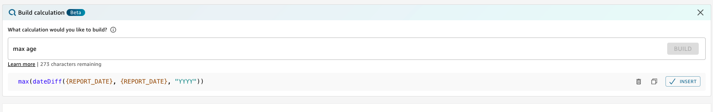

# Build calculations with

Generative BI

With Generative BI, you can use natural language prompts to create calculated
fields in Amazon Quick Sight, as shown in the following image. For more information about
calculated fields in analyses, see [Adding calculated fields](adding-a-calculated-field-analysis.md "adding-a-calculated-field-analysis.md").

###### To build a calculated field with Generative BI

1. Navigate to the analysis that you want to work in and choose
   **Data** from the toolbar at the top of the page. Then
   choose **Add calculated field**.
2. In the calculation editor that appears, choose
   **Build**.
3. Describe the calculation outcome that you want to achieve. For example,
   "year over year percent change in daily sales."
4. Choose **BUILD**.
5. Review the expression that's returned, and then choose
   **Insert** to add it to the expression editor. You can
   also choose the **Copy** icon to copy the expression to
   your clipboard. To delete the expression and start over, choose the
   **Delete** icon next to the expression.
6. When you're finished, close the editor.
   After you add a calculation to the expression editor, you must name the
   calculation before you can save it.
