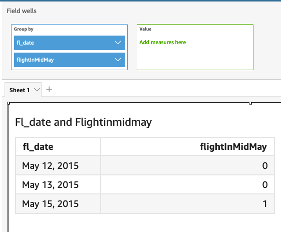
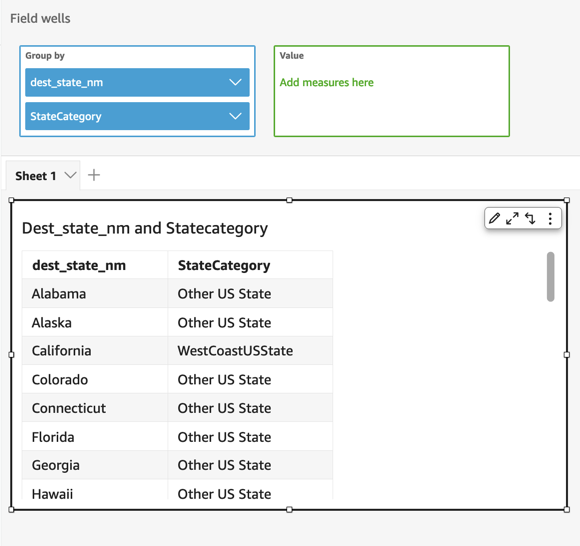

# in

`in` evaluates if an expression exists within a literal list. If the
list contains the expression, in returns true, and otherwise it returns false.
`in` is case sensitive for string type inputs.

`in` accepts two kinds of literal list, one is manually entered list
and the other is a [multivalue
parameter](../../../quicksight/latest/user/parameters-in-quicksight.md "../../../quicksight/latest/user/parameters-in-quicksight.md").

## Syntax

Using a manually entered list:

```
in(`expression`, `[literal-1, ...]`)
```

Using a multivalue parameter:

```
in(`expression`, $`multivalue_parameter`)
```

## Arguments

_expression_

The expression to be compared with the elements in literal list.
It can be a field name like `address`, a literal value
like ‘ `Unknown`’, a single value parameter, or
a call to another scalar function—provided this function is
not an aggregate function or a table calculation.

_literal list_

(required) This can be a manually entered list or a multivalue
parameter. This argument accepts up to 5,000 elements. However, in a
direct query to a third party data source, for example Oracle or
Teradata, the restriction can be smaller.

- _manually entered
  list_ – One or more
  literal values in a list to be compared with the expression.
  The list should be enclosed in square brackets. All the
  literals to compare must have the same datatype as the
  expression.
- _multivalue
  parameter_ – A pre-defined
  multivalue parameter passed in as a literal list. The
  multivalue parameter must have the same datatype as the
  expression.

## Return type

Boolean: TRUE/FALSE

## Example with a static

list

The following example evaluates the `origin_state_name` field for
values in a list of string. When comparing string type input, `in`
only supports case sensitive comparison.

```
in(origin_state_name,["Georgia", "Ohio", "Texas"])
```

The following are the given field values.

```
"Washington"
        "ohio"
        "Texas"
```

For these field values the following values are returned.

```
false
        false
        true
```

The third return value is true because only "Texas" is one of the included
values.

The following example evaluates the `fl_date` field for values in a
list of string. In order to match the type, `toString` is used to
cast the date type to string type.

```
in(toString(fl_date),["2015-05-14","2015-05-15","2015-05-16"])
```



Literals and NULL values are supported in expression argument to be compared
with the literals in list. Both of the following two examples will generate a
new column of TRUE values.

```
in("Washington",["Washington","Ohio"])
```

```
in(NULL,[NULL,"Ohio"])
```

## Example with mutivalue

parameter

Let's say an author creates a [multivalue
parameter](../../../quicksight/latest/user/parameters-in-quicksight.md "../../../quicksight/latest/user/parameters-in-quicksight.md") that contains a list of all the state names. Then the
author adds a control to allow the reader to select values from the list.

Next, the reader selects three values—"Georgia", "Ohio", and
"Texas"—from the parameter's drop down list control. In this case, the
following expression is equivalent to the first example, where those three state
names are passed as the literal list to be compared with the
`original_state_name` field.

```
in (`origin_state_name`, $`{stateName MultivalueParameter}`)
```

## Example with

`ifelse`

`in` can be nested in other functions as a boolean value. One
example is that authors can evaluate any expression in a list and return the
value they want by using `in` and `ifelse`. The following
example evaluates if the `dest_state_name` of a flight is in a
particular list of US states and returns different categories of the states
based on the comparison.

```
ifelse(in(dest_state_name,["Washington", "Oregon","California"]), "WestCoastUSState", "Other US State")
```


